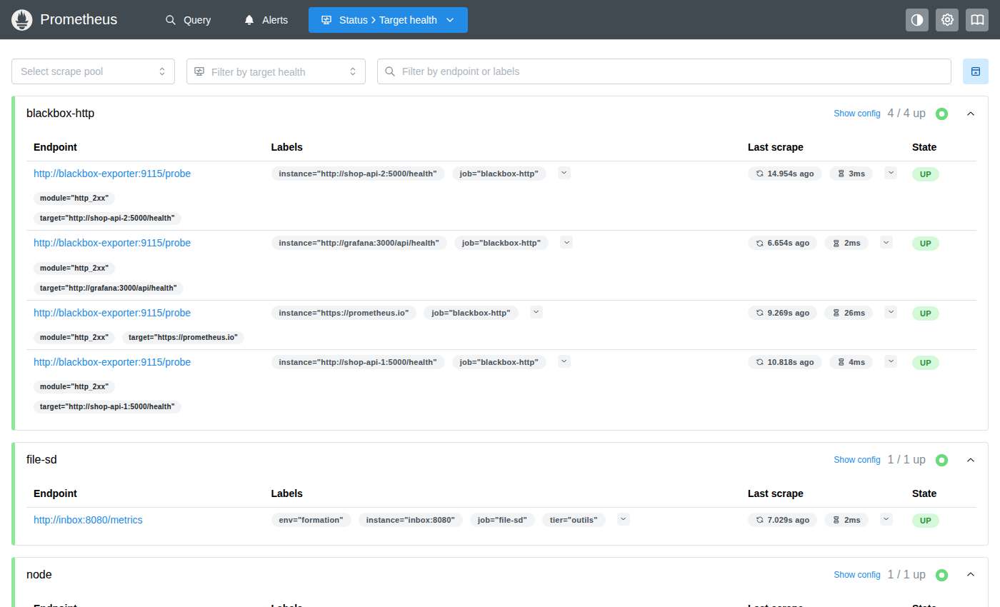

# Jour 1 — Voir : architecture et collecte

Objectif de la journée : à 17h30, chaque stagiaire a une stack qui collecte des métriques
système, des métriques applicatives et des métriques de services tiers, il sait lire un fichier
`prometheus.yml` sans trembler, et il a écrit ses premières requêtes.

| Heure | Séquence | Durée |
|---|---|---|
| 9h00 | Accueil, tour de table, cadrage | 30 min |
| 9h30 | Module 1 — Pourquoi l'observabilité | 35 min |
| 10h05 | Module 2 — Architecture de Prometheus et place de Grafana | 40 min |
| 10h45 | Pause | 15 min |
| 11h00 | Module 3 — Installation et prise en main + exercices 1.1 à 1.4 | 50 min |
| 11h50 | Module 4 — Configuration + exercices 1.5 à 1.8 | 40 min |
| 12h30 | Déjeuner | |
| 14h00 | Module 5 — Les exporters | 30 min |
| 14h30 | TP 1 — Node Exporter | 60 min |
| 15h30 | Pause | 15 min |
| 15h45 | Module 6 — Instrumenter son application | 30 min |
| 16h15 | TP 2 — Instrumentation et services tiers | 60 min |
| 17h15 | Récap, quiz, questions | 15 min |

---

## 9h00 — Accueil et cadrage (30 min)

**Ce que je dis.** Je me présente en deux minutes : architecte cloud, quinze ans d'infra, du
Kubernetes en banque, en santé, dans l'industrie, et surtout des nuits passées devant des écrans
noirs à me demander ce qui se passait. C'est ça qui m'a amené à l'observabilité : pas la
technologie, la douleur.

Tour de table, je note sur le paperboard pour chacun : prénom, poste, ce qu'ils surveillent
aujourd'hui et avec quoi (Zabbix, Centreon, Datadog, rien...), et **une panne dont ils se
souviennent**. Je réutiliserai ces pannes toute la semaine comme exemples. Ça met tout le monde
dans le bain et ça me dit tout de suite qui a déjà touché à Prometheus.

Les trois questions de positionnement (Qualiopi, mais surtout utiles) :
1. Quelle est la différence entre pull et push ?
2. Qu'est-ce qu'une série temporelle ?
3. Sauriez-vous dire si un bug est côté infra ou côté applicatif ?

Ce que je promets pour mercredi soir : « vous saurez diagnostiquer une panne de la boutique en
moins de cinq minutes, et vous aurez été prévenus par Teams avant que le client ne râle ».

Logistique : horaires, pauses, le dépôt GitHub, le guide stagiaire du jour (je ne donne que le
jour 1), et la règle : on cherche d'abord, je corrige ensuite.

**Ce que je montre.** Grafana avec le dashboard *TP 5 - Boutique en ligne* du corrigé, tout vert.
Puis `./lab.sh chaos errors on`, et je laisse tourner en arrière-plan : à la pause, le dashboard
sera rouge. « Voilà ce que vous saurez construire mercredi. »

---

## Module 1 — Pourquoi l'observabilité (35 min)

**Objectif.** Comprendre la différence entre monitoring et observabilité, situer les métriques
parmi les autres signaux, et comprendre pourquoi Prometheus a gagné.

### Ce que je dis

**Les deux pilotes.** Le pilote A a un voyant rouge « MOTEUR » qui s'allume. Il sait que c'est
grave, il ne sait pas pourquoi. Le pilote B a un écran qui dit « pression d'huile -40 %,
vibration sur l'axe Z ». Il coupe le moteur concerné, compense, se pose. Le monitoring
classique, c'est le voyant. L'observabilité, c'est l'écran. Notre métier pendant trois jours,
c'est de fabriquer l'écran.

**Définition utilisable.** Un système est observable quand on peut comprendre son état interne
à partir de ce qu'il expose vers l'extérieur, sans avoir à le rouvrir. Concrètement : quand
la question « pourquoi c'est lent ? » a une réponse en moins de cinq minutes.

**Les trois signaux.**
- Les *métriques* : des nombres horodatés. Peu coûteuses, agrégeables, parfaites pour les
  tendances et les alertes. C'est notre sujet.
- Les *logs* : des événements textuels. Riches, mais chers à stocker et à chercher.
- Les *traces* : le parcours d'une requête à travers les services. Indispensables en
  microservices.
Je cite Loki et Tempo (logs et traces côté Grafana) et OpenTelemetry (le standard
d'instrumentation) sans m'y attarder : on y revient au module 16.

**Pourquoi les métriques d'abord.** Une métrique coûte quelques octets par point. Un log en
coûte des centaines. Sur une flotte de cent serveurs, les métriques tiennent sur un disque de
portable ; les logs, non. Et surtout : c'est sur les métriques qu'on alerte.

> **Anecdote — le Black Friday.** Un site e-commerce, un vendredi de novembre. Tous les voyants
> infra au vert : CPU tranquille, mémoire tranquille, réseau tranquille. Chiffre d'affaires de
> la journée : zéro. Un bug JavaScript sur le bouton « Payer ». Personne n'avait de métrique
> « nombre de commandes par minute ». Le serveur allait très bien ; le business, lui, était à
> l'arrêt. C'est pour ça que notre boutique fil rouge expose `shop_orders_total` et
> `shop_revenue_euros_total` en plus de ses métriques HTTP. Surveiller la machine ne suffit
> jamais.

**Pull contre push.** Les outils historiques (Nagios, Zabbix, Graphite avec collectd) reposent
souvent sur un agent qui *pousse* ses données vers un serveur central. Prometheus fait
l'inverse : il va *chercher* (scraper) les métriques sur chaque cible en HTTP, à intervalle fixe.

Analogie du livreur de pizza contre le buffet : avec le push, si mille serveurs ont un souci en
même temps, mille livreurs sonnent chez vous en même temps ; le monitoring tombe précisément
au moment où on en a besoin. Avec le pull, Prometheus est le client du buffet : il se sert à son
rythme, et si une cible ne répond pas, c'est une information (`up == 0`), pas un silence.

Autres avantages concrets du pull :
- On sait immédiatement quand une cible est morte.
- Une cible expose ses métriques en HTTP, on peut les lire avec un simple `curl`. Débogage
  trivial.
- Pas de configuration côté cible pour savoir « où envoyer ».

Le push garde un cas d'usage : les jobs éphémères (un batch de 3 secondes ne sera jamais
scrapé). On verra la Pushgateway au TP 2.

**Un peu d'histoire, vite.** Né chez SoundCloud en 2012, inspiré de Borgmon (Google). Open
source en 2015. Deuxième projet accueilli par la CNCF en 2016 après Kubernetes, gradué en
2018. Aujourd'hui, c'est le standard de fait : Kubernetes, Docker, la plupart des bases de
données et des middlewares exposent nativement du format Prometheus. Version 3 sortie fin 2024 ;
on travaille sur la 3.15 (septembre 2026).

**Grafana** est né en 2014 comme un fork de Kibana 3, avec une idée : afficher des séries
temporelles de n'importe quelle source. Il ne stocke rien et ne collecte rien : il interroge
Prometheus (et Loki, Tempo, SQL, Elasticsearch...) et dessine. Version 13 sortie en avril
2026 ; on utilise la 13.2.

### Ce que je montre

Rien de technique ici. Je garde le dashboard rouge en arrière-plan.

### Points de vigilance

Les stagiaires venus de Zabbix ou Centreon demandent souvent « mais alors, il n'y a pas
d'agent ? ». Réponse : si, ça s'appelle un exporter, mais il est passif : il expose, il
n'envoie pas. On le voit cet après-midi.

---

## Module 2 — Architecture de Prometheus et place de Grafana (40 min)

**Objectif.** Connaître les composants, le modèle de données et les quatre types de métriques.
À la fin, un stagiaire doit pouvoir dessiner l'architecture au tableau.

### Ce que je dis

**Les composants.** Je dessine au tableau, dans cet ordre :

1. Les **cibles** (targets) : tout ce qui expose une page `/metrics` en HTTP. Une application
   instrumentée, un exporter.
2. Le **serveur Prometheus** : un seul binaire Go qui fait trois choses.
   - *Scraper* : toutes les 15 secondes (par défaut), il appelle chaque `/metrics`.
   - *Stocker* : dans sa base de séries temporelles locale, la TSDB.
   - *Évaluer* : des règles PromQL, pour pré-calculer (recording rules) ou pour alerter.
3. **Alertmanager** : un binaire séparé qui reçoit les alertes de Prometheus, les regroupe,
   les déduplique, les route vers Slack, Teams, PagerDuty, mail.
4. **Grafana** : interroge Prometheus en PromQL et dessine.
5. La **découverte de services** (service discovery) : au lieu de lister les cibles à la
   main, Prometheus les demande à Kubernetes, Consul, AWS, un fichier...

Analogie : Prometheus est un journaliste qui fait sa tournée toutes les 15 secondes et note
tout dans son carnet. Alertmanager est le rédacteur en chef qui décide ce qui mérite un coup
de fil à 3h du matin. Grafana est la maquette du journal.

**Le modèle de données.** C'est le concept le plus important de la journée.

Une *métrique* a un nom : `http_requests_total`. Une *série temporelle* est une métrique plus
un jeu de labels : `http_requests_total{method="GET", route="/api/products", status="200"}`.
Un *échantillon* (sample) est une valeur flottante et un timestamp en millisecondes.

Chaque combinaison de valeurs de labels crée une série distincte. C'est ce qui rend Prometheus
puissant (on peut découper par n'importe quelle dimension) et c'est ce qui le tue quand on
abuse (cardinalité, on y revient à la fin de la journée et au jour 3).

Les labels réservés : `job` (le nom du bloc de configuration), `instance` (l'adresse
`hôte:port`), et tout ce qui commence par `__` est interne.

**Les quatre types.**

| Type | Il fait quoi | Exemples | Ce qu'on en fait |
|---|---|---|---|
| Counter | Ne fait que monter (remis à zéro au redémarrage) | requêtes, erreurs, octets, commandes | `rate()`, `increase()` — jamais la valeur brute |
| Gauge | Monte et descend | mémoire, température, connexions actives, taille de file | valeur brute, `avg_over_time`, `max_over_time`, `deriv` |
| Histogram | Compte les observations par tranches (buckets) | latences, tailles de réponse | `histogram_quantile()` (p95, p99) |
| Summary | Quantiles calculés côté client | latences (ancienne école) | lecture directe des quantiles, non agrégeable |

L'analogie de la voiture pour le Counter : « mon compteur affiche 150 000 km, est-ce que je
roule vite ? » Aucune idée. Ce qui m'intéresse, c'est la dérivée : des km par heure. `rate()`
transforme un compteur kilométrique en vitesse. Règle d'or : **un Counter ne se lit jamais
brut**.

Histogram contre Summary : l'histogramme est calculé côté serveur, on peut additionner les
buckets de dix instances et calculer un p95 global. Le Summary calcule ses quantiles dans
l'application ; on ne peut pas faire la moyenne de deux p95. En 2026, on choisit l'histogramme
sauf cas très particulier. Je mentionne les *native histograms* (buckets exponentiels
automatiques, bien plus précis pour moins de séries), encore marqués expérimentaux dans
Prometheus 3.15 mais déjà utilisés en production par certains ; on les voit au jour 2.

**Le format d'exposition.** Du texte, lisible par un humain :

```
# HELP http_requests_total Nombre total de requêtes HTTP reçues
# TYPE http_requests_total counter
http_requests_total{method="GET",route="/api/products",status="200"} 51.0
```

Une ligne `HELP`, une ligne `TYPE`, puis une ligne par série. C'est tout. C'est pour ça que
tout le monde l'a adopté : n'importe quel langage peut produire ça avec un `printf`.

**La TSDB en deux mots.** Les échantillons arrivent dans un bloc en mémoire (le *head*), sont
journalisés dans un WAL (write-ahead log) pour survivre à un crash, puis toutes les deux heures
un bloc immuable est écrit sur disque. Compression très efficace : un échantillon pèse en
moyenne 1 à 2 octets. Rétention par défaut : 15 jours. On rentre dans le détail au jour 3.

**Où est Grafana dans tout ça.** Grafana ne voit jamais les cibles. Il ne connaît que
Prometheus, à qui il envoie des requêtes PromQL via l'API HTTP `/api/v1/query_range`. Si
Grafana affiche « No data », le réflexe est de tester la même requête directement dans
Prometheus pour savoir qui est en cause.

### Ce que je montre

- http://localhost:5001/metrics : je fais défiler, je pointe un `# TYPE ... counter`, un
  `gauge`, un `histogram` avec ses buckets `le=`, et le `summary` avec `_count` et `_sum`.
- http://localhost:9090 → **Status → Target health** : la liste des cibles, chacune avec son
  dernier scrape.


- Dans la barre de requête : `up`, puis `http_requests_total`. « Ça, c'est PromQL. On y passe la
  journée de demain. »

### Points de vigilance

Le Summary de notre application Python n'expose pas de quantiles (la bibliothèque Python ne
les implémente pas, uniquement `_count` et `_sum`). C'est un piège réel et un bon argument pour
l'histogramme. Pour montrer un vrai Summary avec quantiles, je prends `go_gc_duration_seconds`
exposé par Prometheus lui-même.

---

## Module 3 — Installation et prise en main (50 min)

**Objectif.** Savoir comment on installe Prometheus et Grafana « en vrai », et maîtriser
l'environnement du lab.

### Ce que je dis

**Rappels d'installation.** Cinq façons d'installer Prometheus, par ordre de fréquence en 2026 :

1. **Kubernetes avec l'opérateur** (kube-prometheus-stack, Helm) : le cas majoritaire en
   production. Les cibles sont découvertes automatiquement, la configuration passe par des
   objets `ServiceMonitor` et `PrometheusRule`.
2. **Conteneur Docker** : `docker run -p 9090:9090 -v ./prometheus.yml:/etc/prometheus/prometheus.yml prom/prometheus:v3.15.0`.
   C'est notre cas.
3. **Binaire** : une archive tar.gz sur GitHub, un seul exécutable, `./prometheus --config.file=prometheus.yml`.
   Idéal pour comprendre : pas de magie, un binaire, un fichier YAML, un dossier `data/`.
4. **Paquet distribution** (apt, dnf) : souvent en retard de plusieurs versions, je déconseille.
5. **Managé** : Grafana Cloud, Amazon Managed Prometheus, Google Cloud Managed Service for
   Prometheus, ou un stockage compatible (Mimir, VictoriaMetrics, Thanos). On en parle au
   jour 3.

Même chose pour Grafana : Helm, Docker (`grafana/grafana:13.2.1`), paquet `.deb`/`.rpm`
(Grafana Labs maintient ses propres dépôts, à jour), ou Grafana Cloud.

Les fichiers et dossiers qui comptent :

| Prometheus | Grafana |
|---|---|
| `prometheus.yml` : la configuration | `grafana.ini` (ou `custom.ini`, ou variables `GF_*`) |
| `--storage.tsdb.path` (défaut `data/`) : la base | `/var/lib/grafana` : la base SQLite `grafana.db`, les plugins |
| `--storage.tsdb.retention.time` (défaut 15d) | `/etc/grafana/provisioning/` : datasources, dashboards, alerting en YAML |
| `--web.enable-lifecycle` : autorise le reload par HTTP | port 3000, compte `admin` |
| port 9090 | |

**Pourquoi Docker pour la formation.** Parce qu'on a huit services à faire tourner et que je
veux que tout le monde ait exactement la même chose. Le `docker-compose.yml` est lisible : on
l'ouvre ensemble.

### Ce que je montre

J'ouvre `docker-compose.yml` et je commente service par service, sans entrer dans les
détails : les deux instances de la boutique, le générateur de trafic, Redis et son exporter,
la boîte de réception, Prometheus avec ses flags, Alertmanager, les exporters, Grafana avec
son provisioning. Je m'arrête sur les flags de Prometheus :

```yaml
command:
  - --config.file=/etc/prometheus/prometheus.yml
  - --storage.tsdb.path=/prometheus
  - --storage.tsdb.retention.time=7d
  - --web.enable-lifecycle          # POST /-/reload
  - --web.enable-admin-api          # snapshots (Jour 3)
  - --web.enable-remote-write-receiver
  - --web.external-url=http://localhost:9090
```

Puis `docker compose exec prometheus prometheus --help | head -60` pour montrer qu'il y a
une centaine de flags et que ceux-là sont les seuls qu'on touche en général.

### Exercice 1.1 — Démarrer et vérifier (10 min)

**Énoncé (guide stagiaire).**
1. Lancez la stack : `./lab.sh up` (ou `.\lab.ps1 up`, ou créez votre Codespace).
2. Vérifiez que tous les conteneurs sont `Up` : `./lab.sh status`.
3. Ouvrez Prometheus, Grafana (admin / formation), Alertmanager et l'Inbox dans quatre onglets.
4. Dans Prometheus, **Status → Target health** : combien de cibles sont `UP` ? Notez-les.

**Corrigé.** Trois cibles au démarrage : `prometheus` (localhost:9090) et les deux instances
`shop-api`. Le Node Exporter tourne mais n'est pas encore scrapé : c'est le TP 1.

**Ce que je vérifie.** Que tout le monde a bien 3/3 UP. Erreurs classiques : port 3000 déjà
pris (un autre Grafana, ou un serveur de dev Node) ; Docker Desktop pas démarré ; sur Windows,
le script bloqué par la politique d'exécution.

### Exercice 1.2 — Lire une page /metrics (10 min)

**Énoncé.** Ouvrez http://localhost:5001/metrics (ou le port 5001 dans l'onglet Ports).
1. Trouvez une métrique de chaque type : counter, gauge, histogram, summary. Notez leur nom.
2. Pour `http_request_duration_seconds`, combien de buckets ? Quelle est la borne du dernier ?
3. Quelle est la version de l'application ? Où est-elle stockée ?
4. Que vaut `shop_revenue_euros_total` ? Rechargez la page : elle a bougé ?

**Corrigé.**
1. Counter : `http_requests_total`, `shop_orders_total`, `shop_revenue_euros_total`. Gauge :
   `shop_cart_items`, `shop_stock_units`, `http_requests_in_progress`. Histogram :
   `http_request_duration_seconds` (`_bucket`, `_sum`, `_count`). Summary :
   `shop_payment_duration_seconds` (`_count`, `_sum`, pas de quantiles en Python).
2. 11 buckets explicites, de `le="0.005"` à `le="10.0"`, plus `le="+Inf"`. Chaque bucket est
   cumulatif : `le="0.5"` compte toutes les requêtes de moins de 500 ms.
3. `shop_app_info{version="1.4.2",instance_name="shop-api-1"} 1.0`. La valeur est toujours 1 ;
   l'information est dans les labels. C'est le pattern *info metric*, on l'utilisera au jour 2
   pour une jointure.
4. Elle monte à chaque commande. Un counter, donc.

Je fais remarquer les métriques `python_*` et `process_*` : la bibliothèque cliente les ajoute
gratuitement (mémoire du processus, GC, descripteurs de fichiers).

### Exercice 1.3 — L'interface de Prometheus (10 min)

**Énoncé.**
1. **Status → Configuration** : retrouvez le `scrape_interval` global.
2. **Status → Runtime & build information** : quelle version de Prometheus ? Depuis combien de
   temps tourne-t-il ?
3. **Status → TSDB status** : combien de séries en mémoire ? Quelle métrique a le plus de
   séries ?
4. Onglet **Query** : tapez `up` et exécutez. Puis passez en onglet **Graph**.

**Corrigé.** `scrape_interval: 15s`. Version 3.15.0. Environ 2 000 séries après quelques
minutes ; la métrique la plus « lourde » est `http_request_duration_seconds_bucket` (12 buckets
× routes × 2 instances). `up` renvoie 3 séries à 1.

Je fais remarquer la nouvelle interface de Prometheus 3 (l'onglet *Explain* qui décompose une
requête, le mode *Table* / *Graph*, la complétion dans la barre de requête).

### Exercice 1.4 — Premières requêtes (10 min)

**Énoncé.** Dans l'onglet Query :
1. `http_requests_total` : combien de séries ?
2. Ne gardez que les requêtes de `shop-api-2` (label `instance`).
3. Ne gardez que les erreurs (codes 4xx et 5xx) : label `status`, expression régulière.
4. Combien de requêtes `POST` sur `/api/checkout` depuis le démarrage de shop-api-1 ?

**Corrigé.**
1. Une vingtaine (ça dépend des routes déjà appelées) : chaque combinaison
   méthode × route × code × instance est une série.
2. `http_requests_total{instance="shop-api-2:5000"}`
3. `http_requests_total{status=~"4..|5.."}`
4. `http_requests_total{instance="shop-api-1:5000", method="POST", route="/api/checkout"}` :
   une valeur par code (201 et éventuellement 502).

Je ne vais pas plus loin : la syntaxe complète, c'est demain. L'important aujourd'hui, c'est
`{label="valeur"}`, `!=` et `=~`.

---

## Module 4 — Configuration de Prometheus (40 min)

**Objectif.** Lire et modifier `prometheus.yml` en sécurité : valider, recharger à chaud,
découvrir des cibles autrement qu'à la main, réécrire des labels.

### Ce que je dis

**Anatomie du fichier.** Quatre blocs :

```yaml
global:                 # les réglages par défaut
  scrape_interval: 15s
  evaluation_interval: 15s
  external_labels:      # ajoutés quand Prometheus parle à l'extérieur (Alertmanager, remote_write)
    cluster: formation
rule_files:             # règles d'enregistrement et d'alerte
  - rules/*.yml
alerting:               # où sont les Alertmanager
  alertmanagers:
    - static_configs:
        - targets: ["alertmanager:9093"]
scrape_configs:         # la liste des jobs
  - job_name: shop-api
    static_configs:
      - targets: ["shop-api-1:5000", "shop-api-2:5000"]
        labels:
          env: formation
```

Un *job* regroupe des cibles de même nature. Chaque cible reçoit automatiquement `job` et
`instance`. Les labels ajoutés sous `static_configs` s'appliquent à toutes les cibles du bloc.

**Le rythme.** `scrape_interval` : trop court, on charge les cibles et le disque ; trop long,
on rate les pics. 15 s est le standard, 30 s ou 60 s pour les gros parcs, 5 s pour un besoin
précis. On peut le surcharger job par job. Règle : la fenêtre de `rate()` (jour 2) doit faire
au moins 4 fois le `scrape_interval`.

**Recharger sans redémarrer.** Deux méthodes : `kill -HUP <pid>` ou, si `--web.enable-lifecycle`
est actif, `curl -X POST http://localhost:9090/-/reload`. Si le fichier est invalide, Prometheus
garde l'ancienne configuration et le dit dans ses logs, et la métrique
`prometheus_config_last_reload_successful` passe à 0. On alertera dessus au jour 3.

**Valider avant.** `promtool check config prometheus.yml`. Toujours. C'est le `nginx -t` de
Prometheus. Dans le lab : `./lab.sh check`.

**La découverte de services.** Lister les cibles à la main ne tient pas au-delà de dix
serveurs. Prometheus sait interroger : Kubernetes (`kubernetes_sd_configs`, le plus utilisé),
Consul, DNS, EC2/Azure/GCE, Docker, et le plus simple de tous, un fichier (`file_sd_configs`)
que n'importe quel script peut écrire. Le fichier est relu automatiquement, sans reload. C'est
le pont idéal avec un outil existant (CMDB, Ansible, Terraform).

**Le relabeling.** Entre la découverte d'une cible et son scrape, Prometheus passe la cible
dans une chaîne de règles `relabel_configs` qui peuvent renommer, filtrer, réécrire. C'est le
videur à l'entrée de la boîte de nuit : il regarde les labels (qui commencent par `__meta_` pour
la découverte) et décide qui entre et sous quel nom. `metric_relabel_configs` fait la même chose
après le scrape, sur chaque série : c'est là qu'on jette les métriques inutiles avant qu'elles
ne coûtent du disque. On en voit un usage concret avec le Blackbox Exporter au TP 2.

### Ce que je montre

- `./lab.sh check` puis je casse volontairement l'indentation d'une ligne, `./lab.sh check`
  refuse, je répare.
- `./lab.sh reload`, puis dans Prometheus **Status → Configuration** pour montrer que c'est
  bien la version rechargée.
- `docker compose logs --tail 20 prometheus` pour montrer la ligne `Completed loading of configuration file`.

### Exercice 1.5 — Changer le rythme (10 min)

**Énoncé.**
1. Pour le job `shop-api` uniquement, passez le `scrape_interval` à 5 s.
2. Validez la configuration, rechargez.
3. Vérifiez dans **Status → Target health** (colonne *Last scrape*) et avec la requête
   `prometheus_target_interval_length_seconds{quantile="0.99"}`.

**Corrigé.**

```yaml
  - job_name: shop-api
    scrape_interval: 5s
    static_configs:
      - targets: ["shop-api-1:5000", "shop-api-2:5000"]
```

`./lab.sh check && ./lab.sh reload`. Dans Target health, *Last scrape* ne dépasse plus 5 s.
La requête renvoie une série par intervalle configuré : on voit apparaître `interval="5s"`.
Je demande ensuite de **remettre 15 s** : on ne veut pas fausser les exercices `rate()` de demain.

**Ce que je vérifie.** Que le reload a été fait (beaucoup oublient et attendent que ça change
tout seul).

### Exercice 1.6 — Casser pour comprendre (5 min)

**Énoncé.**
1. Introduisez une erreur dans `prometheus.yml` (un `:` en trop, un tiret manquant).
2. Rechargez **sans** valider. Que se passe-t-il ? Regardez les logs et la métrique
   `prometheus_config_last_reload_successful`.
3. Réparez, rechargez, vérifiez que la métrique repasse à 1.

**Corrigé.** Le `curl -X POST /-/reload` renvoie une erreur HTTP 500 avec le message de parsing.
Prometheus continue de tourner avec l'ancienne configuration. La métrique vaut 0 tant que le
fichier est invalide. Message à faire passer : Prometheus est conservateur, mais une
configuration cassée qui traîne, personne ne s'en rend compte sans alerte.

### Exercice 1.7 — Découverte par fichier (10 min)

**Énoncé.** La boîte de réception (`inbox`) expose aussi une page `/metrics` sur le port 8080.
Ajoutez-la à Prometheus **sans** la lister dans `prometheus.yml` :
1. Ajoutez un job `file-sd` qui lit tous les fichiers `targets/*.yml`.
2. Créez `prometheus/targets/extra.yml` avec la cible `inbox:8080` et un label `tier: outils`.
3. Vérifiez sans recharger que la cible apparaît (comptez jusqu'à 30).

**Corrigé.**

```yaml
  - job_name: file-sd
    file_sd_configs:
      - files: ["targets/*.yml", "targets/*.json"]
        refresh_interval: 30s
```

`prometheus/targets/extra.yml` :

```yaml
- targets: ["inbox:8080"]
  labels:
    tier: outils
```

Un reload est nécessaire pour le nouveau job (une fois), pas pour les fichiers de cibles qui
sont relus toutes les 30 s. Dans Target health, le job `file-sd` apparaît avec la cible
`inbox:8080` UP, et `inbox_messages_received_total` est disponible. On l'utilisera au jour 3
pour compter les notifications reçues.

**Ce que je vérifie.** Le chemin des fichiers est relatif au dossier de `prometheus.yml`
(`/etc/prometheus` dans le conteneur, donc `prometheus/targets/` sur la machine). Erreur
classique : écrire un chemin absolu de la machine hôte.

### Exercice 1.8 — Relabeling (bonus, 10 min)

**Énoncé.** L'exporter Redis (`redis-exporter:9121`) expose ses propres métriques Go
(`go_*`, `process_*`, `promhttp_*`) en plus des métriques Redis. Ajoutez un job `redis-light`
qui scrape cet exporter en jetant ces métriques internes. Comparez le nombre de séries des
deux jobs avec `count by (job) ({job=~"redis.*"})` (il faudra avoir fait le TP 2 pour le job
`redis` complet ; sinon, comparez avant/après en changeant le job).

**Corrigé.**

```yaml
  - job_name: redis-light
    static_configs:
      - targets: ["redis-exporter:9121"]
    metric_relabel_configs:
      - source_labels: [__name__]
        regex: "go_.*|process_.*|promhttp_.*"
        action: drop
```

Le job complet a une trentaine de séries de plus. Sur un parc de cinq cents exporters, c'est
quinze mille séries économisées. C'est le genre de règle qu'on met en place dès le début et
qu'on oublie ensuite.

---

## Module 5 — Les exporters (30 min)

**Objectif.** Comprendre ce qu'est un exporter, savoir en choisir un et le configurer.

### Ce que je dis

**Le problème.** Prometheus parle HTTP et ne comprend que son format texte. Le noyau Linux
parle `/proc` et `/sys`. PostgreSQL parle SQL. Un switch parle SNMP. Un exporter est un
adaptateur : un petit programme qui interroge le système d'un côté et expose une page
`/metrics` de l'autre. L'adaptateur de prise universel.

**Les incontournables.**

| Exporter | Pour quoi | Port habituel |
|---|---|---|
| node_exporter | Linux : CPU, mémoire, disque, réseau, systemd | 9100 |
| windows_exporter | Windows : idem, plus IIS, MSSQL, AD | 9182 |
| blackbox_exporter | Sondes externes : HTTP, TCP, ICMP, DNS, TLS | 9115 |
| cAdvisor / kube-state-metrics | Conteneurs / objets Kubernetes | 8080 |
| postgres_exporter, mysqld_exporter, redis_exporter, mongodb_exporter | Bases de données | 9187, 9104, 9121, 9216 |
| snmp_exporter | Équipements réseau | 9116 |
| pushgateway | Pas un exporter : un relais pour les batchs | 9091 |

Le catalogue officiel (prometheus.io/docs/instrumenting/exporters) en liste des centaines.
Avant d'en écrire un, on vérifie qu'il n'existe pas. Et de plus en plus de logiciels exposent
nativement du Prometheus : Traefik, HAProxy, Kubernetes, etcd, RabbitMQ, Kafka, Grafana lui-même.

**Node Exporter en détail.** Une soixantaine de *collectors*, une trentaine activés par
défaut (cpu, meminfo, filesystem, netdev, loadavg, diskstats, uname, time...). On active ou
désactive avec `--collector.<nom>` / `--no-collector.<nom>`. Le collector `textfile` lit des
fichiers `.prom` dans un dossier : n'importe quel script cron peut y déposer des métriques.
C'est la Pushgateway du pauvre, et elle est souvent préférable.

> **Le piège Docker.** Un Node Exporter lancé dans un conteneur sans précaution voit le
> conteneur : un processeur virtuel, quelques mégaoctets, un système de fichiers overlay. Il
> faut lui monter `/proc`, `/sys` et `/` de l'hôte en lecture seule et lui dire où les trouver
> (`--path.procfs`, `--path.sysfs`, `--path.rootfs`). C'est ce que fait notre compose. Et sur
> Docker Desktop (Mac, Windows), « l'hôte » est la VM Linux de Docker, pas votre machine. En
> production sur Linux, on l'installe plutôt en paquet ou en binaire directement sur l'hôte.

**Blackbox Exporter.** Tous les autres exporters disent « je vais bien » de l'intérieur.
Le blackbox teste de l'extérieur, comme un client : la page répond-elle en 200 ? Le certificat
expire-t-il bientôt ? Le port 5432 accepte-t-il une connexion ? Il fonctionne à l'envers des
autres : Prometheus l'appelle sur `/probe?module=http_2xx&target=https://...`, et c'est là que
le relabeling devient indispensable.

**Pushgateway.** Pour les jobs trop courts pour être scrapés. Le job pousse ses métriques,
la Pushgateway les garde et Prometheus les scrape. Attention : elle ne les oublie jamais (pas
de TTL) et elle transforme le pull en push avec tous ses défauts. Uniquement pour les batchs,
jamais pour des services.

### Ce que je montre

- http://localhost:9100/metrics : `node_cpu_seconds_total` avec ses modes, `node_memory_MemAvailable_bytes`,
  `node_filesystem_avail_bytes`, `node_uname_info`.
- http://localhost:9115 : la page du blackbox avec l'historique des sondes (vide pour l'instant), puis
  http://localhost:9115/probe?module=http_2xx&target=http://shop-api-1:5000/health pour montrer
  `probe_success 1` et `probe_duration_seconds`.

---

## TP 1 — Node Exporter : de la machine à Prometheus (60 min)

**Objectif.** Le cas pratique du programme : ajouter et configurer un Node Exporter, en tirer
les indicateurs classiques d'un serveur Linux.

**Mise en situation (guide stagiaire).** Vous venez de recevoir un serveur. Avant d'y déployer
quoi que ce soit, vous voulez ses signes vitaux dans Prometheus : CPU, mémoire, disque, réseau,
uptime. Et vous voulez pouvoir y ajouter vos propres indicateurs avec un simple script.

### Partie 1 — Brancher l'exporter (10 min)

**Énoncé.**
1. Dans `prometheus/prometheus.yml`, ajoutez un job `node` qui scrape `node-exporter:9100`.
2. Validez, rechargez, vérifiez la cible dans Target health.
3. Requête : `node_uname_info`. Quel noyau ? Quel nom de machine ?

**Corrigé.**

```yaml
  - job_name: node
    static_configs:
      - targets: ["node-exporter:9100"]
```

`node_uname_info{nodename="...", release="6.x..."}`. Sur Docker Desktop, le `nodename` est
celui de la VM (par exemple `docker-desktop`). Sur Codespaces, celui du conteneur de dev.

### Partie 2 — Les indicateurs de base (15 min)

**Énoncé.** Écrivez une requête pour chacun des indicateurs suivants (on accepte des
approximations, la syntaxe complète est pour demain, les fonctions nécessaires sont données) :
1. Uptime en secondes : `time()` et `node_boot_time_seconds`.
2. Mémoire disponible en pourcentage : `node_memory_MemAvailable_bytes`, `node_memory_MemTotal_bytes`.
3. Espace disque utilisé en % sur `/` : `node_filesystem_avail_bytes`, `node_filesystem_size_bytes`, label `mountpoint`.
4. Charge moyenne 1 min : `node_load1`.
5. CPU utilisé en % (la formule est donnée, à recopier et à comprendre) :
   `100 * (1 - avg(rate(node_cpu_seconds_total{mode="idle"}[5m])))`.

**Corrigé.**
1. `time() - node_boot_time_seconds`
2. `100 * node_memory_MemAvailable_bytes / node_memory_MemTotal_bytes`
3. `100 * (1 - node_filesystem_avail_bytes{mountpoint="/"} / node_filesystem_size_bytes{mountpoint="/"})`
4. `node_load1` (et je fais comparer à `count(node_cpu_seconds_total{mode="idle"})`, le nombre
   de cœurs : une charge de 2 sur 2 cœurs, c'est plein).
5. La formule : `node_cpu_seconds_total` est un counter par cœur et par mode (secondes passées
   dans chaque mode). `rate(...[5m])` donne la fraction du temps passée en `idle` sur 5 min,
   par cœur. `avg` fait la moyenne des cœurs. `1 - idle` = occupé. `× 100` = pourcentage.
   Je passe cinq minutes là-dessus, c'est la requête la plus recopiée de l'histoire de
   Prometheus et personne ne la comprend la première fois.

Je fais lancer `./lab.sh chaos cpu 120` et observer la courbe monter sur l'onglet Graph.

### Partie 3 — Configurer les collectors (10 min)

**Énoncé.**
1. Le collector `processes` (nombre de processus, threads) est désactivé par défaut. Activez-le
   en ajoutant `--collector.processes` aux `command` du service `node-exporter` dans
   `docker-compose.yml`, puis `docker compose up -d node-exporter`.
2. Vérifiez l'apparition de `node_processes_state` et `node_processes_threads`.
3. Désactivez un collector inutile pour vous (par exemple `--no-collector.arp`) et vérifiez que
   `node_arp_entries` disparaît de `/metrics`.

**Corrigé.**

```yaml
    command:
      - --path.procfs=/host/proc
      - --path.sysfs=/host/sys
      - --path.rootfs=/rootfs
      - --collector.filesystem.mount-points-exclude=^/(sys|proc|dev|host|etc|rootfs/var/lib/docker/.+)($$|/)
      - --collector.textfile.directory=/textfile
      - --collector.processes
      - --no-collector.arp
```

Remarque à faire : dans une chaîne compose, `$$` échappe le `$` de la regex. Ce n'est pas un
piège du Node Exporter, c'est un piège de compose. Et `node_arp_entries` disparaît de la page
`/metrics` mais reste dans Prometheus pendant quelques minutes (les séries périmées, on en
parle au jour 3).

### Partie 4 — Le textfile collector (10 min)

**Énoncé.** Vous avez un script de sauvegarde en cron. Vous voulez savoir quand il a tourné pour
la dernière fois.
1. Créez `node-exporter/textfile/backup.prom` avec une gauge `backup_last_run_timestamp_seconds`
   (valeur : le timestamp actuel, `date +%s`) et une gauge `backup_files_total` (valeur au choix).
2. Vérifiez sur http://localhost:9100/metrics puis dans Prometheus.
3. Calculez « il y a combien de temps » : `time() - backup_last_run_timestamp_seconds`.

**Corrigé.**

```
# HELP backup_last_run_timestamp_seconds Dernière exécution du script de sauvegarde
# TYPE backup_last_run_timestamp_seconds gauge
backup_last_run_timestamp_seconds 1790404000
# HELP backup_files_total Fichiers sauvegardés lors de la dernière exécution
# TYPE backup_files_total gauge
backup_files_total 1234
```

Sur Mac/Linux : `echo "backup_last_run_timestamp_seconds $(date +%s)" > node-exporter/textfile/backup.prom`.
Sur Windows PowerShell : `"backup_last_run_timestamp_seconds $([DateTimeOffset]::UtcNow.ToUnixTimeSeconds())" | Set-Content node-exporter/textfile/backup.prom`.

Point d'attention : le fichier doit se terminer par un saut de ligne, et une erreur de format
fait échouer tout le fichier (métrique `node_textfile_scrape_error` à 1). Je montre la métrique.

> **Anecdote — les sauvegardes fantômes.** Chez un client, un script de sauvegarde écrivait
> « OK » dans un log depuis dix-huit mois. Personne ne lisait le log. Le jour où on a eu besoin
> de restaurer, la dernière sauvegarde valide datait de dix-huit mois : le montage NFS avait
> disparu, le script écrivait dans le vide. Une gauge `backup_last_success_timestamp_seconds`
> et une alerte « plus de 24 h » auraient coûté dix minutes. On écrit cette alerte au jour 3.

### Partie 5 — Vue d'ensemble (15 min)

**Énoncé.**
1. Quel est le disque (`mountpoint`) le plus rempli ? Utilisez `topk(1, ...)` sur la requête de
   la partie 2.
2. Combien d'octets par seconde entrent sur les interfaces réseau (hors `lo`) ?
   `rate(node_network_receive_bytes_total{device!="lo"}[5m])`.
3. Dans Grafana, **Explore** (menu de gauche) : collez la requête CPU et regardez-la sur les
   30 dernières minutes. Repérez le moment où vous avez lancé le chaos CPU.
4. Bonus : importez le dashboard communautaire *Node Exporter Full* (Dashboards → New → Import,
   ID `1860`) et regardez ce que vous saurez construire demain. Attention, il a besoin d'un
   accès à grafana.com pour l'import par ID ; sinon, on s'en passe.

**Corrigé.** `topk(1, 100 * (1 - node_filesystem_avail_bytes / node_filesystem_size_bytes))`.
Le dashboard 1860 est parfait pour montrer la puissance de Grafana... et ses excès : trois cents
panneaux, personne ne les lit. Demain on construira le nôtre, avec dix panneaux qui répondent à
de vraies questions.

**Ce que je vérifie.** Que le job `node` est bien dans le `prometheus.yml` de tout le monde :
les dashboards de demain en dépendent.

---

## Module 6 — Instrumenter son application (30 min)

**Objectif.** Savoir ajouter une métrique dans du code, choisir son type et ses labels, éviter
l'explosion de cardinalité.

### Ce que je dis

**Whitebox contre blackbox.** Le Node Exporter et le Blackbox regardent l'application de
l'extérieur. Instrumenter, c'est mettre des sondes à l'intérieur : on sait combien de commandes
ont été passées, combien de paiements ont échoué, combien de temps prend l'appel à la banque.
C'est la seule façon d'avoir des métriques *métier*.

**Les bibliothèques clientes.** Officielles : Go, Java/JVM (et Micrometer pour Spring), Python,
Ruby, Rust. Communautaires pour tout le reste (.NET avec prometheus-net, Node.js avec
prom-client, PHP...). Toutes font la même chose : on déclare des objets Counter/Gauge/
Histogram/Summary, on les met à jour dans le code, et la bibliothèque expose `/metrics`. Pas de
base de données, pas de fichier : tout est en mémoire dans le processus, ce qui explique le
compteur remis à zéro au redémarrage.

Le code de notre boutique (`apps/shop-api/app.py`) :

```python
HTTP_REQUESTS = Counter("http_requests_total", "Nombre total de requêtes HTTP reçues",
                        ["method", "route", "status"])
HTTP_DURATION = Histogram("http_request_duration_seconds", "Durée de traitement",
                          ["route"], buckets=(0.005, 0.01, 0.025, 0.05, 0.1, 0.25, 0.5, 1, 2.5, 5, 10))
ORDERS = Counter("shop_orders_total", "Commandes validées", ["payment_method"])
STOCK = Gauge("shop_stock_units", "Unités en stock par produit", ["product"])

# dans le code
HTTP_REQUESTS.labels(method="POST", route="/api/checkout", status="201").inc()
HTTP_DURATION.labels(route="/api/checkout").observe(0.083)
ORDERS.labels(payment_method="card").inc()
STOCK.labels(product="clavier").set(84)
```

**Les conventions de nommage.** Elles comptent, parce que PromQL et les dashboards
communautaires les supposent :
- `snake_case`, préfixe du domaine : `http_`, `shop_`, `node_`, `process_`.
- L'unité en suffixe, en unités de base : `_seconds`, `_bytes`, `_total` pour les counters. Pas
  de millisecondes, pas de kilo-octets : Grafana convertit.
- Un nom décrit une chose mesurée, les labels la découpent. `http_requests_total{status="500"}`,
  pas `http_errors_500_total`.
- Une gauge d'information : `_info` avec valeur 1.

**Les buckets d'histogramme.** Par défaut : de 5 ms à 10 s, adaptés à du web. Pour un batch
qui dure des minutes ou une requête SQL en microsecondes, on les redéfinit. Un p95 ne peut pas
être plus précis que les buckets : si tout tombe entre `le="0.5"` et `le="1"`, le p95 dira
« quelque part entre 500 ms et 1 s ». C'est l'argument des native histograms.

**RED et USE.** Deux méthodes pour ne rien oublier :
- Pour un *service* : **R**ate (débit), **E**rrors, **D**uration. Nos trois métriques HTTP.
- Pour une *ressource* (CPU, disque, file) : **U**tilisation, **S**aturation, **E**rrors.
Les *golden signals* de Google SRE ajoutent la saturation aux trois de RED.

**La cardinalité, le seul vrai danger.** Chaque valeur distincte d'un label crée une série.
Une série coûte de la mémoire (quelques ko dans le head) et de l'index. Quelques règles :
- `method` (5 valeurs), `status` (10), `route` (50) : parfait.
- `user_id`, `session_id`, `request_id`, une adresse IP client, un email : interdit. Un million
  d'utilisateurs = un million de séries = Prometheus qui meurt.
- `route` doit être le *pattern* (`/api/products/<product>`), jamais l'URL réelle
  (`/api/products/clavier`). C'est ce que fait notre middleware avec `request.url_rule.rule`.
- Une recherche `?q=` ne doit jamais devenir un label. Notre route `/api/search` le dit en
  commentaire.

> **Anecdote — le label qui a tué Prometheus.** Une équipe avait ajouté `customer_id` sur ses
> métriques HTTP « pour pouvoir filtrer par client ». Trente mille clients, cinquante routes,
> dix codes HTTP : quinze millions de séries. Prometheus consommait 60 Go de RAM et redémarrait
> toutes les heures. Solution : retirer le label, et pour le besoin réel (un client se plaint),
> passer par les logs ou les traces, qui sont faits pour les données à forte cardinalité.

### Ce que je montre

`apps/shop-api/app.py` dans l'éditeur : les déclarations en haut, le middleware `after_request`
qui observe chaque requête, la route `/api/checkout` qui incrémente les compteurs métier. Je
pointe le `TODO` du TP 2.

---

## TP 2 — Instrumentation et services tiers (60 min)

**Objectif.** Ajouter une métrique métier dans le code, brancher un exporter tiers, des sondes
externes et un batch. À la fin, `prometheus.yml` compte sept jobs.

**Mise en situation.** Le directeur commercial veut savoir quelles fiches produit sont les plus
consultées. L'équipe infra veut surveiller Redis. Le support veut être prévenu si le site est
inaccessible depuis l'extérieur. Et il y a ce batch de sauvegarde nocturne...

### Partie 1 — Une métrique métier dans le code (15 min)

**Énoncé.**
1. Dans `apps/shop-api/app.py`, déclarez un Counter `shop_product_views_total` avec un label
   `product` (cherchez le `TODO`).
2. Incrémentez-le dans la route `/api/products/<product>`.
3. Reconstruisez et redémarrez les deux instances : `docker compose up -d --build shop-api-1 shop-api-2`.
4. Vérifiez sur `/metrics`, puis dans Prometheus : quel produit est le plus consulté ?
   `topk(1, sum by (product) (shop_product_views_total))`.

**Corrigé.**

```python
PRODUCT_VIEWS = Counter(
    "shop_product_views_total",
    "Consultations de fiche produit",
    ["product"],
)
```

Dans `product_detail`, avant `redis_incr(...)` :

```python
    PRODUCT_VIEWS.labels(product=product).inc()
```

Le `clavier` gagne (le générateur de trafic le favorise). Question à poser : « pourquoi
l'incrément est-il placé *après* le test `if product not in PRODUCTS` ? » Parce que sinon,
n'importe qui pourrait créer des séries à l'infini en appelant `/api/products/nimportequoi`.
Le label `product` n'est sûr que parce que ses valeurs sont bornées par le catalogue.

**Ce que je vérifie.** Le rebuild : `docker compose up -d` sans `--build` relance l'ancienne
image et rien ne change. Sur Codespaces, le build prend 30 à 60 s.

### Partie 2 — Un exporter tiers : Redis (10 min)

**Énoncé.** La boutique stocke des compteurs dans Redis. Un `redis-exporter` tourne déjà sur
le port 9121.
1. Ajoutez le job `redis` dans `prometheus.yml`. Validez, rechargez.
2. Requêtes : `redis_up`, `redis_connected_clients`, `rate(redis_commands_processed_total[5m])`.
3. Trouvez la commande Redis la plus utilisée : `topk(3, rate(redis_commands_total[5m]))`.

**Corrigé.**

```yaml
  - job_name: redis
    static_configs:
      - targets: ["redis-exporter:9121"]
```

`INCR` domine (chaque appel API incrémente un compteur). Remarque : l'exporter est configuré
par variable d'environnement `REDIS_ADDR` dans le compose ; c'est le pattern habituel, un
exporter par instance de service, colocalisé (sidecar en Kubernetes).

### Partie 3 — Sondes externes avec Blackbox (15 min)

**Énoncé.** Vous voulez vérifier depuis l'extérieur que :
- `http://shop-api-1:5000/health` et `http://shop-api-2:5000/health` répondent 2xx,
- `http://grafana:3000/api/health` répond,
- `https://prometheus.io` est joignable (accès Internet nécessaire ; sinon, ignorez).

1. Ajoutez un job `blackbox-http` avec `metrics_path: /probe`, le paramètre `module: [http_2xx]`,
   les quatre cibles, et le relabeling qui fait passer la cible en paramètre `target` et
   redirige l'adresse vers `blackbox-exporter:9115`. Le squelette est dans le guide stagiaire ;
   à vous de le compléter.
2. Requêtes : `probe_success`, `probe_duration_seconds`, `probe_http_status_code`.
3. Arrêtez `shop-api-2` (`docker compose stop shop-api-2`) et observez `probe_success` et `up`.
   Redémarrez-le.
4. Bonus : `probe_ssl_earliest_cert_expiry - time()` pour prometheus.io : dans combien de jours
   le certificat expire-t-il ?

**Corrigé.**

```yaml
  - job_name: blackbox-http
    metrics_path: /probe
    params:
      module: [http_2xx]
    static_configs:
      - targets:
          - http://shop-api-1:5000/health
          - http://shop-api-2:5000/health
          - http://grafana:3000/api/health
          - https://prometheus.io
    relabel_configs:
      - source_labels: [__address__]
        target_label: __param_target
      - source_labels: [__param_target]
        target_label: instance
      - target_label: __address__
        replacement: blackbox-exporter:9115
```

Je décortique les trois règles au tableau, c'est le meilleur exemple de relabeling qui existe :
1. L'adresse de la cible (`__address__`, ce que Prometheus s'apprête à scraper) est copiée dans
   `__param_target`, ce qui ajoute `?target=...` à l'URL.
2. Cette même valeur devient le label `instance`, pour qu'on sache de quelle cible on parle.
3. Enfin, `__address__` est remplacée par l'adresse de l'exporter : c'est lui qu'on scrape.

Résultat : Prometheus appelle `http://blackbox-exporter:9115/probe?module=http_2xx&target=http://shop-api-1:5000/health`
et étiquette le résultat `instance="http://shop-api-1:5000/health"`.

Quand on arrête `shop-api-2` : `up{job="shop-api", instance="shop-api-2:5000"}` passe à 0 (la
cible est injoignable) mais `up{job="blackbox-http", instance="http://shop-api-2:5000/health"}`
reste à 1 (l'exporter, lui, répond très bien) et c'est `probe_success` qui passe à 0. C'est LE
point à faire comprendre : avec le blackbox, `up` ne veut pas dire ce qu'on croit.

Division par 86400 pour les jours de certificat.

### Partie 4 — Un batch et la Pushgateway (10 min)

**Énoncé.**
1. Lancez le batch : `./lab.sh batch` (il simule une sauvegarde de quelques secondes et pousse
   trois métriques). Regardez http://localhost:9091.
2. Ajoutez le job `pushgateway` avec `honor_labels: true`. Validez, rechargez.
3. Requêtes : `backup_duration_seconds`, `backup_size_megabytes`, et l'ancienneté de la
   dernière sauvegarde : `time() - backup_last_success_timestamp_seconds`.
4. Sans `honor_labels`, que se passerait-il ? Essayez.

**Corrigé.**

```yaml
  - job_name: pushgateway
    honor_labels: true
    static_configs:
      - targets: ["pushgateway:9091"]
```

Le script (`scripts/batch-job.sh`) pousse sur `/metrics/job/backup/instance/nightly` : les
labels `job="backup"` et `instance="nightly"` font partie de la donnée. Sans `honor_labels`,
Prometheus les écraserait avec `job="pushgateway"` et `instance="pushgateway:9091"` (et
renommerait les originaux `exported_job`, `exported_instance`). Avec, il les respecte.

Je relance le batch deux fois : les valeurs changent, mais la Pushgateway ne garde que la
dernière. Et si le batch ne tourne plus jamais, la métrique reste là, figée, avec son
timestamp qui vieillit : c'est exactement ce qu'on veut pour alerter.

### Partie 5 — Chasse à la cardinalité (bonus, 10 min)

**Énoncé.**
1. Quelles sont les dix métriques qui ont le plus de séries ?
   `topk(10, count by (__name__) ({__name__=~".+"}))`.
2. Combien de séries au total ? `prometheus_tsdb_head_series`. Combien ajoutées par le job
   `redis` ? `count({job="redis"})`.
3. Discussion : si la boutique passait à 200 routes et 50 instances, combien de séries pour
   `http_request_duration_seconds_bucket` ? Est-ce raisonnable ?

**Corrigé.** Les buckets d'histogrammes dominent toujours. 200 routes × 50 instances × 12
buckets × quelques méthodes = plusieurs centaines de milliers de séries pour une seule
métrique. Réponse : on réduit les buckets (6 ou 7 bien choisis), on agrège avec des recording
rules (jour 2), ou on passe aux native histograms.

---

## 17h15 — Récap et quiz du jour 1 (15 min)

Je fais le tour à l'oral, réponses au tableau :

1. Pull ou push : Prometheus fait quoi, et pourquoi ? *(pull ; résilience, `up`, débogage au curl)*
2. Que vaut un Counter brut ? *(rien ; toujours `rate()` ou `increase()`)*
3. Trois labels qu'on ne met jamais sur une métrique. *(user id, request id, IP, email, URL brute...)*
4. Que fait `honor_labels: true` ? *(garde les labels `job`/`instance` de la cible au lieu de les écraser)*
5. Comment vérifier une configuration avant de recharger ? *(`promtool check config`)*
6. Pourquoi `up` reste à 1 quand une cible du blackbox tombe ? *(on scrape l'exporter, pas la cible ; c'est `probe_success` qui compte)*
7. Le Node Exporter dans Docker Desktop mesure quoi ? *(la VM Linux)*
8. Quel est le suffixe d'un counter ? D'une durée ? *(`_total`, `_seconds`)*

**État attendu du `prometheus.yml` ce soir** : jobs `prometheus`, `shop-api`, `node`, `file-sd`,
`redis`, `pushgateway`, `blackbox-http` (et `redis-light` pour ceux qui ont fait le bonus). Le
corrigé complet est `solutions/jour-1/prometheus.yml`. Je demande à chacun de le comparer avec le
sien avant de partir : demain matin, tout le monde repart du même point.

Je rappelle : ne pas faire `./lab.sh reset` ce soir, on veut de l'historique pour demain. Sur
Codespaces, le Codespace peut s'arrêter, les données restent.
