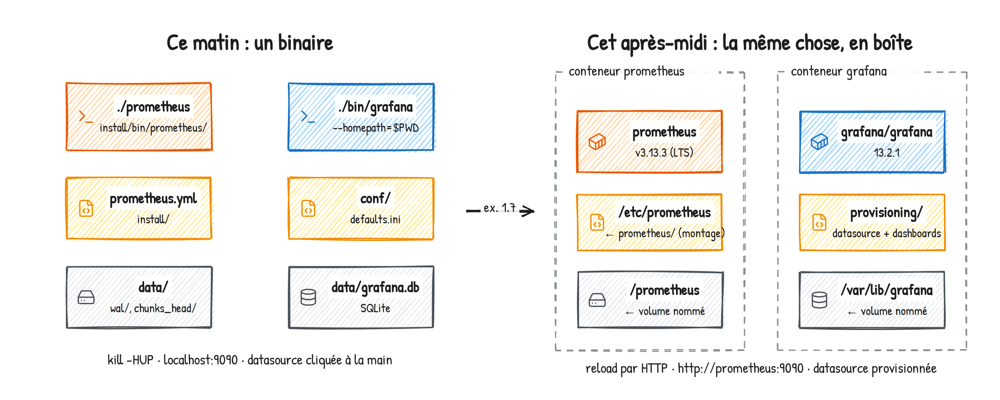
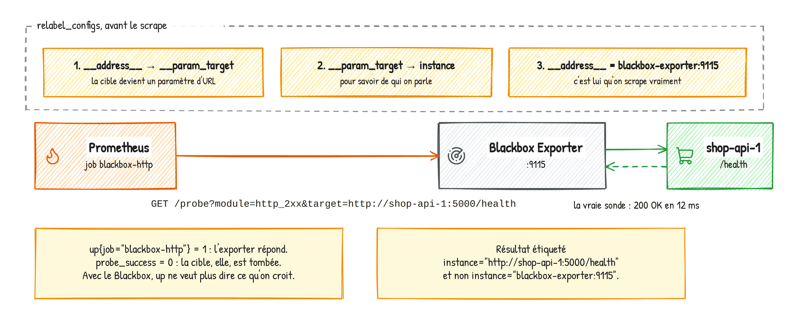

# Jour 1 — Voir : architecture et collecte

Objectif de la journée : à 17h30, chaque stagiaire a construit lui-même, brique par brique,
une stack qui collecte des métriques système, applicatives et de services tiers. Il a lancé
Prometheus et Grafana en binaires avant de les mettre en conteneur, il sait lire un fichier
`prometheus.yml` sans trembler, et il a écrit ses premières requêtes.

| Heure | Séquence | Durée |
|---|---|---|
| 9h00 | Accueil, tour de table, cadrage | 30 min |
| 9h30 | Module 1 — Pourquoi l'observabilité | 30 min |
| 10h00 | Module 2 — Architecture de Prometheus et place de Grafana | 35 min |
| 10h35 | Pause | 15 min |
| 10h50 | Module 3 — Installer à la main : exercices 1.1 à 1.4 (Prometheus puis Grafana en binaires) | 60 min |
| 11h50 | Module 4 — Configuration : exercices 1.5 et 1.6 | 40 min |
| 12h30 | Déjeuner | |
| 14h00 | Exercice 1.7 — Des binaires aux conteneurs (briques 1 et 2) | 20 min |
| 14h20 | Module 5 — Les exporters | 25 min |
| 14h45 | TP 1 — Node Exporter (brique 4) | 55 min |
| 15h40 | Pause | 15 min |
| 15h55 | Module 6 — Instrumenter son application | 25 min |
| 16h20 | TP 2 — Application, instrumentation, services tiers (briques 3 et 5) | 60 min |
| 17h20 | Récap, quiz, questions | 10 min |

---

## 9h00 — Accueil et cadrage (30 min)

**Ce que je dis.** Je me présente en deux minutes : architecte cloud, quinze ans d'infra, du
Kubernetes en banque, en santé, dans l'industrie, et surtout des nuits passées devant des écrans
noirs à me demander ce qui se passait. C'est ça qui m'a amené à l'observabilité : pas la
technologie, la douleur.

Tour de table, je note sur le paperboard pour chacun : prénom, poste, ce qu'ils surveillent
aujourd'hui et avec quoi (Zabbix, Centreon, Datadog, rien...), et **une panne dont ils se
souviennent**. Je réutiliserai ces pannes toute la semaine comme exemples. Ça met tout le monde
dans le bain et ça me dit tout de suite qui a déjà touché à Prometheus.

Les questions de positionnement (Qualiopi, mais surtout utiles) :
1. Quelle est la différence entre pull et push ?
2. Qu'est-ce qu'une série temporelle ?
3. Sauriez-vous dire si un bug est côté infra ou côté applicatif ?

Ce que je promets pour mercredi soir : « vous saurez diagnostiquer une panne de la boutique en
moins de cinq minutes, et vous aurez été prévenus par Teams avant que le client ne râle ».

Logistique : horaires, pauses, le dépôt GitHub, le guide stagiaire du jour (je ne donne que le
jour 1).

**Comment bien suivre ces trois jours** (une minute, sur un ton léger, mais je le dis vraiment) :
1. Posez vos questions tout de suite, pas à la pause : une question que vous vous posez, trois
   autres personnes se la posent. Il n'y a pas de question bête, il y a des choses que je n'ai
   pas encore expliquées.
2. Soyez là : téléphone dans la poche, notifications coupées, Teams fermé. Trois jours c'est
   court, ce qui se rate à 10h manque à 15h. En échange, une pause toutes les 90 minutes et je ne
   déborde pas.
3. Cherchez avant de copier : les corrigés arrivent après un temps de recherche, jamais avant.
   Se tromper dans le lab, c'est le but, et ça ne casse rien.
4. Dites-moi quand ça va trop vite, ou trop lentement. Le rythme est le vôtre, pas celui du deck.

> **Anecdote — les deux jours de silence.** Une session où personne n'a rien dit pendant deux
> jours. Le troisième matin, j'ai découvert que la moitié de la salle était perdue depuis le
> module 4. Depuis, je préfère être interrompu.

**Ce que je montre.** Grafana avec le dashboard *TP 5 - Boutique en ligne* du corrigé, tout vert.
Puis `./lab.sh chaos errors on`, et je laisse tourner en arrière-plan : à la pause, le dashboard
sera rouge. « Voilà ce que vous saurez construire mercredi. »

---

## Module 1 — Pourquoi l'observabilité (30 min)

**Objectif.** Comprendre la différence entre monitoring et observabilité, situer les métriques
parmi les autres signaux, et comprendre pourquoi Prometheus a gagné.

### Ce que je dis

**Les deux pilotes.** Le pilote A a un voyant rouge « MOTEUR » qui s'allume. Il sait que c'est
grave, il ne sait pas pourquoi. Le pilote B a un écran qui dit « pression d'huile -40 %,
vibration sur l'axe Z ». Il coupe le moteur concerné, compense, se pose. Le monitoring
classique, c'est le voyant. L'observabilité, c'est l'écran. Notre métier pendant trois jours,
c'est de fabriquer l'écran.

**Définition utilisable.** Un système est observable quand on peut comprendre son état interne
à partir de ce qu'il expose vers l'extérieur, sans avoir à le rouvrir. Concrètement : quand
la question « pourquoi c'est lent ? » a une réponse en moins de cinq minutes.

**Les trois signaux.**
- Les *métriques* : des nombres horodatés. Peu coûteuses, agrégeables, parfaites pour les
  tendances et les alertes. C'est notre sujet.
- Les *logs* : des événements textuels. Riches, mais chers à stocker et à chercher.
- Les *traces* : le parcours d'une requête à travers les services. Indispensables en
  microservices.
Je cite Loki et Tempo (logs et traces côté Grafana) et OpenTelemetry (le standard
d'instrumentation) sans m'y attarder : on y revient au module 16.

**Pourquoi les métriques d'abord.** Une métrique coûte quelques octets par point. Un log en
coûte des centaines. Sur une flotte de cent serveurs, les métriques tiennent sur un disque de
portable ; les logs, non. Et surtout : c'est sur les métriques qu'on alerte.

> **Anecdote — le Black Friday.** Un site e-commerce, un vendredi de novembre. Tous les voyants
> infra au vert : CPU tranquille, mémoire tranquille, réseau tranquille. Chiffre d'affaires de
> la journée : zéro. Un bug JavaScript sur le bouton « Payer ». Personne n'avait de métrique
> « nombre de commandes par minute ». Le serveur allait très bien ; le business, lui, était à
> l'arrêt. C'est pour ça que notre boutique fil rouge expose `shop_orders_total` et
> `shop_revenue_euros_total` en plus de ses métriques HTTP. Surveiller la machine ne suffit
> jamais.

**Pull contre push.** Les outils historiques (Nagios, Zabbix, Graphite avec collectd) reposent
souvent sur un agent qui *pousse* ses données vers un serveur central. Prometheus fait
l'inverse : il va *chercher* (scraper) les métriques sur chaque cible en HTTP, à intervalle fixe.

Analogie du livreur de pizza contre le buffet : avec le push, si mille serveurs ont un souci en
même temps, mille livreurs sonnent chez vous en même temps ; le monitoring tombe précisément
au moment où on en a besoin. Avec le pull, Prometheus est le client du buffet : il se sert à son
rythme, et si une cible ne répond pas, c'est une information (`up == 0`), pas un silence.

Autres avantages concrets du pull :
- On sait immédiatement quand une cible est morte.
- Une cible expose ses métriques en HTTP, on peut les lire avec un simple `curl`. Débogage
  trivial.
- Pas de configuration côté cible pour savoir « où envoyer ».

Le push garde un cas d'usage : les jobs éphémères (un batch de 3 secondes ne sera jamais
scrapé). On verra la Pushgateway au TP 2.

**Un peu d'histoire, vite.** Né chez SoundCloud en 2012, inspiré de Borgmon (Google). Open
source en 2015. Deuxième projet accueilli par la CNCF en 2016 après Kubernetes, gradué
en 2018. Aujourd'hui, c'est le standard de fait : Kubernetes, Docker, la plupart des bases de
données et des middlewares exposent nativement du format Prometheus. Version 3 sortie fin 2024 ;
on travaille sur la 3.13, la branche LTS du moment. J'explique pourquoi au module 3.

**Nagios, Zabbix, Datadog... et Prometheus.** C'est la question que tout le monde a en tête :
« on a déjà un outil, pourquoi Prometheus ? ». Je m'appuie sur ce qu'ils ont dit au tour de table.

| Outil | Modèle | Sa force | Sa limite | On le choisit quand |
|---|---|---|---|---|
| Nagios, Centreon, Icinga | Des checks OK / WARNING / CRITICAL lancés par le serveur, des plugins | Simple, robuste, 25 ans de plugins ; Centreon très répandu en France | Des états, pas des séries : pas de tendance, pas de « pourquoi » ; configuration lourde par hôte | Parc statique, équipe qui l'a déjà et en est contente |
| Zabbix | Agent (push ou pull), base SQL, templates, alerting et UI intégrés | Tout-en-un, excellent en SNMP et sur le matériel (baies, switches, onduleurs) | Modèle « un hôte a des items », pas « une série a des labels » ; la base SQL souffre au-delà de quelques millions de valeurs | Infra classique, serveurs et réseau, équipes système et réseau |
| Datadog, Dynatrace, New Relic | SaaS, un agent, tout intégré : métriques, logs, traces, APM | Zéro opération, corrélation prête, analyse automatique | Prix par hôte et par volume, données chez un tiers, dépendance forte | Budget, peu de monde pour opérer, contexte non souverain |
| Prometheus + Grafana | Pull HTTP, labels, PromQL, découverte de services, stockage local | Standard de fait du cloud natif, dimensionnel, tout l'expose nativement | Seul : pas d'UI riche (Grafana), pas de long terme (Thanos, Mimir), pas d'auth (reverse proxy) ; à opérer | Kubernetes, conteneurs, microservices, équipes DevOps, souveraineté |

Ma règle : Kubernetes, conteneurs, microservices, une équipe DevOps ou une exigence de
souveraineté, c'est Prometheus. Un parc de serveurs et de réseau stable avec une équipe système,
Zabbix ou Centreon font le travail, et Prometheus vient à côté pour les applications ; je ne
remplace jamais un Zabbix qui marche. Pas de monde, pas de compétence, un budget : le SaaS.
Prometheus n'est pas mieux dans l'absolu, il est mieux dans son contexte, et son contexte est
devenu la norme : les cibles qui apparaissent et disparaissent toutes les minutes, Nagios et
Zabbix ne savent pas les suivre.

> **Anecdote — le doublon qui n'en était pas un.** Un client avait Centreon pour l'infra et
> Prometheus pour Kubernetes, et a mis six mois à accepter que ce n'était pas un doublon mais deux
> outils pour deux mondes. Aujourd'hui les deux tournent, et leurs alertes arrivent dans le même
> Alertmanager.

**L'écosystème CNCF.** La Cloud Native Computing Foundation, créée en 2015 autour de Kubernetes,
héberge des centaines de projets avec un pari constant : des briques ouvertes, interchangeables,
qui parlent le même format ; on ne choisit pas un fournisseur, on assemble. Pour orchestrer :
Kubernetes (premier projet gradué), Helm, Argo CD, Flux ; dans ce monde les cibles bougent tout
le temps, c'est pour ça que la découverte de services est au cœur de Prometheus. Pour observer
les métriques : Prometheus (deuxième projet, gradué 2018), Thanos et Cortex, devenu Mimir, pour
le long terme, OpenMetrics pour le format. Pour les logs et les traces : Fluentd et Fluent Bit,
Loki, Jaeger, Tempo, et OpenTelemetry, le projet le plus actif après Kubernetes, qui instrumente
les trois signaux et que Prometheus 3 reçoit nativement. Prometheus n'est pas un outil isolé,
c'est le modèle de données autour duquel tout l'écosystème s'est aligné. Grafana n'est pas un
projet CNCF, c'est une entreprise, mais elle contribue à la plupart de ces projets et son produit
les affiche tous.

**Grafana** est né en 2014 comme un fork de Kibana 3, avec une idée : afficher des séries
temporelles de n'importe quelle source. Il ne stocke rien et ne collecte rien : il interroge
Prometheus (et Loki, Tempo, SQL, Elasticsearch...) et dessine. Version 13 sortie en avril
2026 ; on utilise la 13.2.

### Ce que je montre

Rien de technique ici. Je garde le dashboard rouge en arrière-plan.

### Points de vigilance

Les stagiaires venus de Zabbix ou Centreon demandent souvent « mais alors, il n'y a pas
d'agent ? ». Réponse : si, ça s'appelle un exporter, mais il est passif : il expose, il
n'envoie pas. On le voit cet après-midi.

---

## Module 2 — Architecture de Prometheus et place de Grafana (35 min)

**Objectif.** Connaître les composants, le modèle de données et les quatre types de métriques.
À la fin, un stagiaire doit pouvoir dessiner l'architecture au tableau.

### Ce que je dis

**Les composants.** Je dessine au tableau, dans cet ordre :

1. Les **cibles** (targets) : tout ce qui expose une page `/metrics` en HTTP. Une application
   instrumentée, un exporter.
2. Le **serveur Prometheus** : un seul binaire Go qui scrape, stocke et évalue.
    - *Scraper* : toutes les 15 secondes (par défaut), il appelle chaque `/metrics`.
    - *Stocker* : dans sa base de séries temporelles locale, la TSDB.
    - *Évaluer* : des règles PromQL, pour pré-calculer (recording rules) ou pour alerter.
3. **Alertmanager** : un binaire séparé qui reçoit les alertes de Prometheus, les regroupe,
   les déduplique, les route vers Slack, Teams, PagerDuty, mail.
4. **Grafana** : interroge Prometheus en PromQL et dessine.
5. La **découverte de services** (service discovery) : au lieu de lister les cibles à la
   main, Prometheus les demande à Kubernetes, Consul, AWS, un fichier...

Analogie : Prometheus est un journaliste qui fait sa tournée toutes les 15 secondes et note
tout dans son carnet. Alertmanager est le rédacteur en chef qui décide ce qui mérite un coup
de fil à 3h du matin. Grafana est la maquette du journal.

**Le modèle de données.** C'est le concept le plus important de la journée.

Une *métrique* a un nom : `http_requests_total`. Une *série temporelle* est une métrique plus
un jeu de labels : `http_requests_total{method="GET", route="/api/products", status="200"}`.
Un *échantillon* (sample) est une valeur flottante et un timestamp en millisecondes.

Chaque combinaison de valeurs de labels crée une série distincte. C'est ce qui rend Prometheus
puissant (on peut découper par n'importe quelle dimension) et c'est ce qui le tue quand on
abuse (cardinalité, on y revient à la fin de la journée et au jour 3).

Les labels réservés : `job` (le nom du bloc de configuration), `instance` (l'adresse
`hôte:port`), et tout ce qui commence par `__` est interne.

**Les quatre types.**

| Type | Il fait quoi | Exemples | Ce qu'on en fait |
|---|---|---|---|
| Counter | Ne fait que monter (remis à zéro au redémarrage) | requêtes, erreurs, octets, commandes | `rate()`, `increase()` — jamais la valeur brute |
| Gauge | Monte et descend | mémoire, température, connexions actives, taille de file | valeur brute, `avg_over_time`, `max_over_time`, `deriv` |
| Histogram | Compte les observations par tranches (buckets) | latences, tailles de réponse | `histogram_quantile()` (p95, p99) |
| Summary | Quantiles calculés côté client | latences (ancienne école) | lecture directe des quantiles, non agrégeable |

L'analogie de la voiture pour le Counter : « mon compteur affiche 150 000 km, est-ce que je
roule vite ? » Aucune idée. Ce qui m'intéresse, c'est la dérivée : des km par heure. `rate()`
transforme un compteur kilométrique en vitesse. Règle d'or : **un Counter ne se lit jamais
brut**.

Histogram contre Summary : l'histogramme est calculé côté serveur, on peut additionner les
buckets de dix instances et calculer un p95 global. Le Summary calcule ses quantiles dans
l'application ; on ne peut pas faire la moyenne de deux p95. En 2026, on choisit l'histogramme
sauf cas très particulier. Je mentionne les *native histograms* (buckets exponentiels
automatiques, bien plus précis pour moins de séries), stables depuis Prometheus 3.9 et
activés par `scrape_native_histograms: true` ; on les voit au jour 2.

**Le format d'exposition.** Du texte, lisible par un humain :

```
# HELP http_requests_total Nombre total de requêtes HTTP reçues
# TYPE http_requests_total counter
http_requests_total{method="GET",route="/api/products",status="200"} 51.0
```

Une ligne `HELP`, une ligne `TYPE`, puis une ligne par série. C'est tout. C'est pour ça que
tout le monde l'a adopté : n'importe quel langage peut produire ça avec un `printf`.

**La TSDB en deux mots.** Les échantillons arrivent dans un bloc en mémoire (le *head*), sont
journalisés dans un WAL (write-ahead log) pour survivre à un crash, puis toutes les deux heures
un bloc immuable est écrit sur disque. Compression très efficace : un échantillon pèse en
moyenne 1 à 2 octets. Rétention par défaut : 15 jours. On rentre dans le détail au jour 3.

**Où est Grafana dans tout ça.** Grafana ne voit jamais les cibles. Il ne connaît que
Prometheus, à qui il envoie des requêtes PromQL via l'API HTTP `/api/v1/query_range`. Si
Grafana affiche « No data », le réflexe est de tester la même requête directement dans
Prometheus pour savoir qui est en cause.

### Ce que je montre

Sur ma stack complète (les stagiaires n'ont encore rien d'installé, c'est voulu) :

- http://localhost:5001/metrics : je fais défiler, je pointe un `# TYPE ... counter`, un
  `gauge`, un `histogram` avec ses buckets `le=`, et le `summary` avec `_count` et `_sum`.
- http://localhost:9090 → **Status → Target health** : la liste des cibles, chacune avec son
  dernier scrape.


- Dans la barre de requête : `up`, puis `http_requests_total`. « Ça, c'est PromQL. On y passe la
  journée de demain. »

### Points de vigilance

Le Summary de notre application Python n'expose pas de quantiles (la bibliothèque Python ne
les implémente pas, uniquement `_count` et `_sum`). C'est un piège réel et un bon argument pour
l'histogramme. Pour montrer un vrai Summary avec quantiles, je prends `go_gc_duration_seconds`
exposé par Prometheus lui-même.

---

## Module 3 — Installer à la main (60 min, exercices compris)

**Objectif.** Voir les tripes de la bête avant de la mettre en boîte : un binaire, un fichier
YAML, un dossier de données. Puis Grafana, branché à la main. Rien n'est installé au départ.

### Ce que je dis

**Rappels d'installation.** Cinq façons d'installer Prometheus, par ordre de fréquence en 2026 :

1. **Kubernetes avec l'opérateur** (kube-prometheus-stack, Helm) : le cas majoritaire en
   production. Les cibles sont découvertes automatiquement, la configuration passe par des
   objets `ServiceMonitor` et `PrometheusRule`.
2. **Conteneur Docker** : `docker run -p 9090:9090 -v ./prometheus.yml:/etc/prometheus/prometheus.yml quay.io/prometheus/prometheus:v3.13.3`.
   Ce qu'on fera cet après-midi.
3. **Binaire** : une archive tar.gz sur GitHub, un seul exécutable, `./prometheus --config.file=prometheus.yml`.
   Ce qu'on fait maintenant, parce que c'est là qu'on comprend.
4. **Paquet distribution** (apt, dnf) : souvent en retard de plusieurs versions, je déconseille.
5. **Managé** : Grafana Cloud, Amazon Managed Prometheus, Google Cloud Managed Service for
   Prometheus, ou un stockage compatible (Mimir, VictoriaMetrics, Thanos). On en parle au jour 3.

Même chose pour Grafana : Helm, Docker (`grafana/grafana:13.2.1`), paquet `.deb`/`.rpm`
(Grafana Labs maintient ses propres dépôts, à jour), binaire, ou Grafana Cloud.

**Quelle version ? La question qu'on oublie.** Prometheus sort une version mineure toutes les
six semaines (3.12 en mai, 3.13 en juillet, 3.14 en août, 3.15 il y a deux jours). Une mineure
cesse de recevoir des correctifs dès que la suivante sort : qui installe la 3.14.0 aujourd'hui
installe une version que plus personne ne corrige. Une fois par an, une mineure est déclarée
**LTS** : elle reçoit pendant un an les correctifs de sécurité et de bugs graves, avec un mois de
recouvrement avec la LTS suivante. En ce moment c'est la **3.13** (sortie le 1er juillet 2026,
supportée jusqu'au 31 juillet 2027, déjà trois patchs : 3.13.1, 3.13.2, 3.13.3) ; avant elle, la
3.5, en fin de vie depuis le 31 juillet. On travaille donc sur la 3.13.3, et c'est ce que je
recommande en production : suivre la LTS, appliquer ses patchs dans le mois, et ne passer sur
une mineure hors LTS que pour une fonctionnalité dont on a vraiment besoin, en sachant qu'on
devra alors suivre toutes les mineures. Ne jamais déployer une version qui a moins d'un mois :
on laisse les autres essuyer les plâtres. La liste des LTS et leurs dates sont sur
prometheus.io, page *Release cycle*.

Grafana, lui, n'a pas de LTS nommée : une majeure par an (avril-mai, Grafana 13 en avril 2026),
une mineure tous les deux mois, des patchs mensuels, et les correctifs de sécurité sont
étiquetés `+security-01`. Chaque mineure est supportée neuf mois, la dernière mineure d'une
majeure quinze mois. Le bon rythme : suivre les mineures avec un ou deux mois de retard en
lisant le changelog, et surtout lire le guide de migration à chaque majeure (les options
supprimées, les changements d'UI qui cassent les habitudes des utilisateurs).

Question à poser à la salle : « qui sait quelle version de Prometheus tourne chez vous, et
depuis quand elle n'a pas été mise à jour ? » Le silence est la réponse habituelle. Un outil de
surveillance qu'on ne met pas à jour est un outil de surveillance qu'on n'audite pas.

> **Anecdote — la 2.x qu'on n'ose plus toucher.** Chez un client, un Prometheus 2.37 tournait
> depuis trois ans sans mise à jour, parce que « ça marche ». Le jour où il a fallu brancher un
> exporter récent, les native histograms qu'il exposait ont fait tomber le scrape. La mise à
> jour vers la 3 s'est faite dans l'urgence, un vendredi, avec les changements de syntaxe
> PromQL et d'UI d'un coup. Une LTS suivie, c'est deux mises à jour par an, prévues, testées,
> ennuyeuses. C'est le but.

Les fichiers et dossiers qui comptent :

| Prometheus | Grafana |
|---|---|
| `prometheus.yml` : la configuration | `conf/defaults.ini` (à ne jamais modifier), `conf/custom.ini` ou variables `GF_*` |
| `--storage.tsdb.path` (défaut `data/`) : la base | `data/` : la base SQLite `grafana.db`, les plugins |
| `--storage.tsdb.retention.time` (défaut 15d) | `conf/provisioning/` : datasources, dashboards, alerting en YAML |
| `--web.enable-lifecycle` : autorise le reload par HTTP | port 3000, compte `admin` |
| port 9090, pas d'authentification | |

**La règle du jour.** Chaque brique de la stack, on l'ajoute nous-mêmes, quand on en a
besoin. Ce matin en binaire, cet après-midi en conteneur, une brique par exercice. Le
`docker-compose.yml` du dépôt est vide au départ : à 17h30 il aura cinq briques.

### Ce que je montre

Rien avant les exercices : je fais avec eux. Je projette mon terminal et j'avance au même
rythme, en commentant. Sur Codespaces, je montre l'onglet *Ports* dès que Prometheus démarre.

### Exercice 1.1 — Installer et lancer Prometheus (15 min)

**Énoncé (guide stagiaire).**
1. Ouvrez la page des releases de Prometheus sur GitHub (ou `prometheus.io/download`) : quelle
   est la dernière version ? Laquelle est la LTS ? Quelle version télécharge `install/download.sh` ?
   Puis téléchargez les binaires : `./install/download.sh` (Linux, Codespaces, macOS) ou
   `.\install\download.ps1` (Windows). Regardez ce qu'il y a dans `install/bin/prometheus/` :
   combien de fichiers ? Lesquels sont exécutables ?
2. Créez `install/prometheus.yml` avec un seul job, `prometheus`, qui scrape `localhost:9090`
   toutes les 15 secondes.
3. Lancez-le depuis `install/bin/prometheus/` :
   `./prometheus --config.file=../../prometheus.yml --storage.tsdb.path=../../data`
   (Windows : `.\prometheus.exe ...`). Lisez les premières lignes de log : quelle version ? quel
   port ? où écrit-il ?
4. http://localhost:9090 → **Status → Target health** : une cible, UP. Puis regardez ce qui est
   apparu dans `install/data/`.

**Corrigé.**

```yaml
global:
  scrape_interval: 15s
scrape_configs:
  - job_name: prometheus
    static_configs:
      - targets: ["localhost:9090"]
```

La dernière version est la 3.15.0 (24 septembre 2026), la LTS est la 3.13 et le script prend
la 3.13.3 : c'est voulu, on vient de le dire. Deux exécutables dans l'archive : `prometheus` et `promtool`. Les logs disent `Server is ready
to receive web requests`, `listening on :9090`, et le dossier `data/` contient `wal/`, `chunks_head/`,
`queries.active` et un `lock` tant qu'il tourne. Pas de base de données à installer, pas de service : un binaire, un YAML, un dossier.

**Ce que je vérifie.** Sur macOS, un binaire téléchargé par le navigateur peut être bloqué par
Gatekeeper ; le script passe par `curl` et ne pose pas ce marqueur. Sur Windows, PowerShell doit
être dans le dossier du binaire (le `..\..\` du chemin). Sur Codespaces, l'onglet *Ports* affiche
9090 tout seul.

### Exercice 1.2 — Lire une page /metrics (10 min)

**Énoncé.** Prometheus se surveille lui-même : ouvrez http://localhost:9090/metrics.
1. Trouvez une métrique de chaque type : counter, gauge, histogram, summary. Notez leur nom.
2. Pour `prometheus_http_request_duration_seconds`, combien de buckets ? Que vaut le dernier ?
3. `go_gc_duration_seconds` est un Summary : qu'est-ce qui le distingue de l'histogramme ?
4. Combien de séries la page contient-elle, à la louche ? (Comptez les lignes sans `#`.)

**Corrigé.**
1. Counter : `prometheus_http_requests_total`, `prometheus_tsdb_head_samples_appended_total`.
   Gauge : `prometheus_tsdb_head_series`, `go_goroutines`, `process_resident_memory_bytes`.
   Histogram : `prometheus_http_request_duration_seconds` (`_bucket`, `_sum`, `_count`).
   Summary : `go_gc_duration_seconds` (`{quantile="0.5"}`... `_sum`, `_count`).
2. Buckets `le="0.1"`, `0.2`, `0.4`, `1`, `3`, `8`, `20`, `60`, `120`, `+Inf` : Prometheus a
   choisi ses propres bornes, adaptées à des requêtes qui peuvent être longues.
3. Le Summary expose directement des quantiles calculés dans le processus (`quantile="0.99"`),
   pas de buckets : impossible de les agréger entre plusieurs instances.
4. Environ 700 lignes. Une seule cible, déjà 700 séries : ça donne l'échelle.

Je fais remarquer `# HELP` et `# TYPE` : n'importe quel langage peut produire ça avec un `printf`.

### Exercice 1.3 — L'interface et les premières requêtes (10 min)

**Énoncé.**
1. **Status → Configuration** : c'est votre fichier ? **Status → Runtime & build information** :
   version, uptime. **Status → TSDB status** : combien de séries en mémoire ?
2. Onglet **Query** : `up`, puis passez en **Graph**.
3. `prometheus_http_requests_total` : combien de séries ? Gardez uniquement le handler
   `/api/v1/query` (label `handler`). Puis uniquement les codes 4xx et 5xx (label `code`, regex).
4. Onglet **Explain** sur `rate(prometheus_http_requests_total[5m])` : que raconte-t-il ?

**Corrigé.** `prometheus_http_requests_total{handler="/api/v1/query"}`,
`prometheus_http_requests_total{code=~"4..|5.."}`. L'onglet *Explain* de Prometheus 3 décompose
la requête : un sélecteur, une fenêtre de 5 minutes, la fonction `rate`. On ne va pas plus loin
en PromQL aujourd'hui : `{label="valeur"}`, `!=`, `=~`, c'est tout ce qu'il faut pour cet
après-midi.

### Exercice 1.4 — Installer Grafana et le brancher (15 min)

**Énoncé.** Dans un second terminal :
1. Lancez Grafana depuis `install/bin/grafana/` : `./bin/grafana server --homepath=$PWD`
   (Windows : `.\bin\grafana.exe server --homepath=$PWD`). Quel port ? Où écrit-il sa base ?
2. http://localhost:3000, `admin` / `admin`, passez l'écran de changement de mot de passe.
3. **Connections → Data sources → Add new data source → Prometheus**. URL :
   `http://localhost:9090`. *Save & test*.
4. **Explore** : `up`, puis `rate(prometheus_http_requests_total[5m])` sur les 15 dernières
   minutes. Cliquez sur *Builder* pour voir la même requête construite en cliquant.
5. Regardez `install/bin/grafana/data/` : que contient-il ?

**Corrigé.** Port 3000, base SQLite `data/grafana.db`, logs dans `data/log/`. Le *Save & test*
doit dire « Successfully queried the Prometheus API ». Message à faire passer : Grafana ne
stocke rien d'autre que sa configuration ; la datasource, c'est une URL et rien de plus. Et on
vient de la cliquer à la main : cet après-midi, elle sera provisionnée par fichier, et on
comparera.

**Ce que je vérifie.** Sans `--homepath`, Grafana cherche `/usr/share/grafana` (le chemin des
paquets) et refuse de démarrer. Sur Codespaces, l'URL de la datasource reste `http://localhost:9090`
: c'est Grafana qui interroge Prometheus, sur la même machine.

---

## Module 4 — Configuration de Prometheus (40 min)

**Objectif.** Lire et modifier `prometheus.yml` en sécurité : valider, recharger à chaud,
comprendre où vont les cibles, découvrir des cibles autrement qu'à la main, réécrire des labels.

### Ce que je dis

**Anatomie du fichier.** Quatre blocs :

```yaml
global:                 # les réglages par défaut
  scrape_interval: 15s
  evaluation_interval: 15s
  external_labels:      # ajoutés quand Prometheus parle à l'extérieur (Alertmanager, remote_write)
    cluster: formation
rule_files:             # règles d'enregistrement et d'alerte
  - rules/*.yml
alerting:               # où sont les Alertmanager
  alertmanagers:
    - static_configs:
        - targets: ["alertmanager:9093"]
scrape_configs:         # la liste des jobs
  - job_name: shop-api
    static_configs:
      - targets: ["shop-api-1:5000", "shop-api-2:5000"]
        labels:
          env: formation
```

Un *job* regroupe des cibles de même nature. Chaque cible reçoit automatiquement `job` et
`instance`. Les labels ajoutés sous `static_configs` s'appliquent à toutes les cibles du bloc.
Dans le dépôt, le bloc `alerting` est en commentaire : on n'a pas encore d'Alertmanager, on le
décommentera au jour 3 (exercice 3.0) quand on activera la brique correspondante.

**Le rythme.** `scrape_interval` : trop court, on charge les cibles et le disque ; trop long,
on rate les pics. 15 s est le standard, 30 s ou 60 s pour les gros parcs, 5 s pour un besoin
précis. On peut le surcharger job par job. Règle : la fenêtre de `rate()` (jour 2) doit faire
au moins 4 fois le `scrape_interval`.

**Recharger sans redémarrer.** Deux méthodes : `kill -HUP <pid>` ou, si `--web.enable-lifecycle`
est actif, `curl -X POST http://localhost:9090/-/reload`. Si le fichier est invalide, Prometheus
garde l'ancienne configuration et le dit dans ses logs, et la métrique
`prometheus_config_last_reload_successful` passe à 0. On alertera dessus au jour 3.

**Valider avant.** `promtool check config prometheus.yml`. Toujours. C'est le `nginx -t` de
Prometheus. Dans le lab en conteneur : `./lab.sh check`.

**La découverte de services.** Lister les cibles à la main ne tient pas au-delà de dix
serveurs. Prometheus sait interroger : Kubernetes (`kubernetes_sd_configs`, le plus utilisé),
Consul, DNS, EC2/Azure/GCE, Docker, et le plus simple de tous, un fichier (`file_sd_configs`)
que n'importe quel script peut écrire. Le fichier est relu automatiquement, sans reload. C'est
le pont idéal avec un outil existant (CMDB, Ansible, Terraform). On s'en sert au TP 2.

**Le relabeling.** Entre la découverte d'une cible et son scrape, Prometheus passe la cible
dans une chaîne de règles `relabel_configs` qui peuvent renommer, filtrer, réécrire. C'est le
videur à l'entrée de la boîte de nuit : il regarde les labels (qui commencent par `__meta_` pour
la découverte) et décide qui entre et sous quel nom. `metric_relabel_configs` fait la même chose
après le scrape, sur chaque série : c'est là qu'on jette les métriques inutiles avant qu'elles
ne coûtent du disque. On en voit un usage concret avec le Blackbox Exporter au TP 2.

### Ce que je montre

Sur mon binaire : je casse volontairement l'indentation d'une ligne, `./promtool check config`
refuse, je répare. `kill -HUP` et la ligne `Completed loading of configuration file` dans le
terminal de Prometheus.

### Exercice 1.5 — Changer le rythme (15 min)

**Énoncé.** Toujours sur le binaire.
1. Passez le `scrape_interval` du job `prometheus` à 5 s. Validez avec `./promtool check config ../../prometheus.yml`
   (depuis `install/bin/prometheus/`).
2. Rechargez sans redémarrer : `kill -HUP $(pgrep -x prometheus)` (Linux, macOS). Sous Windows,
   il n'y a pas de signal : redémarrez Prometheus en ajoutant `--web.enable-lifecycle`, puis
   `Invoke-RestMethod -Method Post http://localhost:9090/-/reload`.
3. Vérifiez dans **Target health** (colonne *Last scrape*) et avec
   `prometheus_target_interval_length_seconds{quantile="0.99"}`.
4. Remettez 15 s.

**Corrigé.**

```yaml
  - job_name: prometheus
    scrape_interval: 5s
    static_configs:
      - targets: ["localhost:9090"]
```

*Last scrape* ne dépasse plus 5 s ; la requête montre `interval="5s"`. Je profite du détour
Windows pour dire que `--web.enable-lifecycle` est ce qu'on activera systématiquement en
conteneur : pas de `kill` dans un conteneur qu'on ne veut pas ouvrir.

### Exercice 1.6 — Casser pour comprendre (10 min)

**Énoncé.**
1. Introduisez une erreur dans `install/prometheus.yml` (un `:` en trop, un tiret manquant).
2. Rechargez **sans** valider. Que se passe-t-il ? Regardez le terminal de Prometheus et la
   métrique `prometheus_config_last_reload_successful`.
3. Réparez, rechargez, vérifiez que la métrique repasse à 1.
4. Arrêtez Prometheus (`Ctrl+C`) et relancez-le : la config cassée l'empêche-t-elle de démarrer ?

**Corrigé.** Au reload, Prometheus loggue `Error reloading config` avec la ligne et la colonne,
garde l'ancienne configuration, et la métrique vaut 0. Au **démarrage**, en revanche, une config
invalide est fatale : il s'arrête tout de suite. Message : Prometheus est conservateur en
marche, intraitable au démarrage. Une config cassée qui traîne, personne ne s'en rend compte
sans alerte.

**Ce que je vérifie.** Que tout le monde a bien réparé avant le déjeuner. Les binaires restent
lancés jusqu'à l'exercice 1.7.

---

## Exercice 1.7 — Des binaires aux conteneurs (20 min)

**Objectif.** Refaire exactement la même chose en Docker Compose, brique par brique, et
comprendre ce que le provisioning change.

**Ce que je dis.** Le `docker-compose.yml` du dépôt ne contient qu'une liste d'`include`
commentés : un fichier par brique dans `compose/`. On active une brique, on relance, et on
regarde ce qu'elle apporte. C'est la seule différence avec ce matin : le binaire, son YAML et
son dossier de données sont dans un conteneur, et le reload passe par HTTP.

**Énoncé.**
1. Arrêtez les deux binaires (`Ctrl+C` dans chaque terminal) : les ports 9090 et 3000 doivent
   être libres.
2. Ouvrez `compose/01-prometheus.yml` et lisez-le : où est le `prometheus.yml` ? le dossier de
   données ? quels flags en plus par rapport à ce matin ?
3. Dans `docker-compose.yml`, décommentez `compose/01-prometheus.yml` et `compose/02-grafana.yml`.
   `./lab.sh up`, puis `./lab.sh status`.
4. Prometheus : **Status → Configuration**. Ce n'est plus votre fichier de ce matin, c'est
   `prometheus/prometheus.yml` du dépôt. Combien de jobs ?
5. Grafana (`admin` / `formation`) : **Connections → Data sources**. La source Prometheus est
   déjà là, avec un cadenas : d'où vient-elle ? Ouvrez `grafana/provisioning/datasources/prometheus.yml`.
   Pourquoi l'URL est-elle `http://prometheus:9090` et plus `localhost` ?
6. Dashboards : *00 - Bienvenue dans le lab* est apparu tout seul. D'où vient-il ?
7. `./lab.sh check` puis `./lab.sh reload` : lisez ce que font ces deux commandes dans `lab.sh`.

**Corrigé.** Le compose monte `prometheus/` dans `/etc/prometheus` et un volume nommé pour la
TSDB ; il ajoute `--web.enable-lifecycle`, `--web.enable-admin-api` et `--web.external-url`.
Un seul job pour l'instant (`prometheus`) : les autres, c'est nous qui les ajoutons cet
après-midi. La datasource et le dashboard viennent de `grafana/provisioning/` : c'est le
*provisioning*, on y revient au jour 2. `localhost` dans un conteneur, c'est le conteneur
lui-même ; entre conteneurs on utilise le nom du service, résolu par le DNS de Docker.

**Ce que je vérifie.** Que les binaires sont bien arrêtés (sinon `port already allocated`). Que
tout le monde voit deux conteneurs `Up`. Codespaces : l'onglet *Ports* liste maintenant les ports
des conteneurs.



### Exercice 1.8 — Relabeling (bonus, 10 min, après le TP 1)

**Énoncé.** Le Node Exporter expose ses propres métriques internes (`go_*`, `process_*`,
`promhttp_*`) en plus des métriques de la machine. Ajoutez un second job `node-light` qui
scrape `node-exporter:9100` en jetant ces métriques internes. Comparez le nombre de séries des
deux jobs avec `count by (job) ({job=~"node.*"})`.

**Corrigé.**

```yaml
  - job_name: node-light
    static_configs:
      - targets: ["node-exporter:9100"]
    metric_relabel_configs:
      - source_labels: [__name__]
        regex: "go_.*|process_.*|promhttp_.*"
        action: drop
```

Le job complet a une quarantaine de séries de plus. Sur un parc de cinq cents machines, ça fait
vingt mille séries économisées. C'est le genre de règle qu'on met en place dès le début et
qu'on oublie ensuite. Une fois la comparaison faite, je fais **retirer** `node-light` : deux
jobs sur la même cible dupliquent toutes les séries, et les dashboards de demain afficheraient
tout en double. En vrai, on met le `metric_relabel_configs` directement sur le job `node`.

---

## Module 5 — Les exporters (25 min)

**Objectif.** Comprendre ce qu'est un exporter, savoir en choisir un et le configurer.

### Ce que je dis

**Le problème.** Prometheus parle HTTP et ne comprend que son format texte. Le noyau Linux
parle `/proc` et `/sys`. PostgreSQL parle SQL. Un switch parle SNMP. Un exporter est un
adaptateur : un petit programme qui interroge le système d'un côté et expose une page
`/metrics` de l'autre. L'adaptateur de prise universel.

**Les incontournables.**

| Exporter | Pour quoi | Port habituel |
|---|---|---|
| node_exporter | Linux : CPU, mémoire, disque, réseau, systemd | 9100 |
| windows_exporter | Windows : idem, plus IIS, MSSQL, AD | 9182 |
| blackbox_exporter | Sondes externes : HTTP, TCP, ICMP, DNS, TLS | 9115 |
| cAdvisor / kube-state-metrics | Conteneurs / objets Kubernetes | 8080 |
| postgres_exporter, mysqld_exporter, redis_exporter, mongodb_exporter | Bases de données | 9187, 9104, 9121, 9216 |
| snmp_exporter | Équipements réseau | 9116 |
| pushgateway | Pas un exporter : un relais pour les batchs | 9091 |

Le catalogue officiel (prometheus.io/docs/instrumenting/exporters) en liste des centaines.
Avant d'en écrire un, on vérifie qu'il n'existe pas. Et de plus en plus de logiciels exposent
nativement du Prometheus : Traefik, HAProxy, Kubernetes, etcd, RabbitMQ, Kafka, Grafana lui-même.

**Node Exporter en détail.** Une soixantaine de *collectors*, une trentaine activés par
défaut (cpu, meminfo, filesystem, netdev, loadavg, diskstats, uname, time...). On active ou
désactive avec `--collector.<nom>` / `--no-collector.<nom>`. Le collector `textfile` lit des
fichiers `.prom` dans un dossier : n'importe quel script cron peut y déposer des métriques.
C'est la Pushgateway du pauvre, et elle est souvent préférable.

> **Le piège Docker.** Un Node Exporter lancé dans un conteneur sans précaution voit le
> conteneur : un processeur virtuel, quelques mégaoctets, un système de fichiers overlay. Il
> faut lui monter `/proc`, `/sys` et `/` de l'hôte en lecture seule et lui dire où les trouver
> (`--path.procfs`, `--path.sysfs`, `--path.rootfs`). C'est ce que fait notre compose. Et sur
> Docker Desktop (Mac, Windows), « l'hôte » est la VM Linux de Docker, pas votre machine. En
> production sur Linux, on l'installe plutôt en paquet ou en binaire directement sur l'hôte.

**Blackbox Exporter.** Tous les autres exporters disent « je vais bien » de l'intérieur.
Le blackbox teste de l'extérieur, comme un client : la page répond-elle en 200 ? Le certificat
expire-t-il bientôt ? Le port 5432 accepte-t-il une connexion ? Il fonctionne à l'envers des
autres : Prometheus l'appelle sur `/probe?module=http_2xx&target=https://...`, et c'est là que
le relabeling devient indispensable.

**Pushgateway.** Pour les jobs trop courts pour être scrapés. Le job pousse ses métriques,
la Pushgateway les garde et Prometheus les scrape. Attention : elle ne les oublie jamais (pas
de TTL) et elle transforme le pull en push avec tous ses défauts. Uniquement pour les batchs,
jamais pour des services.

### Ce que je montre

- http://localhost:9100/metrics : `node_cpu_seconds_total` avec ses modes, `node_memory_MemAvailable_bytes`,
  `node_filesystem_avail_bytes`, `node_uname_info`.
- http://localhost:9115 : la page du blackbox avec l'historique des sondes (vide pour l'instant), puis
  http://localhost:9115/probe?module=http_2xx&target=http://shop-api-1:5000/health pour montrer
  `probe_success 1` et `probe_duration_seconds`.

---

## TP 1 — Node Exporter : de la machine à Prometheus (55 min)

**Objectif.** Le cas pratique du programme : ajouter et configurer un Node Exporter, en tirer
les indicateurs classiques d'un serveur Linux.

**Mise en situation (guide stagiaire).** Vous venez de recevoir un serveur. Avant d'y déployer
quoi que ce soit, vous voulez ses signes vitaux dans Prometheus : CPU, mémoire, disque, réseau,
uptime. Et vous voulez pouvoir y ajouter vos propres indicateurs avec un simple script.

### Partie 1 — Brancher l'exporter (15 min)

**Énoncé.**
1. Lisez `compose/04-node-exporter.yml` : pourquoi ces trois montages `/proc`, `/sys`, `/` ?
   Activez la brique dans `docker-compose.yml`, `./lab.sh up`. Ouvrez http://localhost:9100/metrics.
2. Dans `prometheus/prometheus.yml`, ajoutez un job `node` qui scrape `node-exporter:9100`.
3. Validez (`./lab.sh check`), rechargez (`./lab.sh reload`), vérifiez la cible dans Target health.
4. Requête : `node_uname_info`. Quel noyau ? Quel nom de machine ?

**Corrigé.**

```yaml
  - job_name: node
    static_configs:
      - targets: ["node-exporter:9100"]
```

`node_uname_info{nodename="...", release="6.x..."}`. Sur Docker Desktop, le `nodename` est
celui de la VM (par exemple `docker-desktop`). Sur Codespaces, celui du conteneur de dev.

### Partie 2 — Les indicateurs de base (15 min)

**Énoncé.** Écrivez une requête pour chacun des indicateurs suivants (on accepte des
approximations, la syntaxe complète est pour demain, les fonctions nécessaires sont données) :
1. Uptime en secondes : `time()` et `node_boot_time_seconds`.
2. Mémoire disponible en pourcentage : `node_memory_MemAvailable_bytes`, `node_memory_MemTotal_bytes`.
3. Espace disque utilisé en % sur `/` : `node_filesystem_avail_bytes`, `node_filesystem_size_bytes`, label `mountpoint`.
4. Charge moyenne 1 min : `node_load1`.
5. CPU utilisé en % (la formule est donnée, à recopier et à comprendre) :
   `100 * (1 - avg(rate(node_cpu_seconds_total{mode="idle"}[5m])))`.

**Corrigé.**
1. `time() - node_boot_time_seconds`
2. `100 * node_memory_MemAvailable_bytes / node_memory_MemTotal_bytes`
3. `100 * (1 - node_filesystem_avail_bytes{mountpoint="/"} / node_filesystem_size_bytes{mountpoint="/"})`
4. `node_load1` (et je fais comparer à `count(node_cpu_seconds_total{mode="idle"})`, le nombre
   de cœurs : une charge de 2 sur 2 cœurs, c'est plein).
5. La formule : `node_cpu_seconds_total` est un counter par cœur et par mode (secondes passées
   dans chaque mode). `rate(...[5m])` donne la fraction du temps passée en `idle` sur 5 min,
   par cœur. `avg` fait la moyenne des cœurs. `1 - idle` = occupé. `× 100` = pourcentage.
   Je passe cinq minutes là-dessus : tout le monde la recopie, peu de gens la comprennent la
   première fois.

Je fais lancer `./lab.sh chaos cpu 120` et observer la courbe monter sur l'onglet Graph.

### Partie 3 — Configurer les collectors (10 min)

**Énoncé.**
1. Le collector `processes` (nombre de processus, threads) est désactivé par défaut. Activez-le
   en ajoutant `--collector.processes` aux `command` du service `node-exporter` dans
   `compose/04-node-exporter.yml`, puis `docker compose up -d node-exporter`.
2. Vérifiez l'apparition de `node_processes_state` et `node_processes_threads`.
3. Désactivez un collector inutile pour vous (par exemple `--no-collector.arp`) et vérifiez que
   `node_arp_entries` disparaît de `/metrics`.

**Corrigé.**

```yaml
    command:
      - --path.procfs=/host/proc
      - --path.sysfs=/host/sys
      - --path.rootfs=/rootfs
      - --collector.filesystem.mount-points-exclude=^/(sys|proc|dev|host|etc|rootfs/var/lib/docker/.+)($$|/)
      - --collector.textfile.directory=/textfile
      - --collector.processes
      - --no-collector.arp
```

Remarque à faire : dans une chaîne compose, `$$` échappe le `$` de la regex. Ce n'est pas un
piège du Node Exporter, c'est un piège de compose. Et `node_arp_entries` disparaît de la page
`/metrics` mais reste dans Prometheus pendant quelques minutes (les séries périmées, on en
parle au jour 3).

### Partie 4 — Le textfile collector (10 min)

**Énoncé.** Vous avez un script de sauvegarde en cron. Vous voulez savoir quand il a tourné pour
la dernière fois.
1. Créez `node-exporter/textfile/backup.prom` avec une gauge `backup_last_run_timestamp_seconds`
   (valeur : le timestamp actuel, `date +%s`) et une gauge `backup_files_total` (valeur au choix).
2. Vérifiez sur http://localhost:9100/metrics puis dans Prometheus.
3. Calculez « il y a combien de temps » : `time() - backup_last_run_timestamp_seconds`.

**Corrigé.**

```
# HELP backup_last_run_timestamp_seconds Dernière exécution du script de sauvegarde
# TYPE backup_last_run_timestamp_seconds gauge
backup_last_run_timestamp_seconds 1790404000
# HELP backup_files_total Fichiers sauvegardés lors de la dernière exécution
# TYPE backup_files_total gauge
backup_files_total 1234
```

Sur Mac/Linux : `echo "backup_last_run_timestamp_seconds $(date +%s)" > node-exporter/textfile/backup.prom`.
Sur Windows PowerShell, attention aux fins de ligne : `Set-Content` écrit du CRLF, que le
collector refuse. Il faut forcer le LF :
`[IO.File]::WriteAllText("node-exporter/textfile/backup.prom", "backup_last_run_timestamp_seconds $([DateTimeOffset]::UtcNow.ToUnixTimeSeconds())`n")`.

Point d'attention : le fichier doit se terminer par un saut de ligne, en LF uniquement, et une
erreur de format fait échouer tout le fichier (métrique `node_textfile_scrape_error` à 1). Je montre la métrique.

> **Anecdote — les sauvegardes fantômes.** Chez un client, un script de sauvegarde écrivait
> « OK » dans un log depuis dix-huit mois. Personne ne lisait le log. Le jour où on a eu besoin
> de restaurer, la dernière sauvegarde valide datait de dix-huit mois : le montage NFS avait
> disparu, le script écrivait dans le vide. Une gauge `backup_last_success_timestamp_seconds`
> et une alerte « plus de 24 h » auraient coûté dix minutes. On écrit cette alerte au jour 3.

### Partie 5 — Vue d'ensemble (10 min)

**Énoncé.**
1. Quel est le disque (`mountpoint`) le plus rempli ? Utilisez `topk(1, ...)` sur la requête de
   la partie 2.
2. Combien d'octets par seconde entrent sur les interfaces réseau (hors `lo`) ?
   `rate(node_network_receive_bytes_total{device!="lo"}[5m])`.
3. Dans Grafana, **Explore** (menu de gauche) : collez la requête CPU et regardez-la sur les
   30 dernières minutes. Repérez le moment où vous avez lancé le chaos CPU.
4. Bonus : importez le dashboard communautaire *Node Exporter Full* (Dashboards → New → Import,
   ID `1860`) et regardez ce que vous saurez construire demain. Attention, il a besoin d'un
   accès à grafana.com pour l'import par ID ; sinon, on s'en passe.

**Corrigé.** `topk(1, 100 * (1 - node_filesystem_avail_bytes / node_filesystem_size_bytes))`.
Le dashboard 1860 est parfait pour montrer la puissance de Grafana... et ses excès : des
dizaines de panneaux, personne ne les lit. Demain on construira le nôtre, avec dix panneaux qui répondent à
de vraies questions.

**Ce que je vérifie.** Que le job `node` est bien dans le `prometheus.yml` de tout le monde :
les dashboards de demain en dépendent.

---

## Module 6 — Instrumenter son application (25 min)

**Objectif.** Savoir ajouter une métrique dans du code, choisir son type et ses labels, éviter
l'explosion de cardinalité.

### Ce que je dis

**Whitebox contre blackbox.** Le Node Exporter et le Blackbox regardent l'application de
l'extérieur. Instrumenter, c'est mettre des sondes à l'intérieur : on sait combien de commandes
ont été passées, combien de paiements ont échoué, combien de temps prend l'appel à la banque.
C'est la seule façon d'avoir des métriques *métier*.

**Les bibliothèques clientes.** Officielles : Go, Java/JVM (et Micrometer pour Spring), Python,
Ruby, Rust. Communautaires pour tout le reste (.NET avec prometheus-net, Node.js avec
prom-client, PHP...). Toutes font la même chose : on déclare des objets Counter/Gauge/
Histogram/Summary, on les met à jour dans le code, et la bibliothèque expose `/metrics`. Pas de
base de données, pas de fichier : tout est en mémoire dans le processus, ce qui explique le
compteur remis à zéro au redémarrage.

Le code de notre boutique (`apps/shop-api/app.py`) :

```python
HTTP_REQUESTS = Counter("http_requests_total", "Nombre total de requêtes HTTP reçues",
                        ["method", "route", "status"])
HTTP_DURATION = Histogram("http_request_duration_seconds", "Durée de traitement",
                          ["route"], buckets=(0.005, 0.01, 0.025, 0.05, 0.1, 0.25, 0.5, 1, 2.5, 5, 10))
ORDERS = Counter("shop_orders_total", "Commandes validées", ["payment_method"])
STOCK = Gauge("shop_stock_units", "Unités en stock par produit", ["product"])

# dans le code
HTTP_REQUESTS.labels(method="POST", route="/api/checkout", status="201").inc()
HTTP_DURATION.labels(route="/api/checkout").observe(0.083)
ORDERS.labels(payment_method="card").inc()
STOCK.labels(product="clavier").set(84)
```

**Les conventions de nommage.** Elles comptent, parce que PromQL et les dashboards
communautaires les supposent :
- `snake_case`, préfixe du domaine : `http_`, `shop_`, `node_`, `process_`.
- L'unité en suffixe, en unités de base : `_seconds`, `_bytes`, `_total` pour les counters. Pas
  de millisecondes, pas de kilo-octets : Grafana convertit.
- Un nom décrit une chose mesurée, les labels la découpent. `http_requests_total{status="500"}`,
  pas `http_errors_500_total`.
- Une gauge d'information : `_info` avec valeur 1.

**Les buckets d'histogramme.** Par défaut : de 5 ms à 10 s, adaptés à du web. Pour un batch
qui dure des minutes ou une requête SQL en microsecondes, on les redéfinit. Un p95 ne peut pas
être plus précis que les buckets : si tout tombe entre `le="0.5"` et `le="1.0"`, le p95 dira
« quelque part entre 500 ms et 1 s ». C'est l'argument des native histograms.

**RED et USE.** Deux méthodes pour ne rien oublier :
- Pour un *service* : **R**ate (débit), **E**rrors, **D**uration. Nos trois métriques HTTP.
- Pour une *ressource* (CPU, disque, file) : **U**tilisation, **S**aturation, **E**rrors.
Les *golden signals* de Google SRE ajoutent la saturation aux trois de RED.

**La cardinalité.** Chaque valeur distincte d'un label crée une série.
Une série coûte de la mémoire (quelques ko dans le head) et de l'index. Quelques règles :
- `method` (5 valeurs), `status` (10), `route` (50) : parfait.
- `user_id`, `session_id`, `request_id`, une adresse IP client, un email : interdit. Un million
  d'utilisateurs = un million de séries = Prometheus qui meurt.
- `route` doit être le *pattern* (`/api/products/<product>`), jamais l'URL réelle
  (`/api/products/clavier`). C'est ce que fait notre middleware avec `request.url_rule.rule`.
- Une recherche `?q=` ne doit jamais devenir un label. Notre route `/api/search` le dit en
  commentaire.

> **Anecdote — le label qui a tué Prometheus.** Une équipe avait ajouté `customer_id` sur ses
> métriques HTTP « pour pouvoir filtrer par client ». Trente mille clients, cinquante routes,
> dix codes HTTP : quinze millions de séries. Prometheus consommait 60 Go de RAM et redémarrait
> toutes les heures. Solution : retirer le label, et pour le besoin réel (un client se plaint),
> passer par les logs ou les traces, qui sont faits pour les données à forte cardinalité.

### Ce que je montre

`apps/shop-api/app.py` dans l'éditeur : les déclarations en haut, le middleware `after_request`
qui observe chaque requête, la route `/api/checkout` qui incrémente les compteurs métier. Je
pointe les cinq `TODO` du TP 2, sans les faire.

---

## TP 2 — Application, instrumentation et services tiers (60 min)

**Objectif.** Brancher l'application fil rouge, terminer son instrumentation dans le code,
puis lui ajouter un exporter tiers, des sondes externes et un batch. À la fin, `prometheus.yml`
compte six jobs et la stack a cinq briques.

**Mise en situation.** L'équipe boutique livre son API à moitié instrumentée : elle compte les
requêtes, mais ne mesure ni les latences, ni les commandes, ni le stock. Le directeur commercial
veut son chiffre d'affaires en temps réel et savoir quelles fiches produit sont les plus
consultées. L'équipe infra veut surveiller Redis. Le support veut être prévenu si le site est
inaccessible depuis l'extérieur. Et il y a ce batch de sauvegarde nocturne...

### Partie 1 — Brancher l'application (10 min)

**Énoncé.**
1. Lisez `compose/03-shop-api.yml` : combien de conteneurs ? À quoi sert `traffic` ? Pourquoi
   deux instances de la même image ?
2. Activez la brique, `./lab.sh up` (le premier build prend une minute). Ouvrez
   http://localhost:5001/ puis http://localhost:5001/metrics : quelles métriques `http_*` et
   `shop_*` existent déjà ? Lesquelles manquent par rapport à ce que le module 6 a décrit ?
3. Ajoutez le job `shop-api` (deux cibles, labels `env: formation` et `team: boutique`). Validez,
   rechargez, vérifiez.
4. `sum by (route) (rate(http_requests_total[1m]))` : le trafic simulé se voit.

**Corrigé.**

```yaml
  - job_name: shop-api
    static_configs:
      - targets: ["shop-api-1:5000", "shop-api-2:5000"]
        labels:
          env: formation
          team: boutique
```

Il existe `http_requests_total` (counter), `http_requests_in_progress` et `shop_cart_items`
(gauges), `shop_payment_duration_seconds` (summary sans quantiles, bibliothèque Python oblige),
et les `python_*` / `process_*` gratuits. Il manque l'histogramme de latence, les compteurs
de commandes et de chiffre d'affaires, la gauge de stock, l'info metric et les vues produit :
c'est la partie 2.

### Partie 2 — Terminer l'instrumentation (20 min)

**Énoncé.** Dans `apps/shop-api/app.py`, cinq `TODO` numérotés, chacun en deux temps (déclarer
la métrique, puis l'alimenter dans le code) :
1. `HTTP_DURATION` : Histogram `http_request_duration_seconds`, label `route`, buckets de 5 ms à
   10 s ; observer la durée de chaque requête dans le middleware `_observe`.
2. `STOCK` : Gauge `shop_stock_units`, label `product` ; l'initialiser depuis le dict `stock`,
   la mettre à jour à chaque commande et à chaque réassort.
3. `ORDERS` (Counter `shop_orders_total`, label `payment_method`) et `REVENUE` (Counter
   `shop_revenue_euros_total`) ; les incrémenter dans `/api/checkout`.
4. `APP_INFO` : Gauge `shop_app_info` avec les labels `version` et `instance_name`, à 1.
5. `PRODUCT_VIEWS` : Counter `shop_product_views_total`, label `product`, incrémenté dans
   `/api/products/<product>` **après** la vérification du catalogue.

Reconstruisez : `docker compose up -d --build shop-api-1 shop-api-2`. Vérifiez sur `/metrics`,
puis dans Prometheus : `histogram_quantile(0.95, sum by (le) (rate(http_request_duration_seconds_bucket[5m])))`
et `topk(1, sum by (product) (shop_product_views_total))`.

**Corrigé.** Le fichier complet est `solutions/jour-1/app.py`. Les déclarations :

```python
HTTP_DURATION = Histogram("http_request_duration_seconds", "Durée de traitement des requêtes HTTP",
                          ["route"], buckets=(0.005, 0.01, 0.025, 0.05, 0.1, 0.25, 0.5, 1, 2.5, 5, 10))
STOCK = Gauge("shop_stock_units", "Unités en stock par produit", ["product"])
ORDERS = Counter("shop_orders_total", "Commandes validées", ["payment_method"])
REVENUE = Counter("shop_revenue_euros_total", "Chiffre d'affaires cumulé en euros")
APP_INFO = Gauge("shop_app_info", "Informations de version", ["version", "instance_name"])
APP_INFO.labels(version=APP_VERSION, instance_name=INSTANCE_NAME).set(1)
PRODUCT_VIEWS = Counter("shop_product_views_total", "Consultations de fiche produit", ["product"])
```

Et les appels : `HTTP_DURATION.labels(route=route).observe(elapsed)` dans `_observe` ;
`STOCK.labels(product=name).set(units)` à l'initialisation, après `stock[product] -= 1` et
après le réassort ; `ORDERS.labels(payment_method=method).inc()` et `REVENUE.inc(PRODUCTS[product])`
dans `checkout` ; `PRODUCT_VIEWS.labels(product=product).inc()` dans `product_detail`.

Les erreurs que je vois à chaque session : oublier le `.labels(...)` avant `.inc()` (le
Counter avec label refuse), mettre l'incrément de `PRODUCT_VIEWS` avant le test
`if product not in PRODUCTS` (n'importe qui pourrait créer des séries à l'infini en appelant
`/api/products/nimportequoi` : le label `product` n'est sûr que parce que ses valeurs sont
bornées par le catalogue), et relancer sans `--build` (l'ancienne image repart, rien ne change).

Question à poser : « quel type pour le stock ? » Une Gauge, parce que ça monte et ça descend ;
et on la `set()` depuis la valeur réelle plutôt que de la `dec()` : si le code et la métrique
divergent, c'est la valeur réelle qui a raison.

**Ce que je vérifie.** Que les deux instances ont été reconstruites et que `shop_orders_total`
apparaît chez tout le monde : les dashboards de demain en dépendent. Ceux qui sont bloqués
reçoivent le corrigé projeté et repartent.

### Partie 3 — Un exporter tiers : Redis (10 min)

**Énoncé.** La boutique stocke des compteurs dans Redis.
1. Activez la brique `compose/05-exporters.yml` (lisez-la : quatre services, dont un qui ne
   démarre pas tout seul). `./lab.sh up`. Le `redis-exporter` répond sur le port 9121.
2. Ajoutez le job `redis` dans `prometheus.yml`. Validez, rechargez.
3. Requêtes : `redis_up`, `redis_connected_clients`, `rate(redis_commands_processed_total[5m])`.
4. Trouvez la commande Redis la plus utilisée : `topk(3, rate(redis_commands_total[5m]))`.

**Corrigé.**

```yaml
  - job_name: redis
    static_configs:
      - targets: ["redis-exporter:9121"]
```

`incrby` domine (chaque appel API incrémente un compteur ; redis-py envoie INCRBY). Remarque : l'exporter est configuré
par variable d'environnement `REDIS_ADDR` dans le compose ; c'est le pattern habituel, un
exporter par instance de service, colocalisé (sidecar en Kubernetes).

### Partie 4 — Sondes externes avec Blackbox (10 min)

**Énoncé.** Vous voulez vérifier depuis l'extérieur que :
- `http://shop-api-1:5000/health` et `http://shop-api-2:5000/health` répondent 2xx,
- `http://grafana:3000/api/health` répond,
- `https://prometheus.io` est joignable (accès Internet nécessaire ; sinon, ignorez).

1. Ajoutez un job `blackbox-http` avec `metrics_path: /probe`, le paramètre `module: [http_2xx]`,
   les quatre cibles, et le relabeling qui fait passer la cible en paramètre `target` et
   redirige l'adresse vers `blackbox-exporter:9115`. Le squelette est dans le guide stagiaire ;
   à vous de le compléter.
2. Requêtes : `probe_success`, `probe_duration_seconds`, `probe_http_status_code`.
3. Arrêtez `shop-api-2` (`docker compose stop shop-api-2`) et observez `probe_success` et `up`.
   Redémarrez-le.
4. Bonus : `probe_ssl_earliest_cert_expiry - time()` pour prometheus.io : dans combien de jours
   le certificat expire-t-il ?

**Corrigé.**

```yaml
  - job_name: blackbox-http
    metrics_path: /probe
    params:
      module: [http_2xx]
    static_configs:
      - targets:
          - http://shop-api-1:5000/health
          - http://shop-api-2:5000/health
          - http://grafana:3000/api/health
          - https://prometheus.io
    relabel_configs:
      - source_labels: [__address__]
        target_label: __param_target
      - source_labels: [__param_target]
        target_label: instance
      - target_label: __address__
        replacement: blackbox-exporter:9115
```



Je décortique les trois règles au tableau, c'est le meilleur exemple de relabeling qui existe :
1. L'adresse de la cible (`__address__`, ce que Prometheus s'apprête à scraper) est copiée dans
   `__param_target`, ce qui ajoute `?target=...` à l'URL.
2. Cette même valeur devient le label `instance`, pour qu'on sache de quelle cible on parle.
3. Enfin, `__address__` est remplacée par l'adresse de l'exporter : c'est lui qu'on scrape.

Résultat : Prometheus appelle `http://blackbox-exporter:9115/probe?module=http_2xx&target=http://shop-api-1:5000/health`
et étiquette le résultat `instance="http://shop-api-1:5000/health"`.

Quand on arrête `shop-api-2` : `up{job="shop-api", instance="shop-api-2:5000"}` passe à 0 (la
cible est injoignable) mais `up{job="blackbox-http", instance="http://shop-api-2:5000/health"}`
reste à 1 (l'exporter, lui, répond très bien) et c'est `probe_success` qui passe à 0. Avec le
blackbox, `up` ne veut pas dire ce qu'on croit ; je m'assure que tout le monde l'a vu.

Division par 86400 pour les jours de certificat.

### Partie 5 — Un batch, la Pushgateway et la découverte par fichier (10 min)

**Énoncé.**
1. Lancez le batch : `./lab.sh batch` (il simule une sauvegarde de quelques secondes et pousse
   trois métriques). Regardez http://localhost:9091.
2. Ajoutez le job `pushgateway` avec `honor_labels: true`, mais **sans** `static_configs` :
   utilisez `file_sd_configs` sur `targets/*.yml`, et créez `prometheus/targets/pushgateway.yml`
   avec la cible `pushgateway:9091` et un label `tier: outils`. Validez, rechargez une fois.
3. Requêtes : `backup_duration_seconds`, `backup_size_megabytes`, et l'ancienneté de la
   dernière sauvegarde : `time() - backup_last_success_timestamp_seconds`.
4. Modifiez le label dans le fichier de cibles (`tier: batch`), sans reload : au bout de 30 s,
   la cible change dans Target health.
5. Sans `honor_labels`, que se passerait-il ? Essayez.

**Corrigé.**

```yaml
  - job_name: pushgateway
    honor_labels: true
    file_sd_configs:
      - files: ["targets/*.yml"]
        refresh_interval: 30s
```

`prometheus/targets/pushgateway.yml` :

```yaml
- targets: ["pushgateway:9091"]
  labels:
    tier: outils
```

Le chemin est relatif au dossier de `prometheus.yml` (`/etc/prometheus` dans le conteneur, donc
`prometheus/targets/` sur la machine) ; erreur classique, un chemin absolu de la machine hôte.
Un reload est nécessaire pour le nouveau job, pas pour les fichiers de cibles, relus toutes les
30 s : c'est ça, la découverte de services, et n'importe quel script peut écrire ce fichier.

Le script (`scripts/batch-job.sh`) pousse sur `/metrics/job/backup/instance/nightly` : les
labels `job="backup"` et `instance="nightly"` font partie de la donnée. Sans `honor_labels`,
Prometheus les écraserait avec `job="pushgateway"` et `instance="pushgateway:9091"` (et
renommerait les originaux `exported_job`, `exported_instance`). Avec, il les respecte.

Je relance le batch deux fois : les valeurs changent, mais la Pushgateway ne garde que la
dernière. Et si le batch ne tourne plus jamais, la métrique reste là, figée, avec son
timestamp qui vieillit : c'est exactement ce qu'on veut pour alerter.

### Partie 6 — Chasse à la cardinalité (bonus, 10 min)

**Énoncé.**
1. Quelles sont les dix métriques qui ont le plus de séries ?
   `topk(10, count by (__name__) ({__name__=~".+"}))`.
2. Combien de séries au total ? `prometheus_tsdb_head_series`. Combien ajoutées par le job
   `redis` ? `count({job="redis"})`.
3. Discussion : si la boutique passait à 200 routes et 50 instances, combien de séries pour
   `http_request_duration_seconds_bucket` ? Est-ce raisonnable ?

**Corrigé.** Les buckets d'histogrammes dominent toujours. 200 routes × 50 instances × 12
buckets = 120 000 séries pour une seule
métrique. Réponse : on réduit les buckets (6 ou 7 bien choisis), on agrège avec des recording
rules (jour 2), ou on passe aux native histograms.

---

## 17h20 — Récap et quiz du jour 1 (10 min)

Je fais le tour à l'oral, réponses au tableau :

1. Pull ou push : Prometheus fait quoi, et pourquoi ? *(pull ; résilience, `up`, débogage au curl)*
2. Que vaut un Counter brut ? *(rien ; toujours `rate()` ou `increase()`)*
3. Trois labels qu'on ne met jamais sur une métrique. *(user id, request id, IP, email, URL brute...)*
4. Que fait `honor_labels: true` ? *(garde les labels `job`/`instance` de la cible au lieu de les écraser)*
5. Comment vérifier une configuration avant de recharger ? *(`promtool check config`)*
6. Pourquoi `up` reste à 1 quand une cible du blackbox tombe ? *(on scrape l'exporter, pas la cible ; c'est `probe_success` qui compte)*
7. Le Node Exporter dans Docker Desktop mesure quoi ? *(la VM Linux)*
8. Quel est le suffixe d'un counter ? D'une durée ? *(`_total`, `_seconds`)*

**État attendu ce soir** : cinq briques actives dans `docker-compose.yml` (01, 02, 03, 04, 05),
les jobs `prometheus`, `shop-api`, `node`, `redis`, `pushgateway` (par fichier) et `blackbox-http`
dans `prometheus.yml` (le job `node-light` du bonus a été retiré), et les cinq TODO de
`app.py` faits. Les corrigés sont `solutions/jour-1/prometheus.yml` et `solutions/jour-1/app.py`. Je demande à chacun de le comparer avec le
sien avant de partir : demain matin, tout le monde repart du même point.

Je rappelle : ne pas faire `./lab.sh reset` ce soir, on veut de l'historique pour demain. Sur
Codespaces, le Codespace peut s'arrêter, les données restent.
