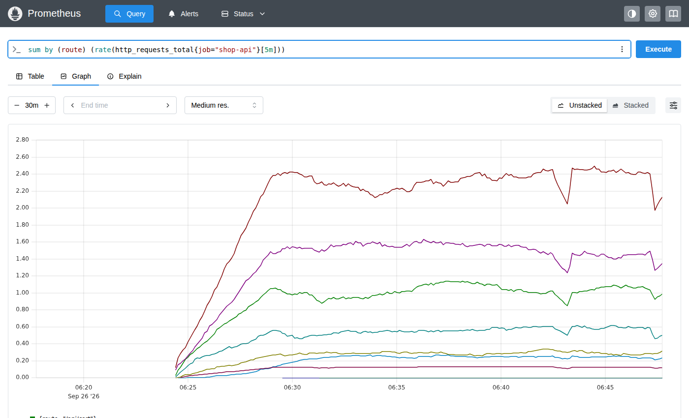
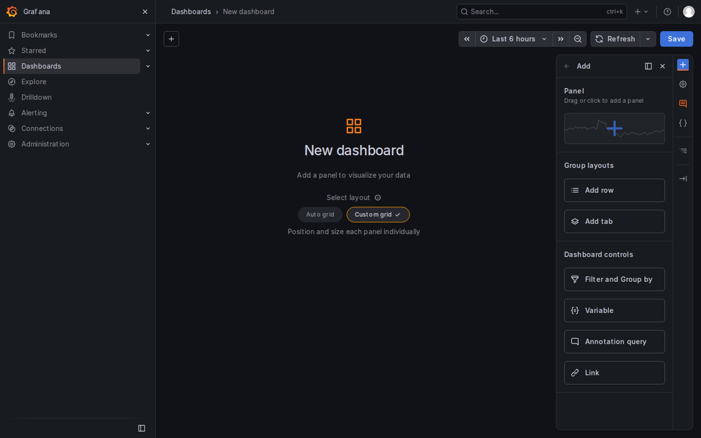
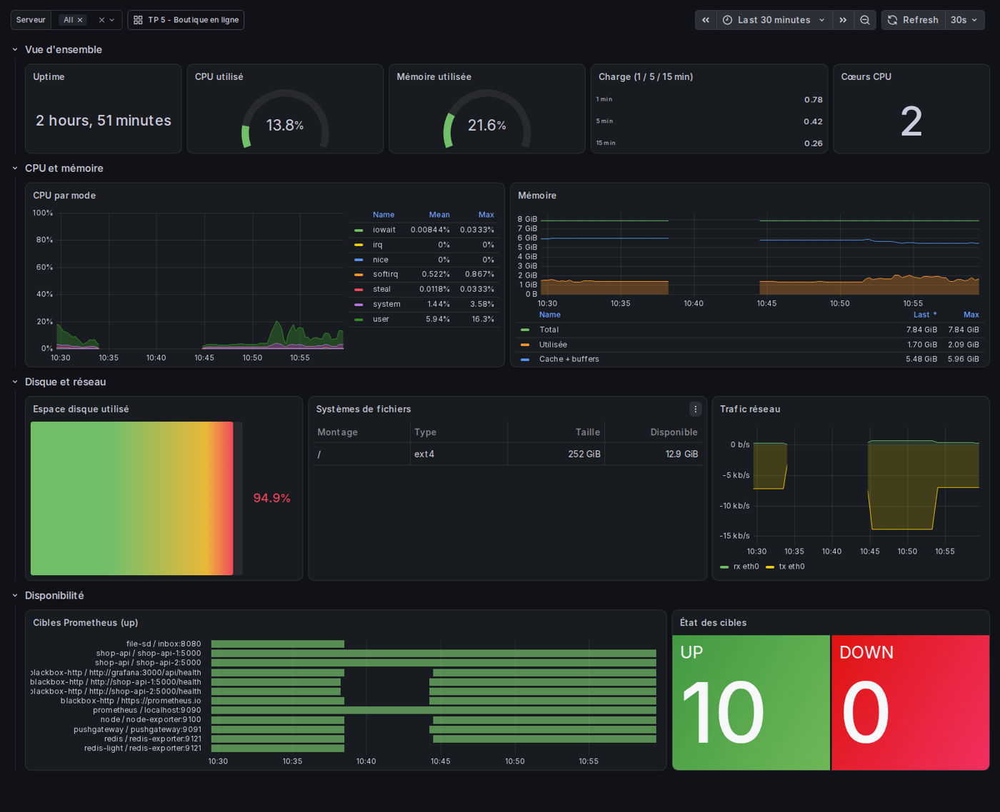
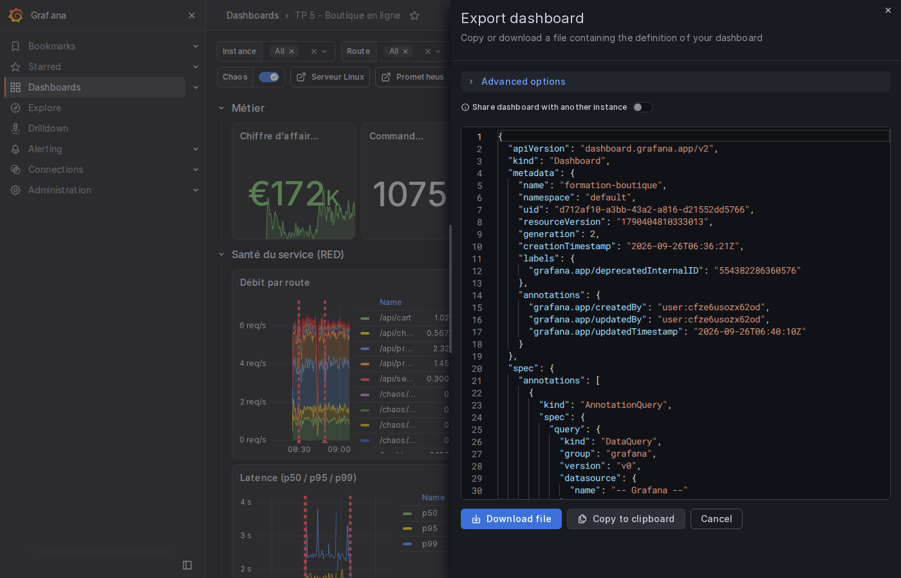

# Jour 2 — Comprendre : PromQL et Grafana

Objectif de la journée : le matin, PromQL devient un réflexe (rate, agrégations, quantiles,
jointures, recording rules). L'après-midi, deux tableaux de bord complets, paramétrables,
versionnés dans Git, et une gestion des droits propre.

| Heure | Séquence | Durée |
|---|---|---|
| 9h00 | Rappel du jour 1, quiz flash, état des lieux des stacks | 15 min |
| 9h15 | Module 7 — PromQL, les fondations | 40 min |
| 9h55 | Exercices série A (2.1 à 2.10) | 40 min |
| 10h35 | Pause | 15 min |
| 10h50 | Module 8 — PromQL avancé | 40 min |
| 11h30 | Exercices série B (2.11 à 2.22) | 40 min |
| 12h10 | TP 3 — Recording rules et tests | 20 min (déborde souvent sur 14h) |
| 12h30 | Déjeuner | |
| 14h00 | Module 9 — Grafana | 35 min |
| 14h35 | TP 4 — Dashboard Serveur Linux | 60 min |
| 15h35 | Pause | 15 min |
| 15h50 | TP 5 — Dashboard Boutique + dashboards as code | 60 min |
| 16h50 | Module 10 — Provisioning, utilisateurs, droits, OSS vs Enterprise + exercices 2.30 à 2.33 | 30 min |
| 17h20 | Récap, quiz | 10 min |

---

## 9h00 — Rappel et état des lieux (15 min)

Quiz flash à l'oral (cinq questions du récap d'hier). Puis chacun lance `./lab.sh up` (le
Codespace a peut-être redémarré, les cinq briques d'hier sont toujours décommentées) puis
`./lab.sh status`, et vérifie dans Target health que les six jobs (`prometheus`, `node`,
`shop-api`, `redis`, `blackbox-http`, `pushgateway`) sont UP et que `shop-api-1:5000/metrics`
expose bien `shop_orders_total`, `shop_stock_units` et `http_request_duration_seconds_bucket` :
tout le PromQL du matin s'appuie sur les métriques qu'ils ont écrites hier. Ceux qui ont un trou
copient `solutions/jour-1/prometheus.yml` ou `app.py`... que je ne distribue pas : je projette le
corrigé et ils complètent. Cinq minutes maximum, on a du PromQL à faire.

Je vérifie que chacun a au moins une heure d'historique ; sinon, rien de grave, les fenêtres
`[5m]` fonctionneront quand même.

---

## Module 7 — PromQL, les fondations (40 min)

**Objectif.** Sélecteurs, types de résultats, opérateurs, agrégations. À la fin, un stagiaire
sait lire n'importe quelle requête simple et en écrire une.

### Ce que je dis

**PromQL n'est pas SQL.** Pas de `SELECT`, pas de `FROM`. On nomme une métrique, on filtre par
labels, on applique des fonctions et des agrégations. Ça se lit de l'intérieur vers
l'extérieur.

**Quatre types de résultats.**
- *Instant vector* : une valeur par série, à un instant. `up`, `http_requests_total{job="shop-api"}`.
  C'est ce que Grafana dessine.
- *Range vector* : pour chaque série, toutes les valeurs sur une fenêtre.
  `http_requests_total[5m]`. Ne se dessine pas ; sert d'entrée aux fonctions comme `rate()`.
- *Scalar* : un nombre. `42`, `time()`, `scalar(...)`.
- *String* : rarissime.

**Les sélecteurs.**

| Matcher | Sens | Exemple |
|---|---|---|
| `=` | égal | `{job="shop-api"}` |
| `!=` | différent | `{route!="/metrics"}` |
| `=~` | regex (ancrée : `^...$`) | `{status=~"5.."}` |
| `!~` | regex négative | `{device!~"lo.*"}` |

Les regex sont ancrées : `status=~"5.."` matche exactement trois caractères. Pour « commence
par », `=~"5.*"`. Depuis Prometheus 3, le `.` matche aussi les sauts de ligne (rare en
pratique).

Le nom de la métrique est lui-même un label, `__name__` : `{__name__=~"shop_.*"}` renvoie
toutes les métriques métier. Pratique pour la chasse à la cardinalité.

**Décalages dans le temps.** `shop_cart_items offset 1h` : la valeur il y a une heure.
`http_requests_total @ 1790400000` : la valeur à un timestamp précis. `@ end()` et `@ start()`
dans Grafana pour figer sur la plage affichée. Utile pour comparer « aujourd'hui vs hier »
sur un même graphique : `rate(x[5m])` et `rate(x[5m] offset 1d)`.

**Les opérateurs.** Arithmétiques (`+ - * / % ^`), de comparaison (`== != > < >= <=`) et
logiques (`and or unless`). Entre deux vecteurs, Prometheus apparie les séries dont **tous les
labels sont identiques**. `node_memory_MemAvailable_bytes / node_memory_MemTotal_bytes` marche
parce que les deux ont exactement `{instance, job}`. Sinon, c'est le module 8 (`on`, `ignoring`).

Un opérateur de comparaison **filtre** : `shop_stock_units < 20` ne renvoie que les produits
sous le seuil, avec leur valeur. Avec `bool` (`shop_stock_units < bool 20`), il renvoie 0 ou 1
pour toutes les séries. C'est la base des alertes : une alerte se déclenche quand la requête
renvoie **au moins une série**, pas quand une valeur est « vraie ».

**Les agrégations.** `sum`, `min`, `max`, `avg`, `count`, `topk(k, ...)`, `bottomk`,
`count_values`, `stddev`, `quantile(0.9, ...)`, `group`.

Deux modificateurs :
- `by (labels)` : garde ces labels, agrège le reste. `sum by (route) (...)` : une série par route.
- `without (labels)` : jette ces labels, garde tous les autres. Plus robuste quand on ne sait
  pas quels labels existent.

`sum(rate(http_requests_total[5m]))` sans `by` : un seul nombre, tous labels confondus.

**Les fonctions à connaître aujourd'hui.** `rate`, `increase`, `irate` (module 8),
`histogram_quantile` (module 8), `time()`, `abs`, `round`, `clamp_min/max`, `sort`,
`sort_desc`, `label_replace`, `absent`, `changes`, `*_over_time`.

Analogie pour `by` et `without` : un tableur avec une colonne par label. `sum by (route)`,
c'est un tableau croisé dynamique avec `route` en ligne et rien en colonne.

### Ce que je montre

Dans Prometheus, onglet Query, chaque concept avec sa requête, en montrant le résultat en
Table puis en Graph. L'onglet *Explain* de Prometheus 3 décompose l'arbre de la requête : je
l'utilise sur `sum by (route) (rate(http_requests_total{job="shop-api"}[5m]))`.

Je montre aussi la différence Table/Graph : Table = instant vector à l'instant T, Graph =
la même requête évaluée à chaque pas de temps (c'est ce que fait Grafana avec `query_range`).



---

## Exercices série A — Sélection et agrégation (40 min)

Format : les stagiaires travaillent seuls dans l'interface Prometheus (pas Grafana, pour se
concentrer sur le langage). Je passe dans les rangs. Toutes les cinq minutes environ, je
projette le corrigé d'un ou deux exercices.

**Énoncés et corrigés.**

**2.1** — Toutes les cibles et leur état.
`up` — 10 séries (tous les jobs du jour 1, dont quatre sondes blackbox), valeur 1 partout si
tout va bien. `up{job="shop-api"}` : 2.

**2.2** — Les requêtes HTTP en erreur (4xx ou 5xx) sur la boutique, sans le `/metrics`.
`http_requests_total{job="shop-api", status=~"4..|5..", route!="/metrics"}`
Erreur classique : `status=~"4|5.."` (la regex est ancrée, `4` seul ne matche pas `404`).

**2.3** — Les cinq dernières minutes de `http_requests_total` pour shop-api-1 sur `/api/checkout`
(range vector). Combien de points ? Pourquoi ?
`http_requests_total{instance="shop-api-1:5000", route="/api/checkout"}[5m]` — environ 20
points par série (300 s / 15 s de scrape). Le graphique refuse de l'afficher : un range
vector n'est pas dessinable.

**2.4** — Pourcentage de mémoire disponible sur le serveur.
`100 * node_memory_MemAvailable_bytes / node_memory_MemTotal_bytes`. Appariement automatique
sur `{instance, job}`.

**2.5** — Combien d'articles y avait-il dans les paniers il y a 10 minutes ? Et l'écart avec
maintenant ?
`shop_cart_items offset 10m` puis `shop_cart_items - shop_cart_items offset 10m`.

**2.6** — Nombre total de requêtes reçues par instance, tous codes et routes confondus.
`sum by (instance) (http_requests_total{job="shop-api"})`
Question piège : est-ce que ça veut dire quelque chose ? Un peu : c'est le total depuis le
démarrage. Ce n'est pas un débit.

**2.7** — Même chose, mais en gardant tout sauf `method`, `status`, `route`.
`sum without (method, status, route) (http_requests_total{job="shop-api"})`
Résultat identique à 2.6 si `env` et `team` sont constants ; la différence, c'est que
`without` garde `env` et `team` dans le résultat. On compare les deux sorties.

**2.8** — Les trois produits les plus en stock, et le moins en stock.
`topk(3, shop_stock_units)` (attention : deux instances, donc chaque produit apparaît deux
fois ; d'où `topk(3, max by (product) (shop_stock_units))`) et `bottomk(1, ...)`.

**2.9** — Les produits dont le stock est sous 60 unités. Puis la même chose en 0/1 pour tous
les produits.
`shop_stock_units < 60` puis `shop_stock_units < bool 60`.

**2.10** — Combien de routes distinctes la boutique a-t-elle servies ? (Deux agrégations
imbriquées.)
`count(count by (route) (http_requests_total{job="shop-api"}))`
Le `count by (route)` intérieur donne une série par route ; le `count` extérieur les compte.
Pattern à retenir : « combien de valeurs distinctes pour ce label ».

**Ce que je vérifie.** Que personne n'est bloqué sur la syntaxe des accolades. Les stagiaires
les plus rapides font 2.10 en 3 minutes ; je leur demande d'écrire la même chose pour « combien
de codes HTTP distincts par route » (`count by (route) (count by (route, status) (...))`).

---

## Module 8 — PromQL avancé (40 min)

**Objectif.** `rate` et ses cousins, les histogrammes, les sous-requêtes, les jointures, les
recording rules, et ce qui fait qu'une requête est lente.

### Ce que je dis

**`rate`, `irate`, `increase`.** Les trois travaillent sur un counter et un range vector.
- `rate(x[5m])` : pente moyenne par seconde sur 5 min. Lisse, robuste, **la** fonction pour
  les graphiques et les alertes.
- `irate(x[5m])` : pente entre les deux derniers points seulement. Réactif, nerveux, à réserver
  aux graphiques à haute résolution. Jamais dans une alerte.
- `increase(x[1h])` : combien le compteur a augmenté sur la fenêtre. C'est `rate × durée`.
  Peut donner des décimales (extrapolation) : « 5,53 commandes » n'a pas de sens mais est
  mathématiquement correct. `round()` si besoin.

Toutes les trois gèrent les remises à zéro (redémarrage) : un counter qui repasse à 0 n'est
pas compté comme une chute.

Règle de la fenêtre : au moins **4 × scrape_interval**, donc `[1m]` minimum avec un scrape
à 15 s ; `[5m]` en pratique. Trop court, des trous ; trop long, on lisse les pics. Dans
Grafana, `$__rate_interval` calcule la bonne fenêtre selon le zoom : on l'utilisera partout.

**Le taux d'erreur.** Le ratio qu'on retrouve dans tous les dashboards :

```
sum(rate(http_requests_total{status=~"5.."}[5m]))
/
sum(rate(http_requests_total[5m]))
```

Piège : si aucune 5xx n'a jamais été vue, le numérateur est **vide** (pas zéro) et le résultat
est vide. On y remédie avec `or vector(0)` sur le numérateur, ou on accepte que « pas de
données » veuille dire « pas d'erreur ». Je fais réfléchir sur les conséquences pour une
alerte.

**Les histogrammes.** `http_request_duration_seconds_bucket{le="0.5"}` compte les requêtes de
moins de 500 ms (cumulatif). Le p95 :

```
histogram_quantile(0.95, sum by (le) (rate(http_request_duration_seconds_bucket[5m])))
```

Décomposition : `rate` sur chaque bucket (ce sont des counters) ; `sum by (le)` agrège les
instances **en gardant `le`**, sans quoi la fonction ne peut plus rien faire ; la fonction
interpole linéairement dans le bucket où tombe le 95e centile. On ajoute `route` dans le `by`
pour un p95 par route.

Le p95 est borné par la précision des buckets. Je le montre : avec nos buckets, un p99 de la
route checkout sous chaos affiche des valeurs suspicieusement rondes (2,5 s, 5 s).

Latence moyenne : `rate(x_sum[5m]) / rate(x_count[5m])`. Toujours vraie, jamais utile pour
un SLO (la moyenne cache les pires cas).

**Native histograms.** Un seul échantillon par série au lieu d'un par bucket, buckets
exponentiels automatiques, précision bien meilleure. `histogram_quantile(0.95, sum(rate(x[5m])))`
sans `by (le)`. Stables depuis Prometheus 3.9, il suffit de `scrape_native_histograms: true`
dans la configuration... et d'une bibliothèque cliente qui les produit, ce qui reste le point
bloquant en 2026. On les regarde de loin ; ils deviendront la norme.

**Les fonctions `_over_time`.** Elles s'appliquent aux gauges sur un range vector :
`max_over_time(shop_cart_items[1h])`, `avg_over_time`, `min_over_time`, `last_over_time`,
`quantile_over_time(0.9, ...)`, `count_over_time`, `changes` (nombre de changements de valeur),
`resets`, `deriv` (pente d'une gauge), `predict_linear(x[6h], 24*3600)` (extrapolation : le
disque sera-t-il plein demain ?), `delta`.

**Les sous-requêtes.** `rate(x[1m])[1h:1m]` : évalue `rate(x[1m])` toutes les minutes sur une
heure et renvoie ça comme range vector. On peut alors faire `max_over_time(rate(x[1m])[1h:1m])`
: le pic de débit sur l'heure. Coûteux, à réserver aux besoins précis.

**Les jointures (vector matching).** Quand les labels ne sont pas identiques des deux côtés :
- `on (labels)` : n'apparier que sur ces labels. `ignoring (labels)` : apparier sur tout sauf
  ceux-là.
- `group_left` / `group_right` : quand un côté a plusieurs séries pour une seule de l'autre
  (many-to-one). `group_left(version)` copie en plus le label `version` du côté droit.

L'exemple canonique avec une info metric :

```
shop_stock_units * on (instance) group_left(version) shop_app_info
```

Chaque série de stock récupère le label `version` de son instance. On peut ensuite faire
`sum by (version) (...)` : « combien de stock géré par la version 1.4.2 ? ». Même technique en
Kubernetes avec `kube_pod_labels`.

`label_replace(up, "pod", "$1", "instance", "(.*):5000")` : crée un label `pod` à partir de
`instance` par regex. Utile pour faire correspondre des labels de sources différentes.

**`absent()`.** `absent(up{job="shop-api"})` renvoie 1 si la série n'existe pas du tout. C'est
la seule façon d'alerter sur « cette métrique a disparu » (une cible retirée de la
configuration par erreur, une application qui n'expose plus une métrique).

**Les recording rules.** Une requête coûteuse ou réutilisée partout se pré-calcule : Prometheus
l'évalue toutes les 15 s et stocke le résultat comme une nouvelle série. Convention de nommage
`niveau:metrique:operations` : `job:http_requests:rate5m`, `instance:node_cpu_utilisation:ratio_rate5m`.
Avantages : dashboards instantanés, alertes simples, et l'agrégation qu'on envoie au stockage
longue durée est déjà faite.

**Ce qui rend une requête lente.** Le nombre de séries touchées × le nombre de points par
série. `rate(http_requests_total[5m])` sans filtre sur un an de données, c'est des milliards
de points. Réflexes :
- filtrer par `job` ou nom exact avant d'agréger ;
- éviter `{__name__=~"..."}` et les regex larges ;
- fenêtres courtes, `_over_time` et sous-requêtes avec parcimonie ;
- recording rules pour ce qui est affiché en permanence ;
- regarder `prometheus_engine_query_duration_seconds` et le *Query inspector* de Grafana.

Prometheus 3 a un onglet *Explain* et l'API `/api/v1/query?stats=all` qui donne le nombre
d'échantillons lus. Je montre.

### Ce que je montre

- La courbe de `rate` contre `irate` sur `shop_orders_total` : je lance `./lab.sh traffic 30`
  puis reviens à 6, et on voit `irate` réagir en un point et `rate` en cinq minutes.
- `histogram_quantile` avec et sans `by (le)` : sans, résultat vide ou NaN.
- La jointure `shop_stock_units * on (instance) group_left(version) shop_app_info` en Table,
  pour voir le label `version` arriver.

---

## Exercices série B — Taux, quantiles, jointures (40 min)

**2.11** — Débit de requêtes par seconde, par route, sur la boutique.
`sum by (route) (rate(http_requests_total{job="shop-api"}[5m]))` — `/api/products` domine.

**2.12** — Combien de commandes ont été passées dans la dernière heure ? Par moyen de paiement ?
`sum(increase(shop_orders_total[1h]))` puis `sum by (payment_method) (increase(shop_orders_total[1h]))`.
Je fais remarquer les décimales et je fais ajouter `round()`.

**2.13** — Chiffre d'affaires par heure (en euros/h) à partir de `shop_revenue_euros_total`.
`sum(rate(shop_revenue_euros_total[5m])) * 3600`. C'est le panneau vedette de cet après-midi.

**2.14** — Taux d'erreur 5xx global, en pourcentage. Puis lancez `./lab.sh chaos errors on`,
attendez deux minutes, observez, puis `./lab.sh chaos errors off`.
`100 * sum(rate(http_requests_total{job="shop-api", status=~"5.."}[5m])) / sum(rate(http_requests_total{job="shop-api"}[5m]))`
Il monte vers 35-40 % puis redescend lentement (la fenêtre de 5 min lisse).

**2.15** — Latence p50, p95 et p99 sur toutes les routes. Puis uniquement sur `/api/checkout`.
`histogram_quantile(0.95, sum by (le) (rate(http_request_duration_seconds_bucket{job="shop-api"}[5m])))`,
et avec `route="/api/checkout"` dans le sélecteur. Les trois quantiles dans le même graphique
en ajoutant trois requêtes (dans Grafana tout à l'heure).

**2.16** — Latence moyenne sur la même métrique. Comparez-la au p95.
`sum(rate(http_request_duration_seconds_sum{job="shop-api"}[5m])) / sum(rate(http_request_duration_seconds_count{job="shop-api"}[5m]))`
La moyenne est très en dessous du p95 : la distribution a une queue.

**2.17** — CPU utilisé en %, par instance, à partir de `node_cpu_seconds_total`. Puis la
répartition par mode (`user`, `system`, `iowait`...) sans `idle`.
`100 * (1 - avg by (instance) (rate(node_cpu_seconds_total{mode="idle"}[5m])))` puis
`sum by (mode) (rate(node_cpu_seconds_total{mode!="idle"}[5m]))`.

**2.18** — Débit réseau entrant en bits/s, hors interfaces `lo`, `veth*`, `br*`, `docker*`.
`sum by (device) (rate(node_network_receive_bytes_total{device!~"lo|veth.*|br.*|docker.*"}[5m])) * 8`

**2.19** — Le pic du nombre d'articles dans les paniers sur la dernière heure, et le pic de débit
de requêtes sur la dernière heure (sous-requête).
`max_over_time(shop_cart_items[1h])` puis `max_over_time(sum(rate(http_requests_total{job="shop-api"}[1m]))[1h:1m])`.

**2.20** — Ajoutez le label `version` (de `shop_app_info`) aux séries de débit par instance.
`sum by (instance) (rate(http_requests_total{job="shop-api"}[5m])) * on (instance) group_left(version) shop_app_info`
Piège : `sum by (instance)` est obligatoire à gauche, sinon il y a plusieurs séries par instance
des deux côtés et Prometheus refuse (many-to-many).

**2.21** — Prometheus scrape-t-il un job `paiement` ? Écrivez la requête qui renverrait 1 s'il
n'existe pas.
`absent(up{job="paiement"})` → 1. `absent(up{job="shop-api"})` → vide.

**2.22** — À ce rythme, combien vaudra `shop_revenue_euros_total` dans une heure ? Et dans
combien de temps le disque `/` sera-t-il plein ? (`predict_linear`)
`predict_linear(shop_revenue_euros_total[10m], 3600)` ;
`predict_linear(node_filesystem_avail_bytes{mountpoint="/"}[1h], 24*3600)` : négatif = plein
avant 24 h. Sur nos machines de lab, le disque bouge peu, la prédiction est bruitée ; c'est
normal, c'est un signal à moyen terme.

**Ce que je vérifie.** Le `by (le)` dans 2.15 : c'est l'erreur numéro un. Et que le chaos a
bien été remis à `off`.

---

## TP 3 — Recording rules et tests unitaires (20 min + débordement)

**Objectif.** Pré-calculer ce qui sera affiché en permanence, valider les règles, et découvrir
que des règles PromQL se testent comme du code.

**Mise en situation.** Les panneaux « débit », « taux d'erreur », « p95 » et « CA par heure »
vont être affichés sur un écran mural 24 h/24. On ne veut pas que Prometheus recalcule les
histogrammes toutes les cinq secondes.

### Partie 1 — Écrire les règles (10 min)

**Énoncé.** Dans `prometheus/rules/recording.yml`, groupe `shop_api_recording`, créez :
1. `instance_route:http_requests:rate5m` — débit par instance et route.
2. `job:http_requests:rate5m` — débit total du job.
3. `instance:http_errors:ratio_rate5m` — ratio d'erreurs 5xx par instance (0 à 1).
4. `route:http_request_duration_seconds:p95_5m` — p95 par route.
5. `job:shop_revenue_euros:rate1h` — CA en euros par heure.

Puis, dans un groupe `node_recording` (intervalle 30 s) :
6. `instance:node_cpu_utilisation:ratio_rate5m` — CPU utilisé (0 à 1).
7. `instance:node_memory_utilisation:ratio` — mémoire utilisée (0 à 1).

Validez (`./lab.sh check`), rechargez, vérifiez dans **Status → Rules** et interrogez
`job:http_requests:rate5m`.

**Corrigé.** Le fichier complet est `solutions/jour-2/recording.yml`. Les points à commenter :
- `interval: 15s` au niveau du groupe surcharge `evaluation_interval`.
- Le ratio d'erreur garde `by (instance)` des deux côtés, sinon appariement impossible.
- Le p95 garde `route` et `le` dans le `sum by`, et se limite aux routes `/api/.*` : sans
  trafic, un quantile vaut NaN et polluerait les tables.
- On stocke des ratios (0-1), pas des pourcentages : Grafana convertira (`percentunit`), et
  les alertes compareront à `0.05`, pas à `5`. Une convention, à tenir partout.

### Partie 2 — Tester les règles (10 min)

**Énoncé.** Ouvrez `prometheus/tests/alerts_test.yml` : il teste l'alerte `TargetDown` avec des
séries simulées. Lancez `./lab.sh test`. Puis ajoutez un test pour votre recording rule
`job:http_requests:rate5m` : avec une série `http_requests_total{job="shop-api", instance="a"}`
qui vaut `0+10x40` (0, 10, 20... toutes les 15 s), que doit valoir la règle à `eval_time: 5m` ?

**Corrigé.** À 15 s d'intervalle, +10 par scrape = 10/15 ≈ 0,667 req/s.

```yaml
rule_files:
  - ../rules/recording.yml
evaluation_interval: 15s
tests:
  - interval: 15s
    input_series:
      - series: 'http_requests_total{job="shop-api", instance="a", route="/", method="GET", status="200"}'
        values: "0+10x40"
    promql_expr_test:
      - expr: job:http_requests:rate5m
        eval_time: 5m
        exp_samples:
          - labels: 'job:http_requests:rate5m{job="shop-api"}'
            value: 0.6666666666666666
```

`promtool test rules` est peu connu et pourtant c'est ce qui permet de mettre les règles dans
une CI. J'insiste : une règle d'alerte non testée est une règle qui sonnera un dimanche pour
rien, ou qui ne sonnera pas le jour où il faut.

### Partie 3 — Mesurer le gain (bonus)

Dans Grafana, Explore, comparer avec le Query inspector (onglet *Stats*) le temps d'exécution
de `histogram_quantile(0.95, sum by (route, le) (rate(http_request_duration_seconds_bucket[5m])))`
et de `route:http_request_duration_seconds:p95_5m`. Sur notre petit lab, la différence est de
quelques millisecondes ; en production avec des milliers de séries, c'est des secondes.

---

## Module 9 — Grafana (35 min)

**Objectif.** Comprendre comment Grafana est construit, connaître l'anatomie d'un dashboard et
les bonnes pratiques de lisibilité, savoir choisir une visualisation.

### Ce que je dis

**Sous le capot.** Un serveur Go, une base SQLite par défaut (`grafana.db`, ou PostgreSQL /
MySQL en production), une interface React. Il ne stocke que sa configuration : utilisateurs,
sources de données, dashboards (en JSON), règles d'alerte. Pas une seule métrique. Tout ce
qu'il affiche vient d'une *source de données* interrogée à la volée.

Configuration par `grafana.ini` ou, dans un conteneur, par variables d'environnement
`GF_<SECTION>_<CLÉ>`. Notre compose en utilise quelques-unes (mot de passe admin, pas
d'inscription, pas de télémétrie).

**Les quatre concepts.**
1. *Data source* : une connexion (Prometheus, Loki, PostgreSQL, ...). La nôtre est
   provisionnée par fichier YAML : personne ne l'a cliquée.
2. *Panel* : une requête + une visualisation + des options. Un panel répond à une question.
3. *Dashboard* : des panels, des variables, des annotations, des liens. Un dashboard répond à
   un besoin (« la boutique va-t-elle bien ? »), pas à tous les besoins.
4. *Folder* : pour ranger et pour donner des droits.

**Grafana 13.** Ce qui a changé et qui compte pour nous : les *dynamic dashboards* sont la
norme (nouvelle barre latérale d'édition, deux modes de disposition : *Custom grid* où on
place chaque panel, *Auto grid* où ils se rangent seuls ; regroupements en *rows* et *tabs* ;
règles d'affichage conditionnel), l'éditeur de variables a été refait, on peut restaurer un
dashboard supprimé, *Git Sync* est disponible en OSS pour versionner les dashboards
directement dans un dépôt. Le plugin de rendu d'images (`grafana-image-renderer`) a été retiré :
plus d'export PNG côté serveur.

**Explore avant de construire.** *Explore* (menu de gauche) est un bac à sable : on tape une
requête, on regarde, on ajuste, puis « Add to dashboard ». On ne construit jamais un panel à
l'aveugle.

**Choisir la visualisation.** Un choix par question :

| La question | La visualisation |
|---|---|
| Ça évolue comment ? | Time series |
| Ça vaut combien, là, maintenant ? | Stat (avec une sparkline) |
| C'est à quel niveau sur une échelle bornée ? | Gauge |
| Comparer quelques valeurs entre elles | Bar gauge (horizontal) |
| Une liste avec plusieurs colonnes | Table |
| Une répartition | Pie chart (avec parcimonie : 5 parts maximum) |
| Un état dans le temps (up/down, ok/warn) | State timeline, Status history |
| Une distribution qui évolue (latences) | Heatmap |
| Un texte, une consigne, un lien | Text |
| Les alertes en cours | Alert list |

**Ce qui rend un dashboard lisible.** Mes règles, dans l'ordre d'importance :
1. **Les unités.** Jamais un « 38491023 » brut. `bytes` → « 36,7 MiB », `seconds` → « 1,2 s »,
   `percentunit` pour un ratio 0-1, `reqps` pour un débit, `currencyEUR`. Grafana convertit tout.
2. **Les seuils et les couleurs.** Vert/orange/rouge cohérents sur tout le dashboard. Un seuil
   se voit sur un Stat, un Gauge, une Table (fond coloré) et même sur un Time series (ligne
   pointillée).
3. **Les value mappings.** `1` → « UP » en vert, `0` → « DOWN » en rouge. Un dashboard doit
   être lisible par quelqu'un qui ne connaît pas Prometheus.
4. **La légende.** `{{route}}` au lieu de `{route="/api/cart", instance="..."}`. En mode
   table avec `Mean` et `Max` quand il y a plus de trois séries.
5. **L'ordre de lecture.** En haut à gauche : les indicateurs qui répondent à « ça va ? ». En
   dessous, le détail. En bas, les données brutes. Les rows regroupent.
6. **Pas plus de 10-12 panels visibles.** Au-delà, on crée un second dashboard et un lien.

**Variables et templating.** Un menu déroulant en haut qui filtre tous les panels. Types :
*Query* (`label_values(node_uname_info, instance)`), *Custom* (liste fixe), *Textbox*,
*Interval*, *Data source*, *Constant*, et le nouveau *Switch* (un interrupteur on/off). Dans
les requêtes : `$instance` ou `${instance}`. Multi-valeur + « All » → il faut `=~` et non `=`
(Grafana génère `a|b|c`). Les variables peuvent se chaîner : `$route` dépend de `$instance`.

Les variables intégrées : `$__rate_interval` (la bonne fenêtre pour `rate`), `$__interval`,
`$__range` (la plage affichée, pour `increase(x[$__range])`), `$__from` / `$__to`.

**Transformations.** Elles travaillent sur le résultat, côté Grafana : fusionner deux requêtes
(*Merge*), renommer et masquer des colonnes (*Organize fields*), trier (*Sort by*), filtrer,
calculer une colonne (*Add field from calculation*), réduire une série à une valeur (*Reduce*).
Indispensables pour les tables.

**Annotations, seuils, liens.** Une annotation est un événement dessiné en trait vertical sur
tous les graphiques : un déploiement, une bascule chaos. Source : une requête Prometheus
(`changes(shop_chaos_mode[1m]) > 0`) ou une saisie manuelle (Ctrl+clic sur un graphique). Les
liens de dashboard (barre du haut) et les data links (clic sur une série) permettent de
naviguer du global vers le détail.

### Ce que je montre

Une visite de Grafana 13 en cinq minutes, en projetant :
- **Connections → Data sources** : la source Prometheus, provisionnée, avec le bouton *Explore*.
- **Explore** : `sum(rate(http_requests_total{job="shop-api"}[$__rate_interval]))`, mode
  *Code*, puis *Builder* pour ceux qui préfèrent cliquer.
- **Dashboards → New → New dashboard** : la barre latérale *Add* (Panel, Add row, Add tab,
  Variable, Annotation query, Link), le choix *Auto grid / Custom grid*.
- Un panel : *Configure visualization*, la requête, *Run queries*, le volet de droite
  *Suggestions / All visualizations*, puis les options (Panel options, Legend, Standard
  options avec Unit, Thresholds, Value mappings, Add field override).
- *Save*, titre, dossier. *Exit edit*.
- Le dashboard *00 - Bienvenue* provisionné : son cadenas « provisioned ».




---

## TP 4 — Un tableau de bord paramétrable pour un serveur Linux (60 min)

**Objectif.** Le cas pratique du programme. Douze panels, huit types de visualisation, une
variable, des seuils, des unités, des transformations, des rows.

**Mise en situation.** L'équipe d'exploitation veut un écran par serveur : d'un coup d'œil, on
doit savoir s'il va bien, et en dessous avoir le détail CPU, mémoire, disque, réseau. Le même
dashboard doit servir pour tous les serveurs : une liste déroulante pour choisir.

Le résultat attendu est projeté (corrigé `solutions/jour-2/dashboards/tp4-serveur-linux.json`,
capture dans le guide stagiaire). Les stagiaires ont la liste des panels, les métriques à
utiliser et les options attendues, pas les requêtes finales.



### Étape 0 — Créer le dashboard et la variable (10 min)

**Énoncé.**
1. Dashboards → New → New dashboard. Disposition *Custom grid*.
2. Barre latérale *Add* → *Variable* → type *Query*. Nom `instance`, label `Serveur`, requête
   `label_values(node_uname_info, instance)`. Cochez *Multi-value* et *Include All value*
   (valeur personnalisée pour All : `.*`).
3. Sauvegardez sous le nom `TP 4 - Serveur Linux` dans le dossier *Formation*.

**Corrigé.** Dans Grafana 13, la variable se crée depuis la barre latérale et se modifie en
cliquant sur sa puce en haut à gauche (`instance`) → *Open variable editor*. La requête
`label_values(...)` est une fonction spéciale de la source Prometheus, pas du PromQL. Avec
*All* = `.*`, toutes les requêtes doivent utiliser `instance=~"$instance"`.

### Étape 1 — Row « Vue d'ensemble » : cinq indicateurs (15 min)

**Énoncé.** Ajoutez une *row* « Vue d'ensemble » puis, dedans :
1. **Uptime** — Stat. `time() - node_boot_time_seconds{instance=~"$instance"}`. Unité
   *Time → duration (d hh:mm:ss)* ou *dtdurations*. Query type *Instant*.
2. **CPU utilisé** — Gauge. La formule CPU du jour 1 avec `[$__rate_interval]`, unité *Percent
   (0-100)*, min 0, max 100, seuils vert / orange à 70 / rouge à 90.
3. **Mémoire utilisée** — Gauge. `100 * (1 - node_memory_MemAvailable_bytes / node_memory_MemTotal_bytes)`
   avec le filtre instance, mêmes seuils.
4. **Charge 1 / 5 / 15 min** — Stat avec trois requêtes (`node_load1`, `node_load5`,
   `node_load15`), légendes `1 min`, `5 min`, `15 min`, orientation horizontale, 2 décimales.
5. **Cœurs CPU** — Stat. `count(node_cpu_seconds_total{mode="idle", instance=~"$instance"})`.

**Corrigé (requêtes exactes).**

| Panel | Requête |
|---|---|
| Uptime | `time() - node_boot_time_seconds{instance=~"$instance"}` |
| CPU | `100 * (1 - avg by (instance) (rate(node_cpu_seconds_total{mode="idle", instance=~"$instance"}[$__rate_interval])))` |
| Mémoire | `100 * (1 - node_memory_MemAvailable_bytes{instance=~"$instance"} / node_memory_MemTotal_bytes{instance=~"$instance"})` |
| Charge | `node_load1{instance=~"$instance"}` (+ load5, load15) |
| Cœurs | `count(node_cpu_seconds_total{mode="idle", instance=~"$instance"})` |

Chemin des options dans le volet de droite : *Standard options → Unit*, *Standard options →
Min / Max*, *Thresholds* (Add threshold), *Stat styles → Orientation*. La légende se règle dans
*Options → Legend* de la requête (champ *Legend : Custom*, valeur `1 min`).

Ce que je fais remarquer : sur la Gauge, sans `avg by (instance)`, on aurait une jauge par
cœur. Et si la variable est sur *All* avec deux serveurs, on aurait deux jauges : c'est voulu,
c'est le comportement multi-valeur.

### Étape 2 — Row « CPU et mémoire » : deux Time series (10 min)

**Énoncé.**
6. **CPU par mode** — Time series empilé (*Graph styles → Stack series : Normal*), *Fill
   opacity* 40, unité *Percent (0.0-1.0)*, min 0 max 1. Requête : `rate` par mode hors `idle`,
   divisé par le nombre de cœurs. Légende `{{mode}}`, mode *Table* à droite avec *Mean* et *Max*.
7. **Mémoire** — Time series, trois requêtes : Total, Utilisée (Total − Disponible), Cache +
   buffers (`node_memory_Cached_bytes + node_memory_Buffers_bytes`). Unité *bytes (IEC)*. Un
   *field override* pour colorer « Utilisée » en orange avec un remplissage.

**Corrigé.**

```
sum by (mode) (rate(node_cpu_seconds_total{mode!="idle", instance=~"$instance"}[$__rate_interval]))
/ scalar(count(node_cpu_seconds_total{mode="idle", instance=~"$instance"}))
```

`scalar()` est nécessaire : `count(...)` renvoie un vecteur sans labels, qui ne s'apparie pas
avec des séries portant `mode`. Sans `scalar`, panel vide. C'est le piège de l'étape.

Override : *Add field override → Fields with name : Utilisée → Add override property : Color
scheme → Single color (orange)* puis *Fill opacity : 30*.

### Étape 3 — Row « Disque et réseau » : Bar gauge, Table, Time series (15 min)

**Énoncé.**
8. **Espace disque utilisé** — Bar gauge horizontal, mode *Gradient*, une barre par
   `mountpoint`, unité Percent, seuils 75 / 90. Exclure `fstype` `tmpfs|overlay|squashfs`.
   Query type *Instant*.
9. **Systèmes de fichiers** — Table. Deux requêtes *Instant* au format *Table* :
   `node_filesystem_size_bytes` et `node_filesystem_avail_bytes` (mêmes filtres). Transformations :
   *Join by field* (champ `mountpoint`, mode *Outer*), puis *Organize fields* pour masquer les
   colonnes `Time`, `__name__`, `job`, `instance`, `device` (en double, suffixées 1 et 2) et
   renommer `Value #A` → Taille, `Value #B` → Disponible, `mountpoint` → Montage, `fstype 1` →
   Type, puis *Sort by* Disponible croissant. Unité bytes.
10. **Trafic réseau** — Time series, réception en positif, émission en négatif (multiplier par
    −1), unité *bits/sec*, légende `rx {{device}}` / `tx {{device}}`.

**Corrigé.**

Bar gauge : `100 * (1 - node_filesystem_avail_bytes{fstype!~"tmpfs|overlay|squashfs", instance=~"$instance"} / node_filesystem_size_bytes{fstype!~"tmpfs|overlay|squashfs", instance=~"$instance"})`,
légende `{{mountpoint}}`.

Table : les deux requêtes en *Format : Table* et *Type : Instant* (menu *Options* sous la
requête). Sans transformation, on obtient deux tables. *Join by field* les apparie sur le
champ choisi (`mountpoint`) ; *Merge* aurait aussi pu marcher mais il apparie sur *tous* les
labels communs et se montre capricieux dès qu'un label diffère. *Organize fields* permet
aussi de réordonner par glisser-déposer.

Réseau : `sum by (device) (rate(node_network_receive_bytes_total{device!~"lo|veth.*|br.*|docker.*", instance=~"$instance"}[$__rate_interval])) * 8`
et `- sum by (device) (rate(node_network_transmit_bytes_total{...}[$__rate_interval])) * 8`.

### Étape 4 — Row « Disponibilité » : State timeline et Stat coloré (10 min)

**Énoncé.**
11. **Cibles Prometheus** — State timeline sur `up`, légende `{{job}} / {{instance}}`. Value
    mappings : `1` → UP (vert), `0` → DOWN (rouge). *Merge equal consecutive values* activé.
12. **État des cibles** — Stat, deux requêtes `sum(up)` (UP) et `count(up == 0) or vector(0)`
    (DOWN), *Color mode : Background*, override couleur verte / rouge.
13. Sauvegardez. Testez la variable : choisissez une instance, puis *All*. Changez la plage de
    temps. Retrouvez le chaos CPU d'hier (ou relancez-en un).

**Corrigé.** Le `or vector(0)` : `count(up == 0)` est vide quand tout va bien, et un Stat vide
affiche « No data ». `or vector(0)` fournit un zéro par défaut. Pattern à retenir pour tous les
compteurs d'anomalies.

Value mappings : *Value mappings → Add value mappings → Value : 1, Display text : UP, Color :
green*.

**Ce que je vérifie.** Que le dashboard est sauvegardé dans le dossier *Formation* avec le bon
titre (le TP 5 y fera un lien). Que la variable fonctionne avec `=~`. Les rapides ajoutent un
panel « Processus » (`node_processes_state`, pie chart) ou passent le dashboard en *Auto grid*
pour comparer.

---

## TP 5 — Le tableau de bord de la boutique, puis dashboards as code (60 min)

**Objectif.** Métier + RED, deux variables chaînées, annotations, liens, heatmap, transformations
avancées ; puis exporter en JSON et provisionner.

**Mise en situation.** Le directeur commercial veut un écran avec le chiffre d'affaires, les
commandes, les paniers, les stocks. L'équipe technique veut, sur le même écran, le débit, les
erreurs et la latence, filtrables par instance et par route. Et tout le monde veut voir sur les
graphiques « quand est-ce qu'on a cassé quelque chose ».

Résultat attendu projeté : `solutions/jour-2/dashboards/tp5-boutique.json`.


### Étape 0 — Variables chaînées (5 min)

**Énoncé.** Nouveau dashboard `TP 5 - Boutique en ligne`, dossier Formation. Deux variables Query,
multi-valeur avec All :
- `instance` : `label_values(http_requests_total{job="shop-api"}, instance)`
- `route` : `label_values(http_requests_total{job="shop-api", instance=~"$instance"}, route)`

**Corrigé.** La seconde dépend de la première : changer `$instance` recalcule la liste des routes.
Dans l'éditeur de variable, *Refresh : On time range change* est le réglage habituel.

### Étape 1 — Row « Métier » (15 min)

**Énoncé.** Cinq panels :
1. **Chiffre d'affaires / heure** — Stat, `rate(shop_revenue_euros_total[$__rate_interval]) * 3600` filtré par
   `$instance`, unité *Currency → Euro (€)*, 0 décimale, sparkline (*Graph mode : Area*), couleur
   fixe verte.
2. **Commandes (dernière heure)** — Stat, `increase(...[1h])` sommé, *Instant*.
3. **Articles dans les paniers** — Stat avec sparkline, `sum(shop_cart_items{...})`.
4. **Commandes par moyen de paiement** — Pie chart (donut), `increase(shop_orders_total[$__range])`
   par `payment_method`, légende à droite avec les pourcentages.
5. **Stock par produit** — Bar gauge, mode *LCD*, une barre par produit, seuils rouge < 20,
   orange < 40, vert au-dessus (*Thresholds* : rouge base, orange 20, vert 40), max 120.

**Corrigé.**

| Panel | Requête |
|---|---|
| CA / h | `sum(rate(shop_revenue_euros_total{job="shop-api", instance=~"$instance"}[$__rate_interval])) * 3600` |
| Commandes | `sum(increase(shop_orders_total{job="shop-api", instance=~"$instance"}[1h]))` |
| Paniers | `sum(shop_cart_items{job="shop-api", instance=~"$instance"})` |
| Paiement | `sum by (payment_method) (increase(shop_orders_total{job="shop-api", instance=~"$instance"}[$__range]))` |
| Stock | `sum by (product) (shop_stock_units{...}) / count by (product) (shop_stock_units{...})` |

Le stock : chaque instance a son propre stock (c'est une simulation, en vrai il serait en base) ;
on affiche la moyenne des deux. `$__range` dans le pie chart : la répartition s'adapte à la plage
affichée. Question à poser : « pourquoi un Stat sur `rate` et pas sur la valeur brute du
compteur ? »

### Étape 2 — Row « Santé du service (RED) » (15 min)

**Énoncé.** Quatre panels, tous filtrés par `$instance` et `$route` (sauf le taux d'erreur, par
instance seulement) :
6. **Débit par route** — Time series empilé, unité *requests/sec*, légende table à droite (Mean, Max).
7. **Taux d'erreur (5xx)** — Time series, unité *Percent (0.0-1.0)*, seuil rouge à 0.05 affiché
   en *Thresholds → Show thresholds : As lines and filled regions*, couleur fixe rouge, sans légende.
8. **Latence p50 / p95 / p99** — Time series, trois requêtes, unité seconds, seuil pointillé à 1 s
   (*Show thresholds : As lines (dashed)*).
9. **Distribution des latences** — Heatmap. Requête `sum by (le) (rate(http_request_duration_seconds_bucket{...}[$__rate_interval]))`
   en *Format : Heatmap*. Dans les options : *Calculate from data : No*, axe Y en secondes,
   palette *Oranges*.

**Corrigé.** Débit : `sum by (route) (rate(http_requests_total{job="shop-api", instance=~"$instance", route=~"$route"}[$__rate_interval]))`.
Taux d'erreur : le ratio du 2.14 sans le `100 *` (unité percentunit). p95 : celui du 2.15 avec
les filtres. Heatmap : le *Format : Heatmap* transforme les buckets `le` en tranches ; c'est la
seule visualisation qui montre une distribution qui bouge dans le temps, et c'est le moment de
lancer `./lab.sh chaos latency on` pour voir la tache orange monter.

### Étape 3 — Row « Détail » : table avec transformations, bar chart, info (10 min)

**Énoncé.**
10. **Top routes** — Table avec deux requêtes Instant / Table : débit par route et p95 par route.
    Transformations *Merge* → *Organize fields* (renommer `Value #A` → req/s, `Value #B` → p95,
    masquer Time) → *Sort by* req/s décroissant. Overrides : unité reqps sur req/s ; unité s,
    3 décimales et *Cell options → Cell type : Colored background* avec seuils 0.5 / 1 sur p95.
11. **Requêtes par code HTTP** — Bar chart : `sum by (status) (increase(http_requests_total{...}[$__range]))`
    en Instant, transformation *Reduce* (mode *Series to rows*, calcul *Last*).
12. **Version déployée** — Stat en *Text mode : Name*, requête `shop_app_info{...}` avec légende
    `{{instance_name}} v{{version}}`.

**Corrigé.** Le *Colored background* sur une colonne de table est le moyen le plus efficace de
faire ressortir un problème dans une liste. Le *Reduce → Series to rows* transforme N séries en
N lignes pour un bar chart par catégorie ; c'est la transformation à connaître pour les
histogrammes de catégories.

### Étape 4 — Annotations et liens (5 min)

**Énoncé.**
13. Barre latérale *Add → Annotation query* : nom `Chaos`, source Prometheus, requête
    `changes(shop_chaos_mode{instance=~"$instance"}[1m]) > 0`, titre `Chaos {{mode}}`, couleur rouge.
14. *Add → Link* : un lien vers le dashboard *TP 4 - Serveur Linux* (type Dashboard, *Keep time
    range*), et un lien externe vers Prometheus.
15. Lancez `./lab.sh chaos errors on` puis `off` deux minutes plus tard : les traits rouges
    apparaissent sur tous les graphiques.

**Corrigé.** Une annotation à partir d'une requête Prometheus est une requête qui renvoie des
séries aux instants où l'événement a lieu ; `changes(...) > 0` isole les bascules. En
production, on annote les déploiements (via l'API `/api/annotations` depuis la CI) : c'est ce qui
permet de répondre tout de suite à « ça a commencé après le déploiement de 14h12 ? ».

### Étape 5 — Dashboards as code (10 min)

**Énoncé.**
16. Bouton *Export* (barre du haut) → *Export as code*. Dépliez *Advanced options* : *Model :
    Classic* (le choix JSON/YAML n'existe que pour V2 Resource). Laissez *Share dashboard with
    another instance* désactivé. *Copy to clipboard* (ou *Download file*).
17. Enregistrez le JSON dans `grafana/dashboards/tp5-boutique.json`. Attendez 10 secondes (le
    provider relit le dossier) et rechargez la liste des dashboards : un second « TP 5 » avec un
    cadenas est apparu (provisionné). Supprimez la version manuelle ou renommez-la.
18. Modifiez un titre de panel dans le JSON. Que se passe-t-il ? Et si vous modifiez le dashboard
    provisionné dans l'interface et sauvegardez ?

**Corrigé.** Le provider `grafana/provisioning/dashboards/dashboards.yml` a `allowUiUpdates: true`,
donc on peut sauvegarder depuis l'interface, mais la prochaine modification du fichier écrasera. En
production, on met `allowUiUpdates: false` et `disableDeletion: true` : la seule source de vérité
est Git. Avec un `uid` fixe dans le JSON, l'URL du dashboard ne change jamais, même après
suppression/recréation : indispensable pour les liens et les runbooks.

Sur les deux modèles d'export : *Classic* est le JSON historique (celui des dashboards
communautaires et de nos fichiers), *V2 Resource* est le nouveau format « à la Kubernetes »
(`apiVersion: dashboard.grafana.app/v2`) qu'utilisent Git Sync et la nouvelle API `/apis`. Le
provisioning par fichier accepte les deux, mais je fais travailler en Classic : plus lisible,
compatible avec tout l'outillage existant (Grafonnet, grafanalib, Terraform). L'option *Share
dashboard with another instance* remplace la source de données par une variable `${DS_PROMETHEUS}`
et ajoute un bloc `__inputs` : c'est le format pour publier sur grafana.com, pas pour provisionner.



Git Sync (Grafana 13, *Administration → Provisioning*) va plus loin : Grafana lit et écrit les
dashboards directement dans un dépôt GitHub/GitLab, avec pull request. Je le montre en
capture d'écran seulement (il faut un dépôt et un token).

---

## Module 10 — Provisioning, utilisateurs, droits, éditions (30 min)

**Objectif.** Savoir tout provisionner par fichier, organiser les droits proprement, et répondre
à « faut-il acheter Enterprise ? ».

### Ce que je dis

**Tout se provisionne.** Sources de données, dashboards, alerting (contact points, policies,
règles), plugins, et même les dossiers, par fichiers YAML/JSON dans `/etc/grafana/provisioning/`.
On l'a fait pour la source Prometheus et le dashboard d'accueil. Alternative : Terraform
(provider Grafana), ou l'API HTTP. Règle : en production, personne n'a le droit d'éditer à la
main ce qui est provisionné.

**Le modèle de droits.**
- **Organisation** : cloisonnement total (sources de données, dashboards, utilisateurs). Une
  organisation par client chez un hébergeur, sinon une seule. Ne pas utiliser les orgs pour
  séparer des équipes : les dossiers suffisent.
- **Utilisateurs** : locaux, ou via OAuth (GitHub, Google, Azure AD/Entra, Okta), LDAP, SAML
  (Enterprise). Rôle par organisation : *Admin*, *Editor*, *Viewer* (et *None* depuis la 10).
  Le *Server Admin* est à part : il gère les orgs et les utilisateurs.
- **Teams** : des groupes. On donne les droits aux teams, pas aux personnes.
- **Permissions sur dossiers et dashboards** : View / Edit / Admin, par utilisateur, team ou
  rôle. Un Viewer peut être Editor sur un dossier précis.
- **Service accounts** : des comptes techniques avec un token, pour les scripts et la CI. Ils
  remplacent les API keys.
- **Permissions sur les sources de données** (Enterprise/Cloud) : limiter qui peut interroger
  quoi. **RBAC fin** (rôles personnalisés) : Enterprise aussi.

Bonne pratique : dossier par équipe, team par équipe, team = Editor sur son dossier, Viewer
ailleurs. Dashboards provisionnés en lecture seule dans un dossier « Officiel ».

**OSS contre Enterprise (et Cloud).**

| | OSS (AGPL v3) | Enterprise | Cloud |
|---|---|---|---|
| Dashboards, alerting, Explore, provisioning, Git Sync | Oui | Oui | Oui |
| Sources de données | Toutes les open source (Prometheus, Loki, SQL, Elastic, ...) | + connecteurs commerciaux (Splunk, Datadog, ServiceNow, Oracle, SAP HANA, ...) | idem |
| Authentification | OAuth, LDAP, proxy | + SAML, SCIM, sync de teams | idem |
| Droits | Rôles fixes, permissions dossiers | + RBAC fin, permissions par source de données | idem |
| Rapports PDF planifiés, white-labelling, audit logs, query caching, usage insights | Non | Oui | Oui |
| Support | Communauté | Contrat | Inclus |
| Grafana Assistant (IA) | Preview, via connexion Cloud | Preview | Oui |
| Prix | Gratuit | Licence par utilisateur actif | Free tier puis à l'usage |

Ma réponse : la plupart des entreprises n'ont pas besoin d'Enterprise. On y va pour SAML/SCIM
imposés par la sécurité, pour un connecteur commercial, ou pour les rapports. Grafana Cloud est
intéressant pour ne pas opérer Prometheus/Loki/Tempo soi-même (c'est Mimir derrière).

### Ce que je montre

**Administration → Users and access → Users / Teams / Service accounts**, puis sur un dossier :
*Dashboards → dossier Formation → Folder actions → Manage permissions*.

### Exercice 2.30 — Un lecteur (5 min)

**Énoncé.** Créez l'utilisatrice `lecture` (Administration → Users and access → Users → New user),
rôle *Viewer*. Ouvrez une fenêtre de navigation privée, connectez-vous avec ce compte. Que
peut-elle faire ? Essayez de modifier le TP 5.

**Corrigé.** Elle voit tout, modifie rien, n'a pas Explore (par défaut les Viewers n'ont pas
Explore ; `viewers_can_edit` a été retiré en Grafana 12, il faut des permissions par dossier).
Le bouton *Edit* est absent.

### Exercice 2.31 — Une team éditrice sur son dossier (10 min)

**Énoncé.**
1. Créez un dossier *Boutique* et déplacez-y le dashboard TP 5 (*Move*).
2. Créez la team *equipe-boutique* (Administration → Users and access → Teams → New team), ajoutez
   `lecture`.
3. Sur le dossier Boutique : *Folder actions → Manage permissions → Add a permission → Team
   equipe-boutique → Edit*.
4. En navigation privée, avec `lecture` : elle peut maintenant éditer le TP 5 mais pas le TP 4.

**Corrigé.** C'est le modèle à répliquer : rôle global minimal, droits élevés par dossier via
team. Question : « et si on veut qu'elle voie le dossier Boutique mais pas le dossier Formation ? »
→ retirer le rôle Viewer (rôle *None*) et donner *View* sur Boutique uniquement.

### Exercice 2.32 — Une organisation (5 min)

**Énoncé.** Administration → General → Organizations → New org `Client-B`. Basculez dedans (menu
profil en bas / haut). Que voyez-vous ?

**Corrigé.** Rien : pas de source de données, pas de dashboard. Le provisioning ne s'applique
qu'à `orgId: 1` sauf mention contraire. Retour à *Main Org.*. Message : les orgs, c'est pour le
multi-tenant strict, et c'est lourd.

### Exercice 2.33 — Service account et API (bonus, 5 min)

**Énoncé.** Créez un service account `ci` (rôle Editor), générez un token, puis depuis un terminal
listez les dashboards :

```
curl -s -H "Authorization: Bearer <token>" http://localhost:3000/api/search?type=dash-db
```

Bonus : posez une annotation « Déploiement v1.4.3 » via `POST /api/annotations`.

**Corrigé.**

```
curl -s -X POST http://localhost:3000/api/annotations \
  -H "Authorization: Bearer <token>" -H "Content-Type: application/json" \
  -d '{"tags":["deploy"],"text":"Déploiement v1.4.3"}'
```

L'annotation apparaît sur tous les dashboards dont la source d'annotations intégrée
(*Annotations & Alerts*) est active, sur le trait de temps courant. En CI, c'est une étape
de quelques lignes dans le pipeline. Remarque : l'API historique `/api/...` reste fonctionnelle en 13 mais Grafana
la fait progressivement migrer vers `/apis/...` (API à la Kubernetes) ; pour les scripts, les
deux marchent aujourd'hui.

---

## 17h20 — Récap et quiz du jour 2 (10 min)

1. Que renvoie `rate()` et sur quel type de métrique ? *(un débit par seconde ; counter uniquement)*
2. Pourquoi `sum by (le)` dans `histogram_quantile` ? *(la fonction a besoin des buckets)*
3. `$__rate_interval`, ça sert à quoi ? *(la fenêtre de rate adaptée au zoom)*
4. Multi-valeur + All : `=` ou `=~` ? *(`=~`)*
5. Comment afficher « UP » au lieu de 1 ? *(value mapping)*
6. Comment fusionner deux requêtes dans une table ? *(transformation Merge)*
7. Où met-on un dashboard pour qu'il survive à une réinstallation ? *(dans Git, provisionné)*
8. Un Viewer peut-il éditer un dashboard ? *(oui, avec une permission Edit sur son dossier)*
9. Trois choses qu'apporte Enterprise. *(SAML/SCIM, RBAC fin, connecteurs commerciaux, rapports...)*

**État attendu ce soir** : `recording.yml` rempli, les dashboards TP 4 et TP 5 sauvegardés dans
le dossier Formation, `tp5-boutique.json` dans `grafana/dashboards/`. Demain, on casse tout et on
se fait prévenir.
