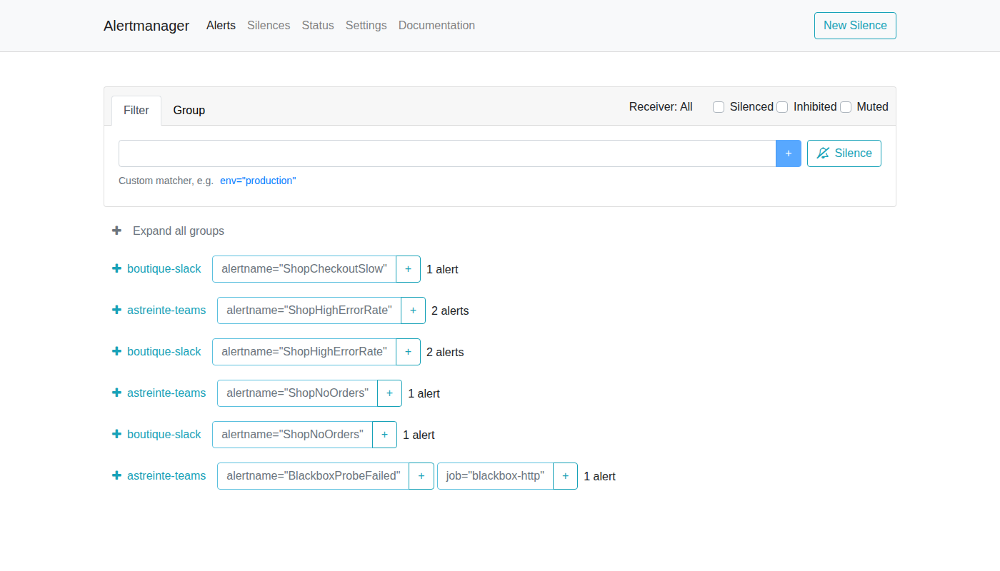
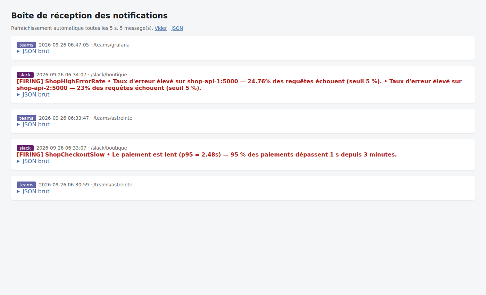
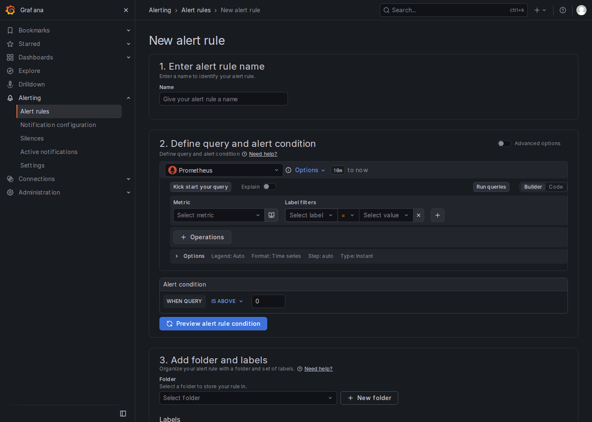
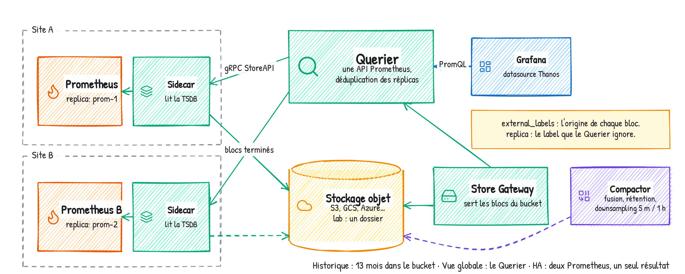

# Jour 3 — Réagir : alertes, exploitation, passage à l'échelle

Objectif de la journée : le matin, les stagiaires écrivent des alertes qui ne réveillent que
pour de bonnes raisons et les routent vers Teams, Slack et une boîte de réception. L'après-midi,
alerting Grafana, exploitation de Prometheus (performance, sauvegarde, sécurité), passage à
l'échelle avec un vrai Thanos monté brique par brique, et un war game pour finir.

| Heure | Séquence | Durée |
|---|---|---|
| 9h00 | Rappel du jour 2 + Exercice 3.0 — Brancher l'Alertmanager (brique 6) | 15 min |
| 9h15 | Module 11 — Philosophie de l'alerting et règles Prometheus | 25 min |
| 9h40 | Module 12 — Alertmanager | 25 min |
| 10h05 | TP 6 — Alertes Prometheus et routage Alertmanager | 55 min |
| 11h00 | Pause | 15 min |
| 11h15 | Module 13 — Notifications tierces : Slack, PagerDuty, Teams (Workflows), GitHub, templates | 30 min |
| 11h45 | TP 7 — Cas pratique : alerte CPU → Teams | 45 min |
| 12h30 | Déjeuner | |
| 14h00 | Module 14 — Alerting Grafana | 25 min |
| 14h25 | TP 8 — Alerting Grafana, de l'interface au code | 45 min |
| 15h10 | Module 15 — Performances, limites, bonnes pratiques + exercices 3.1 à 3.5 | 25 min |
| 15h35 | TP 9 — Sauvegarde, restauration, sécurité | 30 min |
| 16h05 | Pause | 10 min |
| 16h15 | Module 16 — Mise à l'échelle et écosystème | 10 min |
| 16h25 | TP 10 — Thanos : historique long et vue globale (brique 7) | 50 min |
| 17h15 | War game + évaluation finale | 15 min |

---

## 9h00 — Rappel et exercice 3.0 (15 min)

Quiz flash. Vérification que `recording.yml` est en place chez tout le monde (les alertes du
matin s'appuient dessus pour certaines) et que le dashboard TP 5 est là (on va le regarder
pendant les pannes).

### Exercice 3.0 — Brancher l'Alertmanager (10 min)

**Ce que je dis.** Depuis le jour 1, Prometheus évalue déjà une règle d'alerte (`TargetDown`, dans
`rules/alerts.yml`) mais il n'a personne à qui l'envoyer. On ajoute la brique.

**Énoncé.**
1. Dans `docker-compose.yml`, décommentez `compose/06-alerting.yml`. Lisez-le : deux services.
   `./lab.sh up`, `./lab.sh status`. Ouvrez http://localhost:9093 et http://localhost:8080.
2. Prometheus ne connaît toujours pas l'Alertmanager : dans `prometheus/prometheus.yml`,
   décommentez le bloc `alerting` (cible `alertmanager:9093`). Validez, rechargez.
3. Vérifiez dans Prometheus, **Status → Alertmanager discovery** : une cible active.
4. Ouvrez `alertmanager/alertmanager.yml` : il est minimal, un seul receiver vers l'Inbox. C'est
   lui qu'on va enrichir au TP 6.

**Corrigé.** Le service `inbox` est une petite application du dépôt qui joue Teams, Slack et
PagerDuty : tout ce qu'Alertmanager enverra pendant la journée arrive sur http://localhost:8080.
Sans le bloc `alerting`, une alerte passe *firing* dans Prometheus et ne va nulle part ; on le
voit avec `prometheus_notifications_sent_total` qui reste à zéro.

**Ce que je vérifie.** Tout le monde a une cible sur la page *Alertmanager discovery*. Ceux qui
ont oublié le reload voient la page vide.


### Pas à pas — rappel et exercice 3.0

```bash
./lab.sh up && sleep 30 && ./lab.sh status
```

`docker-compose.yml` : décommenter `- compose/06-alerting.yml`, `./lab.sh up`. PORTS → 9093 et
8080 → globe. `prometheus/prometheus.yml` : retirer les `# ` devant les quatre lignes du bloc
`alerting`. `./lab.sh check && ./lab.sh reload`. Prometheus → Status → **Alertmanager discovery** :
une cible.

---

## Module 11 — Philosophie de l'alerting et règles Prometheus (25 min)

**Objectif.** Savoir ce qui mérite une alerte, et écrire une règle propre.

### Ce que je dis

**La règle de Google SRE.** On alerte sur les **symptômes**, pas sur les causes. « CPU à 90 % »
est une cause possible d'un problème... ou le signe que le serveur fait son travail. « Les
clients attendent plus de 3 secondes » ou « 5 % des paiements échouent » sont des symptômes :
quelqu'un souffre, il faut agir. Corollaire : une alerte doit être **actionnable**. Si la
réponse à « qu'est-ce que je fais quand ça sonne ? » est « rien, je regarde », ce n'est pas une
alerte, c'est un panel de dashboard.

> **Anecdote — les 400 alertes.** Une équipe d'astreinte recevait 400 notifications par jour.
> Disques à 80 %, CPU à 85 %, un ping raté. Résultat : plus personne ne les lisait, et la nuit
> où la base de données est tombée, l'alerte est passée avec les autres. Après nettoyage : 12
> alertes, toutes sur des symptômes clients, chacune avec un runbook. La fatigue d'alerte tue
> plus de systèmes que les pannes.

**Les niveaux.** Pas besoin de plus de trois : `critical` (on réveille quelqu'un), `warning` (on regarde
demain matin), `info` (ticket, tableau de bord). La sévérité est un label, on routera dessus.

**Anatomie d'une règle.**

```yaml
groups:
  - name: shop-api
    rules:
      - alert: ShopHighErrorRate          # nom en CamelCase, unique
        expr: |                            # alerte si l'expression renvoie des séries
          sum by (instance) (rate(http_requests_total{job="shop-api", status=~"5.."}[5m]))
          / sum by (instance) (rate(http_requests_total{job="shop-api"}[5m])) > 0.05
        for: 2m                            # vrai pendant 2 min avant FIRING
        keep_firing_for: 3m                # reste FIRING 3 min après le retour à la normale
        labels:
          severity: critical
          team: boutique
        annotations:
          summary: "Taux d'erreur élevé sur {{ $labels.instance }}"
          description: "{{ $value | humanizePercentage }} des requêtes échouent (seuil 5 %)."
          runbook_url: "https://.../shop-errors.md"
```

Points clés :
- Une alerte se déclenche **par série renvoyée** : avec `by (instance)`, deux instances en
  erreur = deux alertes. Sans `by`, une seule alerte globale. C'est un choix.
- Cycle de vie : *inactive* → *pending* (condition vraie, `for` pas écoulé) → *firing*.
  `for` évite les alertes sur un pic d'une seconde. `keep_firing_for` (depuis 2.42) évite le
  clignotement quand la valeur oscille autour du seuil.
- *Labels* : servent à router (Alertmanager) et à grouper. *Annotations* : servent aux humains,
  avec des templates Go : `{{ $labels.x }}`, `{{ $value }}`, filtres `humanize`,
  `humanizePercentage`, `humanizeDuration`, `printf "%.2f"`.
- `runbook_url` est une convention (pas un mot-clé), reprise par Alertmanager et Grafana dans
  leurs templates.

**Les classiques à avoir.** `up == 0` (mais attention aux blackbox), `probe_success == 0`,
`prometheus_config_last_reload_successful == 0`, `absent(up{job="critique"})`, le taux
d'erreur, le p95, `predict_linear` sur le disque, le batch trop vieux, et
`prometheus_notifications_errors_total` (Prometheus n'arrive plus à parler à Alertmanager :
la seule alerte qui ne peut pas être envoyée, à surveiller autrement).

**Tester.** `promtool check rules`, puis `promtool test rules` avec des séries simulées, comme
au TP 3. Et en conditions réelles avec le chaos.

### Ce que je montre

Dans Prometheus, **Alerts** : la règle `TargetDown` déjà présente. J'arrête `shop-api-2`,
on regarde passer *pending* puis *firing* au bout d'une minute, la notification arrive dans
l'Inbox. Je redémarre, *resolved* arrive.


### Pas à pas — démonstration du module 11

```bash
docker compose stop shop-api-2
```

Prometheus → **Alerts** : `TargetDown` pending, puis firing après une minute. Alertmanager
(9093) : l'alerte. Inbox (8080) : la notification. Puis `docker compose start shop-api-2` :
resolved deux minutes plus tard.

---

## Module 12 — Alertmanager (25 min)

**Objectif.** Comprendre l'arbre de routage, le regroupement, l'inhibition et les silences.

### Ce que je dis

**Son rôle.** Prometheus évalue et envoie ; Alertmanager décide *qui* prévenir, *quand*, et
*combien de fois*. Il déduplique (deux Prometheus en HA envoient la même alerte), il regroupe
(50 instances down = 1 notification), il route (critical → astreinte, boutique → canal
boutique), il inhibe (si la base est down, taire les alertes des services qui en dépendent), il
respecte les silences et les plages horaires.

**L'arbre de routage.**

```yaml
route:                          # la racine reçoit tout
  receiver: inbox-default
  group_by: ["alertname", "job"]
  group_wait: 30s               # regrouper avant la 1re notification
  group_interval: 5m            # avant d'envoyer les nouveautés d'un groupe
  repeat_interval: 4h           # re-notifier une alerte toujours active
  routes:
    - matchers: [severity = critical]
      receiver: astreinte-teams
      continue: true            # évaluer aussi les routes suivantes
    - matchers: [team = boutique]
      receiver: boutique-slack
```

Une alerte descend l'arbre : première route qui matche, elle s'y arrête, sauf `continue: true`.
Les routes enfants héritent des paramètres du parent. Les `matchers` acceptent `=`, `!=`, `=~`,
`!~`.

**Le regroupement** est le concept qui surprend. `group_by: [alertname, job]` : toutes les
alertes `TargetDown` du job `shop-api` partent dans **une** notification. `group_wait` retarde
la première pour laisser arriver les autres. C'est ce qui évite les 50 mails à 3h du matin.
Sans `group_by` (ou `group_by: ['...']`), une notification par alerte.

**L'inhibition.** `inhibit_rules` : si une alerte *source* est active (`TargetDown` sur
l'instance X), on tait les alertes *cibles* (`ShopHighErrorRate` sur la même instance X grâce à
`equal: [instance]`). Quand le serveur est éteint, inutile de dire qu'il répond lentement.

**Les silences.** Créés dans l'interface (ou `amtool silence add`), avec des matchers et une
durée. Pour une maintenance planifiée. Ils s'appliquent après le routage. Les **time intervals**
(`mute_time_intervals`, `active_time_intervals`) sont des silences récurrents : week-end, nuit,
heures ouvrées.

**Les receivers.** Un nom, et une ou plusieurs intégrations : `webhook_configs`, `slack_configs`,
`msteamsv2_configs`, `pagerduty_configs`, `opsgenie_configs`, `email_configs`, `telegram_configs`,
`discord_configs`, `webex_configs`, `pushover_configs`, `sns_configs`, `victorops_configs`,
`mattermost_configs`... Le webhook est le joker : n'importe quel service HTTP peut recevoir le
JSON.

**Le format webhook.** C'est celui que reçoit notre Inbox :

```json
{ "receiver": "inbox-default", "status": "firing", "groupLabels": {"alertname": "TargetDown"},
  "commonLabels": {...}, "commonAnnotations": {...}, "externalURL": "http://localhost:9093",
  "alerts": [ { "status": "firing", "labels": {...}, "annotations": {...},
               "startsAt": "...", "endsAt": "...", "generatorURL": "...", "fingerprint": "..." } ] }
```

**Haute disponibilité.** Plusieurs Alertmanager en cluster (gossip) ; chaque Prometheus envoie
à tous ; ils dédupliquent entre eux. Quelques lignes de configuration, on en parle au module 16.

### Ce que je montre

- http://localhost:9093 : les alertes actives, les groupes, le bouton *Silence*, **Status** avec
  la configuration chargée.




- `docker compose exec alertmanager amtool alert` (les alertes actives ; `amtool` trouve
  l'URL dans `/etc/amtool/config.yml`, monté par le compose), puis
  `docker compose exec alertmanager amtool config routes show --config.file=/etc/alertmanager/alertmanager.yml`
  (l'arbre en ASCII) et `... amtool config routes test --config.file=/etc/alertmanager/alertmanager.yml severity=critical team=boutique`
  (« vers quel receiver ? »). Le `--config.file` est obligatoire pour ces deux commandes.


### Pas à pas — démonstration du module 12

```bash
docker compose exec alertmanager amtool config routes show --config.file=/etc/alertmanager/alertmanager.yml
docker compose exec alertmanager amtool config routes test --config.file=/etc/alertmanager/alertmanager.yml severity=critical team=boutique
docker compose exec alertmanager amtool alert
```

---

## TP 6 — Alertes Prometheus et routage Alertmanager (55 min)

**Objectif.** Écrire quatre alertes métier/service, les tester en cassant la boutique, puis
construire l'arbre de routage avec regroupement, inhibition, silence et plage horaire.

**Mise en situation.** L'équipe boutique veut être prévenue dans son canal quand le site souffre.
L'astreinte veut recevoir uniquement le critique, tout de suite. L'infra ne veut rien recevoir le
week-end sauf le critique. Et personne ne veut recevoir « erreurs sur shop-api-2 » quand
shop-api-2 est éteint.

### Partie 1 — Les alertes de la boutique (15 min)

**Énoncé.** Dans `prometheus/rules/alerts.yml`, groupe `shop-api`, écrivez :
1. `ShopHighErrorRate` (critical, team boutique) : taux d'erreur 5xx > 5 % par instance pendant
   2 min, `keep_firing_for: 3m`, `summary` avec l'instance, `description` avec la valeur en
   pourcentage (`humanizePercentage`), `runbook_url` vers `docs/runbooks/shop-errors.md`.
2. `ShopCheckoutSlow` (warning, boutique) : p95 de `/api/checkout` > 1 s pendant 3 min, `summary`
   avec la valeur (`humanizeDuration`).
3. `ShopNoOrders` (critical, boutique) : aucune commande depuis 10 min **alors qu'il y a du trafic**
   (deux conditions avec `and`), pendant 5 min.
4. `ShopStockLow` (info, team logistique) : stock < 15 unités, avec le produit dans le summary.
Puis dans un groupe `disponibilite`, ajoutez `BlackboxProbeFailed` (critical) sur `probe_success == 0`.
Validez, testez (`./lab.sh test` doit toujours passer), rechargez. Vérifiez dans **Alerts**.

**Corrigé.** Fichier complet : `solutions/jour-3/alerts.yml`. Les points à discuter :
- `ShopNoOrders` : `sum(rate(shop_orders_total[10m])) == 0 and sum(rate(http_requests_total{job="shop-api"}[10m])) > 0`.
  Le `and` apparie des vecteurs sans labels (les deux `sum` n'en ont aucun) : ça marche. Sans le
  `and`, l'alerte sonnerait aussi la nuit quand il n'y a simplement personne sur le site.
- `ShopStockLow` sonnera peut-être pendant le TP (le stock descend puis se réassortit) : c'est
  volontaire, ça fait vivre l'Inbox.
- `BlackboxProbeFailed` : ceux qui n'ont pas Internet ont déjà `https://prometheus.io` en échec ;
  ça leur fait une alerte critique de test gratuite.

### Partie 2 — Casser et vérifier (10 min)

**Énoncé.**
1. `./lab.sh chaos errors on`. Chronométrez : au bout de combien de temps `ShopHighErrorRate`
   passe *pending* ? *firing* ? À quel moment la notification arrive dans l'Inbox ? Expliquez
   chaque délai.
2. `./lab.sh chaos errors off`. Combien de temps avant *resolved* ? Pourquoi ?
3. Même exercice avec `./lab.sh chaos latency on` et `ShopCheckoutSlow`.
4. Regardez le dashboard TP 5 pendant ce temps : les annotations Chaos et le panneau d'erreurs.

**Corrigé.** Pending dès que `rate[5m]` dépasse 5 %, soit environ une minute après le chaos (la
fenêtre de 5 min se remplit d'erreurs progressivement ; à 40 % d'erreurs, la barre des 5 % est
franchie au bout de 40 s environ, plus un scrape et une évaluation). Firing 2 min
plus tard (`for`). Notification 30 s plus tard (`group_wait`). Au retour : la fenêtre de 5 min met
plusieurs minutes à redescendre sous 5 %, puis `keep_firing_for: 3m`, puis la notification
*resolved* au prochain `group_interval`. Total : 8 à 10 minutes. Leçon : chaque paramètre a un coût
en réactivité, et l'empilement `[5m]` + `for` + `keep_firing_for` + `group_wait` s'additionne.

### Partie 3 — L'arbre de routage (15 min)

**Énoncé.** Dans `alertmanager/alertmanager.yml` :
1. Les receivers vers l'Inbox : `inbox-default` (`/webhook/default`), `infra-inbox`
   (`/webhook/infra`), `astreinte-teams` en `msteamsv2_configs` vers `http://inbox:8080/teams/astreinte`
   (on mettra une vraie URL Teams au TP 7), `boutique-slack` en `slack_configs` vers
   `http://inbox:8080/slack/boutique`, canal `#boutique-alertes`.
2. Routes : `severity = critical` → astreinte-teams, `group_wait` 10 s, `repeat_interval` 1 h,
   `continue: true` ; `team = boutique` → boutique-slack ; `severity = info` → inbox-default avec
   `group_interval` 30 m et `repeat_interval` 24 h ; `team = infra` → infra-inbox.
3. Validez (`./lab.sh check`), rechargez, puis
   `docker compose exec alertmanager amtool config routes test --config.file=/etc/alertmanager/alertmanager.yml severity=critical team=boutique`
   : vers quels receivers ?
4. Relancez `./lab.sh chaos errors on` et observez l'Inbox : combien de messages, sur quels canaux,
   avec quel format ?

**Corrigé.** Fichier : `solutions/jour-3/alertmanager.yml` (routes 1 à 3 et 5). Une alerte
critical + boutique part vers `astreinte-teams` **et** `boutique-slack` grâce à `continue: true`.
Dans l'Inbox, on compare le JSON Slack (`attachments` avec `color: danger`) et la carte adaptative
Teams (`attachments[].content.body[]` de type `TextBlock`) : deux formats générés par Alertmanager
à partir de la même alerte.

`amtool config routes test` est peu connu et évite des heures de « pourquoi ça n'arrive pas
dans le bon canal ».

### Partie 4 — Inhibition (5 min)

**Énoncé.** Ajoutez deux `inhibit_rules` : (a) `TargetDown` inhibe `ShopHighErrorRate` et
`ShopCheckoutSlow` sur la même `instance` ; (b) une alerte `critical` inhibe le `warning` de même
`alertname` sur la même `instance` (règle générique : aucune alerte du lab n'existe en deux
sévérités, elle ne se déclenchera pas ici). Testez : chaos errors on, puis `docker compose stop shop-api-2`.
Que voit-on dans Alertmanager ?

**Corrigé.** L'alerte `ShopHighErrorRate{instance="shop-api-2:5000"}` passe *inhibited* dans
l'interface (filtre *Inhibited*). Elle reste visible mais n'est plus notifiée. Redémarrer
shop-api-2 et remettre le chaos à off.

### Partie 5 — Silence et plage horaire (10 min)

**Énoncé.**
1. Dans l'interface Alertmanager, créez un silence de 30 min sur `alertname="ShopStockLow"` avec un
   commentaire. Vérifiez que l'alerte n'est plus notifiée. Même chose en ligne de commande :
   `docker compose exec alertmanager amtool silence add alertname=ShopStockLow -d 30m -c "réassort en cours"`
   puis `amtool silence query` et `amtool silence expire <id>`.
2. Ajoutez un `time_intervals` nommé `nuit-et-weekend` (samedi, dimanche, et 20h-8h en
   `Europe/Paris`) et appliquez-le en `mute_time_intervals` sur la route `team = infra`.

**Corrigé.** Le piège habituel : un intervalle `20:00` → `08:00` est refusé (« start time cannot be
equal or greater than end time »). Il faut deux intervalles : `20:00-24:00` et `00:00-08:00`.
Grafana a exactement la même contrainte. Deuxième piège : `location` doit être un nom de fuseau
IANA, et le conteneur doit avoir la base tzdata (l'image officielle l'a).

**Ce que je vérifie.** `./lab.sh check` passe chez tout le monde, l'Inbox a reçu au moins un
message Teams et un message Slack, et le chaos est off.


### Pas à pas — TP 6

Partie 1 : éditer `prometheus/rules/alerts.yml`, les cinq alertes (corrigé : `solutions/jour-3/alerts.yml`
dans le démo).

```bash
docker compose exec prometheus promtool check rules /etc/prometheus/rules/alerts.yml
./lab.sh test && ./lab.sh reload
```

Partie 2 : `./lab.sh chaos errors on`, chronomètre, Prometheus → Alerts, Inbox. `./lab.sh chaos
errors off`. Partie 3 : `alertmanager/alertmanager.yml`,

```bash
docker compose exec alertmanager amtool check-config /etc/alertmanager/alertmanager.yml
curl -X POST localhost:9093/-/reload
docker compose exec alertmanager amtool config routes test --config.file=/etc/alertmanager/alertmanager.yml severity=critical team=boutique
```

Partie 5, silence par amtool :

```bash
docker compose exec alertmanager amtool silence add alertname=ShopStockLow -d 1h -c "réassort en cours"
docker compose exec alertmanager amtool silence query
```

---

## Module 13 — Notifications tierces et ChatOps (30 min)

**Objectif.** Configurer Slack, PagerDuty, Teams via Workflows, un webhook vers GitHub, et
personnaliser les messages.

### Ce que je dis

**Slack.** Deux méthodes : le *incoming webhook* historique (`api_url`, une URL secrète par
canal) ou une application Slack avec token (`slack_configs` supporte `api_url` et, depuis
Alertmanager 0.30, une configuration « app » avec token de bot). Dans les deux cas, on met le
secret dans un fichier (`api_url_file`) et jamais dans le YAML commité.

```yaml
slack_configs:
  - api_url_file: /etc/alertmanager/secrets/slack.url
    channel: "#boutique-alertes"
    send_resolved: true
    title: '[{{ .Status | toUpper }}] {{ .CommonLabels.alertname }}'
    text: '{{ range .Alerts }}• {{ .Annotations.summary }}{{ "\n" }}{{ end }}'
```

**PagerDuty.** L'outil d'astreinte de référence (avec Opsgenie, en fin de vie chez Atlassian, et
Grafana OnCall/IRM). Events API v2 : une *integration key* par service.

```yaml
pagerduty_configs:
  - routing_key_file: /etc/alertmanager/secrets/pagerduty.key
    severity: '{{ .CommonLabels.severity }}'
    description: '{{ .CommonLabels.alertname }}: {{ .CommonAnnotations.summary }}'
```

PagerDuty gère l'escalade, les plannings, l'acquittement ; Alertmanager lui envoie *trigger* et
*resolve* avec la même clé de déduplication.

**Microsoft Teams, la méthode 2026.** Les connecteurs Office 365 (« Incoming Webhook » dans les
paramètres d'un canal) ont été retirés par Microsoft : création bloquée depuis août 2024, coupure
définitive des connecteurs existants en mai 2026, après plusieurs reports. L'ancien `msteams_configs` d'Alertmanager
est donc déprécié. La méthode actuelle passe par **Workflows** (Power Automate) :

1. Dans Teams, dans le canal cible : **...** → *Workflows* → modèle « **Post to a channel when a
   webhook request is received** » (« Publier dans un canal lorsqu'une demande de webhook est
   reçue »).
2. Donner un nom, choisir l'équipe et le canal, créer. Teams affiche une URL
   `https://prod-xx.westeurope.logic.azure.com:443/workflows/.../triggers/manual/paths/invoke?...`.
   La copier, c'est le secret.
3. Le flux attend une *Adaptive Card* dans le corps du POST. Alertmanager (`msteamsv2_configs`)
   et Grafana (contact point *Microsoft Teams*) la produisent tout seuls.

```yaml
msteamsv2_configs:
  - webhook_url_file: /etc/alertmanager/secrets/teams.url
    send_resolved: true
```

Pour un canal privé, il faut éditer le flux et passer l'action « Post your own adaptive card as
the Flow bot » de *Flow bot* à *User*. Et si Grafana dit « envoyé » mais que rien n'arrive, on
regarde l'historique d'exécution du flux dans Power Automate.

Notre Inbox expose `/teams/...` et accepte la carte : on peut tout tester sans compte
Microsoft. Le jour où on a la vraie URL, on la remplace, rien d'autre ne change.

**GitHub.** Le pattern ChatOps : une alerte ouvre une issue (ou commente celle qui existe) et la
ferme à la résolution. On ne branche pas Alertmanager directement sur l'API GitHub : on passe
par un *repository_dispatch* qui déclenche un workflow Actions. Le dépôt contient
`.github/workflows/alert-to-issue.yml` qui fait exactement ça. Côté émetteur, Grafana (contact
point *Webhook*, payload personnalisé et en-tête `Authorization: Bearer <token>`) est le plus
simple ; Alertmanager sait aussi le faire avec `webhook_configs` + `http_config.authorization` +
le bloc `payload` (Alertmanager ≥ 0.32). Alternative très répandue : un petit relais (une
fonction serverless, un `n8n`) entre les deux.

**Les templates.** Alertmanager utilise les templates Go. On définit ses blocs dans un fichier
`.tmpl` chargé par `templates:` et on les appelle avec `{{ template "nom" . }}`. Les variables
utiles : `.Status`, `.Alerts` (et `.Alerts.Firing`, `.Alerts.Resolved`), `.CommonLabels`,
`.CommonAnnotations`, `.GroupLabels`, `.ExternalURL`. Notre `alertmanager/templates/formation.tmpl`
en contient deux. Ce qu'un bon message contient : le statut, le nombre d'alertes, le résumé, la
sévérité, l'instance, le lien runbook, le lien vers le dashboard. Ce qu'il ne contient pas : un
dump de tous les labels.

**Grafana IRM.** Pour mémoire : Grafana propose sa propre astreinte (plannings, escalades,
appels) dans Grafana Cloud ; la version OSS d'OnCall a été archivée en mars 2026.

### Ce que je montre

- La création du flux Workflows, pas à pas (annexe E) ; en direct si j'ai un tenant de démo.
- Le fichier `.github/workflows/alert-to-issue.yml` et un `curl` de test si le token est disponible.

---

## TP 7 — Cas pratique : alerte CPU élevé, notification dans Teams (45 min)

**Objectif.** Le cas pratique du programme, de bout en bout : la règle, le routage, la
notification Teams via Workflows, un message personnalisé.

**Mise en situation.** L'équipe infra veut être prévenue dans son canal Teams quand un serveur
dépasse 80 % de CPU pendant plus de deux minutes, avec un message lisible : le serveur, la
valeur, un lien vers le dashboard.

### Partie 1 — La règle (10 min)

**Énoncé.** Groupe `infrastructure` dans `alerts.yml` :
1. `HostHighCpuLoad` (warning, team infra) : CPU > 80 % pendant 2 min, fenêtre de `rate` 2 min,
   `summary` : « CPU à NN % sur <instance> » (`printf "%.0f"`).
2. Bonus : `HostOutOfMemory` (mémoire > 90 % pendant 5 min), `HostDiskWillFillIn24h`
   (`predict_linear` sur 6 h, et espace < 20 %), `BackupTooOld` (dernière sauvegarde Pushgateway >
   24 h), `PrometheusConfigReloadFailed`.
3. Ajoutez un test unitaire pour `HostHighCpuLoad` dans `prometheus/tests/` : une série
   `node_cpu_seconds_total{mode="idle", cpu="0", instance="srv"}` qui n'augmente plus (CPU
   saturé), et vérifiez l'alerte à 4 min.
Validez, testez, rechargez.

**Corrigé.** Règle dans `solutions/jour-3/alerts.yml`. Le test :

```yaml
rule_files:
  - ../rules/alerts.yml
evaluation_interval: 15s
tests:
  - interval: 15s
    input_series:
      # idle n'augmente plus : le CPU est occupé à 100 %
      - series: 'node_cpu_seconds_total{mode="idle", cpu="0", instance="srv", job="node"}'
        values: "100 100 100 100 100 100 100 100 100 100 100 100 100 100 100 100 100 100 100 100"
    alert_rule_test:
      - eval_time: 4m
        alertname: HostHighCpuLoad
        exp_alerts:
          - exp_labels:
              severity: warning
              team: infra
              instance: srv
            exp_annotations:
              summary: "CPU à 100 % sur srv"
              description: "L'utilisation CPU dépasse 80 % depuis 2 minutes."
```

Attention à la subtilité : `rate` d'une série constante vaut 0, donc `1 - 0 = 100 %`. Les valeurs
doivent être présentes (pas de trous) sur toute la fenêtre.

### Partie 2 — Le routage vers Teams (10 min)

**Énoncé.**
1. Ajoutez une route `alertname = HostHighCpuLoad` → receiver `astreinte-teams`, `group_wait: 10s`,
   **avant** la route `team = infra` (pourquoi ?).
2. Si vous avez une URL Workflows : remplacez `webhook_url` par la vraie URL (ou mieux :
   `webhook_url_file` pointant sur un fichier monté). Sinon, gardez `http://inbox:8080/teams/astreinte`.
3. Validez, rechargez, `docker compose exec alertmanager amtool config routes test --config.file=/etc/alertmanager/alertmanager.yml alertname=HostHighCpuLoad team=infra severity=warning`.

**Corrigé.** L'ordre compte : l'arbre s'arrête à la première route qui matche (sans `continue`).
Si `team = infra` est avant, l'alerte part vers `infra-inbox` (et se fait muter le week-end).
`amtool config routes test` doit répondre `astreinte-teams`.

### Partie 3 — Déclencher (10 min)

**Énoncé.**
1. `./lab.sh chaos cpu 300` (5 minutes de CPU à fond).
2. Suivez dans Prometheus **Alerts** puis dans Alertmanager, puis dans Teams (ou l'Inbox, canal
   `teams`). Chronométrez.
3. Ouvrez la carte : que contient-elle ? Qu'est-ce qui manque pour qu'elle soit vraiment utile ?

**Corrigé.** Pending vers 2 min (le `rate[2m]` doit dépasser 80 %, ce qui prend presque toute la
fenêtre), firing 2 min plus tard, carte Teams 10 s après. La carte par défaut (`msteamsv2.default.text`) contient tous les labels et
annotations : lisible mais verbeux. Il manque un lien vers le dashboard et le runbook en clair.

### Partie 4 — Personnaliser le message (15 min)

**Énoncé.**
1. Ouvrez `alertmanager/templates/formation.tmpl` : deux blocs, `formation.title` et
   `formation.text`.
2. Utilisez-les dans le receiver `astreinte-teams` (`title:` et `text:`).
3. Ajoutez au bloc `formation.text` un lien vers le dashboard TP 4 :
   `http://localhost:3000/d/formation-serveur-linux?var-instance={{ .Labels.instance }}`.
4. Rechargez, relancez un chaos CPU (ou attendez le `repeat_interval`), comparez.

**Corrigé.**

```yaml
  - name: astreinte-teams
    msteamsv2_configs:
      - webhook_url: http://inbox:8080/teams/astreinte
        send_resolved: true
        title: '{{ template "formation.title" . }}'
        text: '{{ template "formation.text" . }}'
```

Et dans le template :

```
{{ define "formation.text" }}
{{ range .Alerts -}}
{{ .Annotations.summary }}
Sévérité : {{ .Labels.severity }} | Instance : {{ .Labels.instance }}
Dashboard : http://localhost:3000/d/formation-serveur-linux?var-instance={{ .Labels.instance }}
{{ if .Annotations.runbook_url }}Runbook : {{ .Annotations.runbook_url }}{{ end }}
{{ end }}
{{ end }}
```

Astuce pour tester un template sans attendre une alerte : `amtool template render --template.glob='/etc/alertmanager/templates/*.tmpl' --template.text='{{ template "formation.title" . }}'`
(avec des données par défaut). Et pour tester un receiver sans alerte réelle : envoyer une
alerte de test à Alertmanager directement :

```
curl -X POST http://localhost:9093/api/v2/alerts -H 'Content-Type: application/json' -d '[{
  "labels": {"alertname": "TestTeams", "severity": "critical", "instance": "test"},
  "annotations": {"summary": "Ceci est un test"}}]'
```

**Ce que je vérifie.** Chacun a une carte Teams (ou Inbox `teams`) qui contient sa `summary` et le
lien dashboard.


### Pas à pas — TP 7

Règle dans `alerts.yml`, route dans `alertmanager.yml`, puis :

```bash
./lab.sh chaos cpu 300
```

Test sans attendre :

```bash
curl -X POST localhost:9093/api/v2/alerts -H 'Content-Type: application/json' -d '[{"labels":{"alertname":"HostHighCpuLoad","severity":"warning","team":"infra","instance":"node-exporter:9100"},"annotations":{"summary":"CPU à 92 % sur node-exporter:9100"}}]'
```

Partie 4, rendu du template :

```bash
docker compose exec alertmanager amtool template render --template.glob='/etc/alertmanager/templates/*.tmpl' --template.text='{{ template "formation.text" . }}'
```

---

## Module 14 — Alerting Grafana (25 min)

**Objectif.** Comprendre l'alerting unifié de Grafana, ses différences avec Alertmanager, et
quand choisir l'un ou l'autre.

### Ce que je dis

**Ce que c'est.** Depuis Grafana 9, l'alerting « unifié » : des règles évaluées par Grafana
lui-même, sur n'importe quelle source de données (Prometheus, mais aussi Loki, SQL, Elastic...),
avec un Alertmanager embarqué (le même code) pour le routage. On retrouve les mêmes concepts sous
d'autres noms :

| Alertmanager | Grafana | |
|---|---|---|
| receiver | **Contact point** | où envoyer |
| route | **Notification policy** | qui reçoit quoi |
| silence | **Silence** | même chose |
| time_interval | **Time interval** (mute timing) | plages horaires |
| template | **Notification template** | même langage Go |
| règle Prometheus (`for`) | **Alert rule** (pending period, keep firing for) | |
| — | **Recording rule** Grafana | pré-calcul, écrit via remote write |

**Une règle Grafana.** Une ou plusieurs requêtes (A, B...), puis des *expressions* : *Reduce*
(une série → une valeur : last, mean, max), *Math* (`$A / $B * 100`), *Threshold* (`> 80`),
*Classic condition*. La condition finale est une expression qui vaut 0 ou 1 par série. Multidimensionnel : une instance d'alerte par série, comme Prometheus. États : Normal, Pending,
Alerting, NoData, Error (les deux derniers sont configurables : traiter NoData comme OK, Alerting
ou NoData).

Deux modes dans l'interface : *Grafana-managed* (évalué par Grafana, ce qu'on vient de décrire)
et *Data source-managed* (Grafana écrit la règle... dans Prometheus, via une API de rules ;
nécessite Mimir/Cortex/Loki ou un Prometheus avec l'API d'écriture de règles). On reste sur
Grafana-managed.

**Quand utiliser quoi.**
- Alertes sur métriques Prometheus, pures, versionnées dans Git, testées avec `promtool` :
  **Prometheus + Alertmanager**. Plus robuste (une alerte évaluée là où sont les données), pas de
  dépendance à Grafana, Alertmanager en HA trivial.
- Alertes multi-sources (un log Loki + une métrique), alertes SQL, équipes qui vivent dans
  Grafana et veulent cliquer, lien direct règle ↔ panel : **Grafana alerting**.
- Les deux coexistent très bien : Grafana peut aussi afficher les alertes Prometheus (source de
  données avec *Manage alerts via Alerting UI*, activé chez nous) et même router les alertes
  Prometheus vers son Alertmanager embarqué, ou un Alertmanager externe.
- Ce qu'il ne faut pas faire : dupliquer la même alerte des deux côtés.

**Provisionner.** Tout l'alerting Grafana se provisionne par fichier YAML dans
`provisioning/alerting/`, par API (`/api/v1/provisioning/...`) ou Terraform. Chaque objet a un
bouton *Export* dans l'interface qui génère le YAML.

### Ce que je montre

**Alerting → Alert rules** : les règles Prometheus sont déjà visibles (section *Data source
managed*, *Prometheus*), avec leur état. **Alerting → Notification configuration** : contact
points, policies, templates, time intervals.



---

## TP 8 — Alerting Grafana, de l'interface au code (45 min)

**Objectif.** Créer une règle multi-dimensionnelle dans l'interface, un contact point Teams, une
politique de notification, la tester, puis tout exporter et provisionner par fichier.

### Partie 1 — Contact point et politique (10 min)

**Énoncé.**
1. **Alerting → Notification configuration → Contact points → New contact point**. Nom
   `inbox-grafana`, intégration *Webhook*, URL `http://inbox:8080/webhook/grafana`. *Test* : le
   message arrive dans l'Inbox ? Sauvegardez.
2. Second contact point `teams-astreinte`, intégration *Microsoft Teams*, URL : votre URL
   Workflows ou `http://inbox:8080/teams/grafana`. *Test*, sauvegardez.
3. **Notification policies** : éditez la *Default policy* pour envoyer vers `inbox-grafana`. Puis
   *New notification policy* (route enfant) : matcher `severity = critical` → `teams-astreinte`,
   *Override grouping* non, *Override general timings* : group wait 10 s.

**Corrigé.** Le bouton *Test* envoie une alerte fictive `TestAlert` : première chose à faire pour
tout nouveau contact point. Le webhook Grafana envoie le même format que le webhook Alertmanager,
plus quelques champs (`orgId`, `title`, `message`, `state`) : on compare dans l'Inbox.

### Partie 2 — Une règle dans l'interface (15 min)

**Énoncé.** **Alerting → Alert rules → New alert rule** :
1. Nom : `Boutique - taux d'erreur élevé (Grafana)`.
2. Requête A (Prometheus, mode *Code*, type *Instant*) : le taux d'erreur 5xx **par instance**, en
   pourcentage.
3. Condition : *WHEN QUERY A IS ABOVE 5* (ou, en *Advanced options*, une expression *Reduce* Last
   puis *Threshold* > 5). *Preview alert rule condition*.
4. Dossier *Formation*, labels `severity=critical`, `team=boutique`, `source=grafana`.
5. Groupe d'évaluation `boutique-grafana`, intervalle 1 min, *Pending period* 2 min, *Keep firing
   for* 1 min. *Configure no data and error handling* : NoData → OK.
6. Notifications : contact point... rien à choisir si vous laissez la politique de notification
   décider (mode *Use notification policy* dans les *Advanced options*), sinon sélectionnez
   `teams-astreinte`.
7. Message : *Summary* `{{ $labels.instance }} : {{ printf "%.1f" $values.B.Value }} % d'erreurs`,
   *Description*, *Runbook URL*, et *Link dashboard and panel* vers le panneau *Taux d'erreur*
   du TP 5.
8. Sauvegardez. `./lab.sh chaos errors on`, attendez. Suivez la règle (état, historique), puis
   l'Inbox.

**Corrigé.** Le YAML équivalent est dans `solutions/jour-3/grafana-alerting.yml`. Points à
commenter :
- *Instant* pour la requête : une alerte a besoin d'une valeur par série, pas d'une courbe. En
  mode *Range*, il faut obligatoirement un *Reduce*.
- `$values.B.Value` dans les annotations : `B` est le nom de l'expression Reduce (en mode simple,
  Grafana crée B et C tout seul). `$labels` fonctionne comme dans Prometheus.
- Le lien dashboard/panel ajoute les annotations `__dashboardUid__` et `__panelId__` : le
  message de notification contient un lien direct vers le graphique, et le panel affiche les
  alertes qui lui sont liées.
- La règle apparaît en *Alerting* avec deux instances (shop-api-1, shop-api-2). L'onglet
  *History* montre les transitions.

### Partie 3 — La règle CPU et une mise en sourdine (5 min)

**Énoncé.** Créez `Serveur - CPU élevé (Grafana)` (warning, team infra) sur la même logique avec
un seuil à 80. Puis **Time intervals → Add time interval** `nuit` (22h-7h, Europe/Paris) et
appliquez-le en *Mute timings* sur la politique par défaut. Que se passe-t-il pour l'intervalle
22:00 → 07:00 ?

**Corrigé.** Même contrainte qu'Alertmanager : deux intervalles, `22:00-24:00` et `00:00-07:00`.

### Partie 4 — Tout en code (15 min)

**Énoncé.**
1. Sur chaque objet (règle, contact point, politique, time interval) : *More → Export* (ou le
   bouton *Export* de la liste) au format YAML. Assemblez un fichier
   `grafana/provisioning/alerting/formation.yml` avec les sections `contactPoints`, `policies`,
   `groups`, `muteTimes`.
2. Supprimez les objets créés à la main dans l'interface. `docker compose restart grafana`.
3. Vérifiez que tout est revenu, en lecture seule (cadenas *Provisioned*).
4. Bonus : `curl -s -u admin:formation http://localhost:3000/api/v1/provisioning/alert-rules | jq`.

**Corrigé.** Fichier : `solutions/jour-3/grafana-alerting.yml`. Erreurs classiques : un `uid`
manquant sur un contact point (obligatoire pour que les policies le référencent), un `folder` qui
n'existe pas (Grafana le crée), `datasourceUid: prometheus` qui doit correspondre à l'uid
provisionné. Et le fameux intervalle qui passe minuit : un fichier invalide **empêche Grafana de
démarrer** (il redémarre en boucle, `docker compose logs grafana` montre `failure to parse file`).
C'est plus brutal qu'Alertmanager, qui garde l'ancienne config.


### Pas à pas — module 14 et TP 8

Grafana → **Alerting → Contact points → Create contact point** : Name `inbox-grafana`,
Integration **Webhook**, URL `http://inbox:8080/webhook/grafana`, **Test** → Send test
notification, **Save contact point**. Second : `teams-astreinte`, Integration **Microsoft
Teams**, URL `http://inbox:8080/teams/grafana` (ou la vraie URL Workflows).

**Alerting → Notification policies** : sur *Default policy*, **···** → Edit → Contact point
`inbox-grafana`, Update. Puis **New child policy** : Label `severity`, Operator `=`, Value
`critical`, Contact point `teams-astreinte`, Override group timings → Group wait `10s`, Save.

**Alerting → Alert rules → New alert rule** : les six étapes du chapitre Jour 3, TP 8.
Partie 4 : sur la règle, **···** → **Export** → format YAML → copier dans
`grafana/provisioning/alerting/formation.yml` (fichier à créer), même chose pour les contact
points (**Contact points → ··· → Export**). Puis `docker compose restart grafana`. Si Grafana ne
redémarre pas : `docker compose logs grafana | tail -20`, le fichier YAML est en cause.

---

## Module 15 — Performances, limites, bonnes pratiques (25 min, exercices compris)

**Objectif.** Savoir dimensionner, diagnostiquer un Prometheus qui souffre, et déployer proprement.

### Ce que je dis

**Ce qui coûte.** Principalement : le nombre de séries actives (mémoire), le débit d'échantillons
(CPU, disque), et les requêtes (CPU, mémoire au moment de la requête). Ordres de grandeur en 2026
sur une machine correcte : un Prometheus seul tient confortablement 1 à 2 millions de séries
actives et quelques centaines de milliers d'échantillons par seconde. Mémoire : compter grossièrement
2 à 4 Ko par série active dans le head, plus le cache. Disque : 1 à 2 octets par échantillon
(1 million de séries × 1 échantillon/15 s × 1,5 octet ≈ 8,5 Go par jour).

**La TSDB.** Le *head* en mémoire reçoit tout, adossé au **WAL** (journal sur disque, rejoué au
démarrage : c'est pour ça qu'un gros Prometheus met plusieurs minutes à redémarrer). Toutes les
deux heures, le head est écrit en **bloc** immuable (`01M3E7...` : chunks, index, meta.json,
tombstones). Les blocs sont ensuite **compactés** en blocs plus gros (jusqu'à 10 % de la
rétention). La rétention (`--storage.tsdb.retention.time` et/ou `.size`) supprime les blocs
entiers. Supprimer des séries ciblées : l'API admin `delete_series` + `clean_tombstones`
(`--web.enable-admin-api`, que le lab active).

**Les séries périmées (staleness).** Quand une série disparaît d'un scrape, Prometheus écrit un
marqueur et la série disparaît des requêtes instantanées après 5 min. Une série qui change de
labels toutes les minutes (un pod qui redémarre, un label avec un timestamp) crée une nouvelle
série à chaque fois : c'est le *churn*, second tueur après la cardinalité.

**Diagnostiquer.**
- **Status → TSDB status** : nombre de séries, top des métriques et des labels par cardinalité.
- `prometheus_tsdb_head_series`, `rate(prometheus_tsdb_head_samples_appended_total[5m])`,
  `process_resident_memory_bytes{job="prometheus"}`, `prometheus_tsdb_compaction_duration_seconds`,
  `prometheus_engine_query_duration_seconds{slice="inner_eval"}`, `scrape_duration_seconds`,
  `scrape_samples_scraped`, `up`.
- `promtool tsdb analyze /prometheus` sur un bloc : les labels et métriques les plus coûteux.
- Un dashboard « Prometheus lui-même » : le 3662 communautaire, ou celui de kube-prometheus.

**Limiter la casse.**
- `sample_limit`, `label_limit`, `label_name_length_limit`, `label_value_length_limit` par job :
  Prometheus refuse un scrape qui dépasse (et `up` passe à 0, ce qui alerte).
- `metric_relabel_configs` avec `drop` pour ce qu'on ne veut pas.
- `--query.max-samples`, `--query.timeout`, `--query.max-concurrency`.
- Recording rules pour tout ce qui est affiché en boucle.
- Fenêtres de `rate` raisonnables, `$__rate_interval` dans Grafana, pas de dashboard
  auto-refresh à 5 s sur 24 h.

**Déployer proprement.**
- **Sécurité** : Prometheus n'a ni authentification ni chiffrement par défaut. Depuis 2.24, le
  `--web.config.file` ajoute TLS et basic auth (mots de passe bcrypt). En pratique on met un
  reverse proxy (nginx, Traefik, oauth2-proxy) devant, ou on ne l'expose pas et on passe par
  Grafana. Idem pour Alertmanager, les exporters et la Pushgateway. Les secrets dans des fichiers
  (`*_file`), jamais dans le YAML.
- **Haute disponibilité** : deux Prometheus identiques qui scrapent les mêmes cibles (avec
  `external_labels: replica: a|b`), deux ou trois Alertmanager en cluster ; Alertmanager
  déduplique. Grafana avec une base PostgreSQL et plusieurs répliques derrière un load balancer.
- **Mode agent** (`--agent`) : un Prometheus sans stockage ni requêtes, qui scrape et pousse en
  `remote_write`. Pour les sites distants et l'edge. Grafana Alloy fait la même chose (et les logs,
  et les traces, et OpenTelemetry).
- **Grafana** : PostgreSQL au lieu de SQLite dès qu'il y a plus de deux utilisateurs actifs, tout
  provisionné, un dossier par équipe, `admin` désactivé au profit du SSO, sauvegarde de la base.
- **Conventions** : nommage des métriques, labels `env`/`team`/`service` partout (via
  `external_labels` ou relabeling), un runbook par alerte, des tests de règles en CI.

### Exercices 3.1 à 3.5 — Diagnostic (10 min)

**3.1** — Combien de séries actives ? Quelle métrique en a le plus ? Quel label a le plus de
valeurs distinctes ? (TSDB status et requêtes)
*`prometheus_tsdb_head_series` (~4 000 chez nous) ; `http_request_duration_seconds_bucket` ; label
`le` ou `route` selon le moment. `topk(10, count by (__name__) ({__name__=~".+"}))`.*

**3.2** — Combien d'échantillons par seconde entrent ? Combien de mémoire consomme Prometheus ?
*`rate(prometheus_tsdb_head_samples_appended_total[5m])` (~300/s) ;
`process_resident_memory_bytes{job="prometheus"}` (~150-300 Mo).*

**3.3** — Quel job coûte le plus cher au scrape ? Quel est le plus lent ?
*`sort_desc(sum by (job) (scrape_samples_scraped))` → `redis` ou `shop-api` ;
`sort_desc(max by (job) (scrape_duration_seconds))` → `blackbox-http` (la sonde https).*

**3.4** — Mettez un `sample_limit: 100` sur le job `redis`. Rechargez. Que devient `up{job="redis"}` ?
Retirez-le.
*`up` passe à 0, et `scrape_samples_post_metric_relabeling` > 100 explique pourquoi. Prometheus
préfère perdre un job que se noyer.*

**3.5** — Quelle requête de ce matin était la plus lente ? Comparez la version brute et la
recording rule avec `?stats=all` :
`curl -s 'http://localhost:9090/api/v1/query?stats=all' --data-urlencode 'query=histogram_quantile(0.95, sum by (route, le) (rate(http_request_duration_seconds_bucket[5m])))' | jq .data.stats`
*`totalQueryableSamples` et `timings.execTotalTime` : la brute lit des milliers d'échantillons, la
recording rule quelques dizaines.*


### Pas à pas — exercices du module 15

Prometheus → Status → TSDB status. Exercice 3.4 : `sample_limit: 100` sous `job_name: redis`,
check, reload, `up{job="redis"}` : 0. Retirer, reload.

---

## TP 9 — Sauvegarde, restauration, sécurité (30 min)

**Objectif.** Sauvegarder et restaurer Prometheus et Grafana, protéger Prometheus par mot de passe.

**Mise en situation.** Un audit demande : « si le serveur de monitoring brûle, en combien de
temps le remettez-vous ? Et qui peut lire vos métriques ? » (La troisième question de l'audit,
« avez-vous 13 mois d'historique ? », c'est le TP 10.)

### Partie 1 — Snapshot et restauration de Prometheus (12 min)

**Énoncé.**
1. `./lab.sh snapshot` (appelle `POST /api/v1/admin/tsdb/snapshot`, possible grâce à
   `--web.enable-admin-api`). Listez les snapshots : `docker compose exec prometheus ls /prometheus/snapshots/`.
   Que contient un snapshot ?
2. Notez le nombre de séries de `shop_orders_total` d'il y a 5 min : `count(shop_orders_total offset 5m)`.
3. Simulez la catastrophe et restaurez :

```bash
SNAP=<nom du snapshot>
docker compose stop prometheus
docker compose run --rm --no-deps --user root --entrypoint sh prometheus -c \
  "cd /prometheus && mv snapshots /tmp/ && rm -rf ./* && cp -a /tmp/snapshots/$SNAP/. . && mv /tmp/snapshots . && chown -R nobody:nobody /prometheus"
docker compose start prometheus
```

4. Vérifiez que l'historique est là (`count(shop_orders_total offset 5m)` renvoie toujours des
   séries). Qu'a-t-on perdu ? (Le `chown nobody` correspond à l'utilisateur de l'image officielle.)

**Corrigé.** Un snapshot est un dossier avec des liens durs vers les blocs existants plus un bloc
pour le head : quasi instantané, et il ne coûte que le head en espace. On perd ce qui a été ingéré
entre le snapshot et la restauration. Une stratégie réelle : snapshot + `rsync`/`restic` du
dossier `snapshots/` vers un stockage objet, toutes les heures ou toutes les nuits, puis
suppression du snapshot local. Alternative : sauvegarder `data/` directement à froid (Prometheus
arrêté) ou avec un snapshot du volume (LVM, EBS). Ne jamais copier `data/` à chaud sans snapshot :
le WAL bouge.

### Partie 2 — Sauvegarde de Grafana (8 min)

**Énoncé.**
1. Où est la base de Grafana ? Copiez-la : `docker compose cp grafana:/var/lib/grafana/grafana.db ./grafana-backup.db`.
   Quelle taille ? Qu'y a-t-il dedans ?
2. Exportez tous les dashboards via l'API en un script (bash ou PowerShell) : listez avec
   `/api/search?type=dash-db`, puis `/api/dashboards/uid/<uid>` pour chacun, en écrivant un fichier
   JSON par dashboard.
3. Discussion : qu'est-ce qui n'est **pas** dans les dashboards JSON et qu'il faut aussi sauvegarder ?

**Corrigé.**

```bash
mkdir -p backup && for uid in $(curl -s -u admin:formation 'http://localhost:3000/api/search?type=dash-db' | jq -r '.[].uid'); do
  curl -s -u admin:formation "http://localhost:3000/api/dashboards/uid/$uid" | jq .dashboard > "backup/$uid.json"
done
```

Ce qui n'est pas dans les JSON : utilisateurs, teams, permissions, sources de données (et leurs
secrets, chiffrés dans la base avec `secret_key` de `grafana.ini`), alerting, préférences, plugins.
D'où : soit on sauvegarde la base (SQLite : copie à chaud acceptable avec `sqlite3 .backup`, mieux
avec Grafana arrêté ; PostgreSQL : `pg_dump`), soit, et c'est la bonne réponse, **tout est provisionné et la
sauvegarde, c'est Git**. La base ne contient alors que de l'état reconstructible.

### Partie 3 — Un mot de passe sur Prometheus (10 min)

**Énoncé.**
1. Créez `prometheus/web.yml` avec `basic_auth_users` : utilisateur `admin`, mot de passe
   `formation` (hash bcrypt fourni dans le guide, ou généré avec `htpasswd -nBC 10 ""`).
2. Ajoutez `--web.config.file=/etc/prometheus/web.yml` au service `prometheus` du compose,
   `docker compose up -d prometheus`. Vérifiez : http://localhost:9090 demande un mot de passe ;
   `promtool check web-config` valide le fichier.
3. Qu'est-ce qui casse ? Réparez-le.

**Corrigé.** `solutions/jour-3/web.yml`. Ce qui casse : Grafana (source de données → *Basic auth*
à activer avec les identifiants, ou dans le provisioning `basicAuth: true`, `basicAuthUser`,
`secureJsonData.basicAuthPassword`), `./lab.sh reload` (ajouter `-u admin:formation`), et le
sidecar Thanos du TP 10 si on le laissait en place (`--prometheus.http-client` avec les
identifiants). Alertmanager ne parle pas à Prometheus, donc rien de ce côté. Leçon : la sécurité
se fait au début, pas à la fin. On **retire** le `web.config.file` à la fin du TP : le TP 10 et le
war game se font sans mot de passe.


### Pas à pas — TP 9

```bash
./lab.sh snapshot
docker compose exec prometheus ls /prometheus/snapshots/
```

Restauration : les quatre commandes du chapitre Jour 3, TP 9 partie 1 (copier-coller, en
remplaçant `SNAP=`). Partie 2 :

```bash
docker compose cp grafana:/var/lib/grafana/grafana.db ./grafana-backup.db
mkdir -p backup && for uid in $(curl -s -u admin:formation 'http://localhost:3000/api/search?type=dash-db' | jq -r '.[].uid'); do curl -s -u admin:formation "http://localhost:3000/api/dashboards/uid/$uid" | jq .dashboard > "backup/$uid.json"; done
ls backup/
```

Partie 3 : créer `prometheus/web.yml` (corrigé `solutions/jour-3/web.yml`), ajouter
`- --web.config.file=/etc/prometheus/web.yml` dans `compose/01-prometheus.yml`,
`docker compose up -d prometheus`. Prometheus demande un mot de passe. Grafana → Data sources →
Prometheus : Authentication **Basic authentication**, `admin` / `formation`, Save & test.
**Retirer** le flag à la fin : `docker compose up -d prometheus`.

---

## Module 16 — Mise à l'échelle et écosystème (10 min)

**Objectif.** Savoir quoi faire quand un Prometheus ne suffit plus, et où va l'écosystème.

### Ce que je dis

**Les signaux.** OOM récurrents ou compaction qui n'en finit pas → trop de séries : d'abord
réduire (cardinalité, `drop`, agrégation). Besoin de plus de 30-60 jours → stockage longue
durée. Plusieurs sites/clusters et une vue globale → fédération ou stockage central. Besoin de
HA « vraie » (pas de trou pendant un redémarrage) → duo de Prometheus, ou stockage distribué.

**Les options, dans l'ordre.**
1. **Sharding fonctionnel** : un Prometheus par équipe, par cluster, par type (infra / applis).
   Simple, robuste, mais des vues séparées.
2. **Fédération** : un Prometheus central qui scrape `/federate` de Prometheus régionaux (avec un
   `match[]` sur des recording rules agrégées). Ancien, limité, mais suffisant pour une vue globale
   légère.
3. **Un stockage longue durée au-dessus des Prometheus** :
    - **Thanos** : un *sidecar* à côté de chaque Prometheus envoie ses blocs dans un stockage
      objet (S3, GCS, Azure Blob...), un *Store Gateway* les relit, un *Querier* interroge tout le
      monde avec une seule API Prometheus et déduplique les réplicas, un *Compactor* fusionne les
      blocs et calcule des résolutions dégradées (downsampling). Les Prometheus restent tels
      qu'ils sont : c'est ce qu'on monte au TP 10.
    - **Grafana Mimir** (issu de Cortex) : les Prometheus envoient en remote write, Mimir stocke
      et sert ; horizontalement scalable, multi-tenant, c'est le moteur de Grafana Cloud.
    - **VictoriaMetrics** : remote write aussi, simple à opérer, très économe, PromQL étendu
      (MetricsQL). Version single-node ou cluster.

    Les trois exposent une API compatible Prometheus : Grafana ne voit pas la différence. Thanos a
    aussi un mode *Receive* (remote write) ; Mimir et VictoriaMetrics n'ont pas de sidecar.
4. **Managé** : Grafana Cloud, Amazon Managed Prometheus, Google Managed Prometheus, Azure Monitor
   managed Prometheus.

**OpenTelemetry.** Le standard d'instrumentation pour les trois signaux. Prometheus 3 reçoit
nativement de l'OTLP (`--web.enable-otlp-receiver`) et sait gérer les noms de métriques avec
points et UTF-8 (nouvelle syntaxe `{"service.name"="x"}`). Le Collector OTel (ou Grafana Alloy)
peut scraper des cibles Prometheus, recevoir de l'OTLP, et envoyer en remote write. En 2026,
instrumenter en OpenTelemetry et stocker dans Prometheus/Mimir est la combinaison la plus courante
pour du neuf.

**Loki et Tempo.** Les mêmes idées appliquées aux logs (Loki indexe les labels, pas le texte) et
aux traces (Tempo). Grafana les corrèle : d'un pic de latence (Prometheus) vers les traces
(exemplars) vers les logs, en quelques clics. C'est la suite logique de cette formation.

**Kubernetes.** kube-prometheus-stack : Prometheus Operator, `ServiceMonitor`, `PodMonitor`,
`PrometheusRule`, kube-state-metrics, node-exporter, Grafana avec des dizaines de dashboards, le
tout en un `helm install`. Tout ce qu'on a vu s'applique ; la découverte de services fait le reste.

### Ce que je montre

Le schéma Thanos du deck, qu'on va construire dans les cinquante minutes qui suivent. Et les
liens de l'annexe C.



---

## TP 10 — Thanos : historique long et vue globale (50 min)

**Objectif.** Monter un Thanos complet au-dessus de deux Prometheus, voir les blocs partir vers
un stockage objet, interroger les deux Prometheus d'une seule requête, et brancher Grafana dessus.

**Mise en situation.** La boutique ouvre un second site. Chaque site a son Prometheus (rétention
15 jours). L'audit veut 13 mois d'historique et une vue globale, sans toucher aux Prometheus
existants.

**Ce que je dis avant de lancer.** Tout tient dans une brique, `compose/07-thanos.yml`, et tout
tourne dans le Codespace (six conteneurs de plus, environ 400 Mo de RAM ; ceux qui sont sur leur
machine avec Docker Desktop ont la même chose). Le « stockage objet » du lab est un dossier
partagé (`type: FILESYSTEM` dans `thanos/objstore.yml`) : le même fichier pointerait sur S3, GCS ou
Azure en production, rien d'autre ne change. Une seule modification sur le Prometheus existant,
et elle est obligatoire : un sidecar qui envoie des blocs exige que la compaction locale soit
désactivée, c'est-à-dire `min-block-duration` égal à `max-block-duration` (c'est le Compactor de
Thanos qui compacte, dans le bucket). En production on met 2 h, la valeur par défaut du minimum ;
dans le lab on met 10 minutes pour voir les envois pendant le TP. Ceux qui sont sous Docker Desktop **Windows** : le TP marche aussi, simplement les
conteneurs Thanos tournent en `root` (droits sur le volume partagé), ce qu'on ne ferait pas en
production.

### Partie 1 — Lire l'architecture et lancer (10 min)

**Énoncé.**
1. Ouvrez `compose/07-thanos.yml` et repérez, pour chaque service, son rôle et à qui il parle :
   `thanos-sidecar-a`, `prometheus-b`, `thanos-sidecar-b`, `thanos-store`, `thanos-query`,
   `thanos-compact`. Quel volume est partagé par qui ?
2. Ouvrez `thanos/prometheus-b.yml` : qu'est-ce qui diffère du Prometheus principal ? Pourquoi les
   deux ont-ils un `external_labels.replica` différent ?
3. Dans `compose/01-prometheus.yml`, décommentez les deux flags `--storage.tsdb.*-block-duration=10m`.
4. Dans `docker-compose.yml`, décommentez `compose/07-thanos.yml`. `./lab.sh up`, `./lab.sh status` :
   six conteneurs de plus, tous `Up`. Notez l'heure.

**Corrigé.** Le volume `prometheus-data` est partagé entre `prometheus` et son sidecar (le sidecar
lit la TSDB en place, en lecture seule dans les faits) ; `thanos-bucket` est le « bucket »,
partagé entre les deux sidecars, le store et le compactor. `prometheus-b` scrape les mêmes cibles
(`shop-api`, `node`) avec `replica: prom-2`. Les `external_labels` sont **la** clé de Thanos : ils
identifient l'origine de chaque bloc dans le bucket, et `replica` est le label que le Querier
saura ignorer pour dédupliquer. Deux Prometheus sans `external_labels` distincts, et Thanos
refuse de démarrer. Le changement de taille de bloc redémarre Prometheus (`./lab.sh up` le
recrée) : l'historique est conservé, il a simplement des blocs de 2 h derrière et de 10 min devant.
Dans le compose, `--endpoint=` est marqué déprécié par Thanos 0.42 au profit de `--endpoint.sd-config`
(un fichier de découverte) ; il fonctionne toujours, et il est plus lisible pour un TP.

### Partie 2 — Le Querier : une vue, deux Prometheus (12 min)

**Énoncé.**
1. http://localhost:10902 : c'est l'interface de Prometheus, à un détail près. **Stores** : que voyez-vous ?
   Quels labels chaque *store* annonce-t-il ?
2. Requête `up{job="shop-api"}`. Combien de séries ? Décochez **Use Deduplication** (en haut de la page).
   Combien maintenant ? Expliquez.
3. `count by (replica) (up)` sans déduplication, puis avec. Où est passé le label `replica` ?
4. Arrêtez `prometheus-b` (`docker compose stop prometheus-b`) : `up{job="shop-api"}` avec
   déduplication. Redémarrez-le. C'est la haute disponibilité selon Thanos : deux Prometheus qui
   scrapent la même chose, un Querier qui fusionne.
5. Le Prometheus principal a des métriques que `prometheus-b` n'a pas (Redis, Blackbox, Pushgateway).
   `count(count by (__name__) ({__name__=~".+"}))` sur le Querier, sur Prometheus, sur Prometheus B.

**Corrigé.** Trois stores : deux sidecars (avec leurs `external_labels`, et une fenêtre de temps
qui commence au démarrage de chaque Prometheus) et le Store Gateway (vide pour l'instant, on y revient).
Sans déduplication, 4 séries `up{job="shop-api"}` (2 instances × 2 réplicas), chacune avec son
`replica` ; avec, 2 séries et le label `replica` a disparu : c'est `--query.replica-label=replica`
dans le compose. Prometheus B arrêté, le Querier sert la donnée de prom-1 sans trou : les sidecars
sont marqués *unhealthy* après quelques secondes mais la requête aboutit (avec un avertissement
partiel si un store ne répond pas). L'union des métriques : le Querier expose tout ce qu'au moins
un Prometheus connaît.

### Partie 3 — Grafana sur Thanos (8 min)

**Énoncé.**
1. Ajoutez une source de données dans Grafana : type *Prometheus*, nom `Thanos`, URL
   `http://thanos-query:10902`. Dans *Performance*, choisissez *Prometheus type* : **Thanos**. Sauvegardez
   et testez. Version fichier : `grafana/provisioning/datasources/thanos.yml` (l'un ou l'autre).
2. Ouvrez le dashboard TP 5 et, dans les réglages, changez la source de données du dashboard pour
   `Thanos` (ou ajoutez une variable `datasource` de type *Data source*). Tout s'affiche-t-il ?
3. Explore, source Thanos : `shop_orders_total`. Le label `replica` a disparu, `cluster` est resté.
   Pourquoi garde-t-on `cluster` ?

**Corrigé.** `solutions/jour-3/grafana-datasource-thanos.yml`. Le type *Thanos* dans Grafana active
les options propres à Thanos (downsampling, dédup). Tout s'affiche : l'API est la même. Une variable
`datasource` est la bonne pratique, elle permet de basculer un dashboard entre le Prometheus local et
la vue globale sans le dupliquer. `cluster` reste parce qu'il **distingue** des données différentes
(deux sites, ce seraient deux valeurs) ; `replica` distingue deux copies de la **même** donnée.
C'est exactement la différence entre un label qu'on garde et un label qu'on déduplique.

### Partie 4 — Le bucket, le Store Gateway et le Compactor (15 min)

**Énoncé.** À faire quinze minutes au moins après le lancement de la partie 1 (le premier bloc
vient du Prometheus principal, qui découpe son head existant ; `prometheus-b`, dont la TSDB est
neuve, met 15 à 20 minutes à produire le sien).
1. `docker compose exec thanos-store ls -la /bucket` : des dossiers au nom bizarre (des ULID).
   Ouvrez le `meta.json` de l'un d'eux (`cat /bucket/<ULID>/meta.json`) : de qui vient ce bloc ? quelle
   période couvre-t-il ? Côté sidecar, les compteurs d'envoi se lisent sur son `/metrics` (Thanos
   n'est pas scrapé dans le lab) :
   `docker compose exec thanos-sidecar-a wget -qO- localhost:10902/metrics | grep thanos_shipper_uploads`.
2. Sur le Querier, **Stores** : le Store Gateway annonce maintenant une fenêtre de temps et des labels.
   Lesquels ?
3. Les logs du compactor : `docker compose logs thanos-compact | tail -20`. Que fait-il ? Il attend
   (flag `--wait`) : quelle rétention a-t-on configurée pour chaque résolution ?
4. Discussion : que se passe-t-il quand `prometheus` supprime un bloc localement au bout de 15 jours ?
   D'où vient la donnée d'il y a 6 mois quand Grafana la demande ? Et celle d'il y a 2 minutes ?

**Corrigé.** Chaque bloc est un dossier ULID avec `meta.json` (labels d'origine dont `replica`,
`minTime`/`maxTime`, source `sidecar`), `index` et `chunks/`. Le sidecar envoie chaque bloc terminé,
d'où les blocs de 10 minutes. Le Store Gateway indexe le bucket et annonce ses `external_labels`
et sa fenêtre, comme un sidecar ; le Querier le traite comme n'importe quel store. Le Compactor
fusionne les petits blocs en gros blocs (par groupe de labels identiques), déduplique
verticalement les réplicas si on le lui demande, et calcule les résolutions 5 min et 1 h (le
downsampling ; `--query.auto-downsampling` sur le Querier choisit la bonne). Rétention configurée :
brut 30 jours, 5 min 90 jours, 1 h un an : le « 13 mois d'historique » de l'audit, pour le prix
d'un stockage objet. La donnée de 2 minutes vient des sidecars (le head de Prometheus n'est jamais
dans le bucket) ; celle de 6 mois vient du Store Gateway ; celle d'il y a 3 heures peut venir des
deux, et le Querier déduplique. Un seul processus a le droit d'écrire dans un groupe de blocs du
bucket : **un** compactor par bucket, jamais deux.

**Ce que je vérifie.** Que tout le monde a au moins un bloc dans `/bucket` avant de passer à la
suite ; si le Codespace a été lancé tard, je montre le mien. Le piège du TP : oublier de
décommenter les flags de la partie 1, étape 3. Sans eux, `thanos-sidecar-a` refuse de démarrer et
boucle sur `Compaction needs to be disabled (storage.tsdb.min-block-duration =
storage.tsdb.max-block-duration)` dans ses logs, le Querier ne voit que `prom-2`, et rien de
`prom-1` n'arrive jamais dans le bucket. `docker compose logs thanos-sidecar-a` le dit en clair.

### Partie 5 — Ranger (5 min)

**Énoncé.** Le war game se fait sur la stack de ce matin. Recommentez `compose/07-thanos.yml` et les
deux flags de `compose/01-prometheus.yml`, `./lab.sh up` (les conteneurs Thanos sont retirés par
`docker compose up --remove-orphans`, que `lab.sh` passe pour vous). Vérifiez avec `./lab.sh status`.
Les volumes restent : `./lab.sh reset` pour tout effacer, à la fin de la formation seulement.

**Ce que je dis pour conclure.** Ce qu'on a fait en 50 minutes est une vraie architecture Thanos,
la même qu'en production au nombre de réplicas et au stockage objet près. Ce qu'on n'a pas vu :
Thanos *Receive* (les Prometheus poussent en remote write, pour les cas où le sidecar ne peut pas
lire la TSDB, ou pour du multi-tenant), *Ruler* (évaluer des règles globales sur le Querier), la
*Query Frontend* (cache et découpage des grosses requêtes), et le chiffrement/TLS entre composants.
Mimir et VictoriaMetrics résolvent le même problème en remplaçant le stockage local des Prometheus
plutôt qu'en le complétant ; le choix dépend surtout de ce que l'équipe sait opérer.


### Pas à pas — TP 10

`compose/01-prometheus.yml` : retirer le `# ` devant les deux lignes
`--storage.tsdb.min-block-duration=10m` et `max-block-duration=10m`. `docker-compose.yml` :
décommenter `- compose/07-thanos.yml`.

```bash
./lab.sh up && sleep 30 && ./lab.sh status     # dix-huit conteneurs Up ; noter l'heure
docker compose logs thanos-sidecar-a | tail -5  # pas d'erreur "Compaction needs to be disabled"
```

PORTS → 10902 → globe : le Querier. Menu **Stores**. Query : `up{job="shop-api"}` ; décocher
**Use Deduplication** en haut de la page, ré-exécuter. `count by (replica) (up)`.

```bash
docker compose stop prometheus-b     # le Querier répond toujours
docker compose start prometheus-b
```

Grafana → Connections → Data sources → **Add new data source** → Prometheus : Name `Thanos`,
URL `http://thanos-query:10902`, section **Performance → Prometheus type : Thanos**, Save & test.
Dashboard *TP 5* → Settings → changer la source par défaut, ou une variable Data source.

Quinze minutes après le lancement :

```bash
docker compose exec thanos-store ls -la /bucket
docker compose exec thanos-store sh -c 'cat /bucket/*/meta.json | head -40'
docker compose exec thanos-sidecar-a wget -qO- localhost:10902/metrics | grep thanos_shipper_uploads
docker compose logs thanos-compact | tail -20
```

Ranger : recommenter la brique 07 et les deux flags, `./lab.sh up`, `./lab.sh status` : douze
conteneurs.

---

## 17h15 — War game et évaluation finale (15 min)

**Le war game (10 min).** Les stagiaires ne touchent plus à la configuration. Je casse la boutique
d'une façon qu'ils ne connaissent pas, en ciblant **une seule instance** (le script `lab.sh` casse
les deux instances ; moi, je vise) :

```
curl -X POST http://localhost:5002/chaos/latency/on          # shop-api-2 seulement
curl -X POST "http://localhost:5001/chaos/cpu?seconds=240"   # CPU depuis shop-api-1
docker compose stop redis-exporter                            # un exporter qui disparaît
```

Chaque stagiaire (ou binôme) doit, en moins de cinq minutes et par écrit : (1) dire ce qui est
cassé, (2) sur quelle instance, (3) depuis quand, (4) quelle alerte a sonné et quelle alerte aurait
dû sonner, (5) quelle serait la première action. Ils ont Grafana, Prometheus, Alertmanager,
l'Inbox. Puis on débriefe : qui a trouvé quoi, avec quel outil, et surtout ce qui manquait
(souvent : une alerte sur `redis_up`, un panneau par instance, un lien dashboard → logs).

Variante si le groupe est fort : ils écrivent l'alerte manquante avant de partir.

**L'évaluation (5 min).** Le questionnaire est rempli en ligne, la correction est envoyée le soir même. Le questionnaire de fin de formation reprend les questions du
positionnement du jour 1 plus une dizaine de questions techniques (annexe A). Correction à l'oral,
tout de suite.

**Pour finir.** Ce qu'ils emportent : le dépôt (branche `formation-2026`), leur stack, les trois
guides, les liens de l'annexe C. Ce que je leur conseille de faire lundi : choisir **un** service
chez eux, l'instrumenter en RED, un dashboard, deux alertes symptômes, un runbook. Pas plus. Le
reste viendra.

Je rappelle le questionnaire de satisfaction Sparks et je reste dix minutes pour les questions
individuelles.


### Pas à pas — war game

Je casse dans **mon** démo si on partage la stack, ou je donne la commande à un membre de chaque
binôme s'ils ont chacun leur Codespace :

```bash
curl -X POST http://localhost:5002/chaos/latency/on          # shop-api-2 seulement
curl -X POST "http://localhost:5001/chaos/cpu?seconds=240"   # CPU depuis shop-api-1
docker compose stop redis-exporter                            # un exporter qui disparaît
```

Remise en état après le débrief : `./lab.sh chaos reset && docker compose start redis-exporter`.

---

