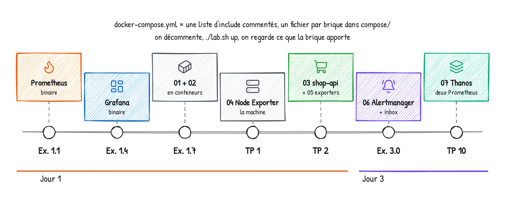

# Formation Prometheus & Grafana — Guide stagiaire, jour 1

**Voir : architecture et collecte**

Formateur : Yohan Parent · Dépôt : https://github.com/yparent/formation-observabilite-lab (branche `formation-2026`)

Ce guide contient les énoncés des exercices du jour, quelques rappels et de la place pour vos
réponses. Les corrigés sont donnés en séance, après un temps de recherche : jouez le jeu.

## Le programme du jour

| Heure | Séquence |
|---|---|
| 9h00 | Accueil, tour de table |
| 9h30 | Pourquoi l'observabilité |
| 10h00 | Architecture de Prometheus, place de Grafana |
| 10h50 | Installer à la main — exercices 1.1 à 1.4 (Prometheus, puis Grafana) |
| 11h50 | Configuration de Prometheus — exercices 1.5 et 1.6 |
| 14h00 | Exercice 1.7 — Des binaires aux conteneurs |
| 14h20 | Les exporters |
| 14h45 | TP 1 — Node Exporter |
| 15h55 | Instrumenter son application |
| 16h20 | TP 2 — Application, instrumentation et services tiers |
| 17h20 | Récap et quiz |

## Comment on travaille

Rien n'est installé au départ, et c'est voulu. Ce matin, vous téléchargez Prometheus puis
Grafana et vous les lancez à la main. Cet après-midi, vous refaites la même chose en
conteneurs, **une brique à la fois** : `docker-compose.yml` ne contient qu'une liste
d'`include` commentés, un fichier par brique dans `compose/`, et chaque exercice vous dit
laquelle décommenter. À 17h30, vous aurez monté cinq briques et écrit chaque ligne de votre
`prometheus.yml`.

| Brique | Fichier | Exercice |
|---|---|---|
| Prometheus | `compose/01-prometheus.yml` | 1.7 |
| Grafana | `compose/02-grafana.yml` | 1.7 |
| Node Exporter | `compose/04-node-exporter.yml` | TP 1 |
| La boutique (2 instances + trafic) | `compose/03-shop-api.yml` | TP 2 |
| Redis, Blackbox, Pushgateway | `compose/05-exporters.yml` | TP 2 |



## Le fil rouge

Une boutique en ligne, `shop-api`, en deux instances, instrumentée avec `prometheus_client`,
avec un générateur de trafic qui simule des clients. Elle vous est livrée à moitié
instrumentée : c'est vous qui finissez le travail au TP 2. Tout au long des trois jours, on la
surveille, on la casse, on se fait prévenir.

## Les services du lab (une fois les briques activées)

| Service | URL locale | Rôle |
|---|---|---|
| Prometheus | http://localhost:9090 | Collecte, stockage, PromQL |
| Grafana | http://localhost:3000 | Visualisation — `admin` / `formation` |
| shop-api-1 / -2 | http://localhost:5001 · :5002 | La boutique — `/metrics` |
| Node Exporter | http://localhost:9100/metrics | Métriques machine |
| Blackbox Exporter | http://localhost:9115 | Sondes |
| Pushgateway | http://localhost:9091 | Batchs |
| Redis Exporter | http://localhost:9121/metrics | Service tiers |

Sur Codespaces, utilisez l'onglet **Ports** de VS Code pour ouvrir chaque service.

Commandes (à partir de l'exercice 1.7) : `./lab.sh up | status | check | reload | logs <service>`
(Windows : `.\lab.ps1`). Après **chaque** modification de `prometheus/prometheus.yml` :
`./lab.sh check` puis `./lab.sh reload`.

---

## Rappels

**Pull.** Prometheus va chercher (scraper) les métriques sur chaque cible en HTTP, à intervalle
fixe (15 s par défaut). Une cible qui ne répond pas, c'est `up == 0`.

**Le modèle de données.** Métrique + labels = série. `http_requests_total{method="GET", route="/api/products", status="200"}`.
Chaque combinaison de valeurs de labels est une série distincte.

**Les quatre types.**

| Type | Comportement | Exemple | Usage |
|---|---|---|---|
| Counter | ne fait que monter | `http_requests_total` | `rate()`, jamais brut |
| Gauge | monte et descend | `shop_cart_items` | valeur brute |
| Histogram | buckets cumulatifs `le=` | `http_request_duration_seconds` | `histogram_quantile()` |
| Summary | quantiles côté client | `go_gc_duration_seconds` | lecture directe |

**Le format d'exposition.**

```
# HELP http_requests_total Nombre total de requêtes HTTP reçues
# TYPE http_requests_total counter
http_requests_total{method="GET",route="/api/products",status="200"} 51.0
```

**Quelle version ?** Prometheus sort une mineure toutes les six semaines, et une mineure n'est
plus corrigée dès que la suivante sort. Une fois par an, une mineure est déclarée LTS et reçoit
pendant un an les correctifs de sécurité et de bugs graves. LTS en cours : 3.13 (juillet 2026 →
juillet 2027). Le lab tourne en 3.13.3 : en production, on suit la LTS et ses patchs. Grafana n'a
pas de LTS : une majeure par an, une mineure tous les deux mois, patchs mensuels ; on suit les
mineures avec un mois de retard, changelog lu.

**Ce qu'il y a dans une installation.** Prometheus : un binaire (`prometheus`, plus `promtool`
pour valider), un fichier `prometheus.yml`, un dossier de données (`--storage.tsdb.path`), le
port 9090. Grafana : un binaire, un dossier `conf/` (ne jamais modifier `defaults.ini`), un
dossier `data/` avec sa base SQLite, le port 3000.

---

## Exercice 1.1 — Installer et lancer Prometheus

1. Ouvrez la page des releases de Prometheus sur GitHub (ou prometheus.io/download) : quelle est
   la dernière version ? Laquelle est la LTS ? Quelle version télécharge `install/download.sh` ?
   Puis téléchargez les binaires : `./install/download.sh` (Linux, Codespaces, macOS) ou
   `.\install\download.ps1` (Windows). Regardez ce qu'il y a dans `install/bin/prometheus/` :
   combien de fichiers ? Lesquels sont exécutables ?
2. Créez `install/prometheus.yml` avec un seul job, `prometheus`, qui scrape `localhost:9090`
   toutes les 15 secondes. Trois blocs suffisent : `global`, `scrape_configs`, `static_configs`.
3. Lancez-le depuis `install/bin/prometheus/` :
   `./prometheus --config.file=../../prometheus.yml --storage.tsdb.path=../../data`
   (Windows : `.\prometheus.exe --config.file=..\..\prometheus.yml --storage.tsdb.path=..\..\data`).
   Lisez les premières lignes de log : quelle version ? quel port ? où écrit-il ?
4. http://localhost:9090 → **Status → Target health** : une cible, UP. Puis regardez ce qui est
   apparu dans `install/data/`.

> Votre `prometheus.yml` et vos réponses :
>
>
>
>

*Astuce : le fichier `install/README.md` reprend les commandes de lancement pour chaque système.
Laissez Prometheus tourner dans ce terminal, ouvrez-en un second pour la suite.*

## Exercice 1.2 — Lire une page /metrics

Prometheus se surveille lui-même : ouvrez http://localhost:9090/metrics.

1. Trouvez une métrique de chaque type : counter, gauge, histogram, summary. Notez leur nom.
2. Pour `prometheus_http_request_duration_seconds`, combien de buckets ? Que vaut le dernier ?
3. `go_gc_duration_seconds` est un Summary : qu'est-ce qui le distingue de l'histogramme ?
4. Combien de séries la page contient-elle, à la louche ? (Comptez les lignes sans `#`.)

> Réponses :
>
>

*Astuce : Ctrl+F sur `# TYPE`. Et `curl -s localhost:9090/metrics | grep -vc '^#'` compte pour vous.*

## Exercice 1.3 — L'interface et les premières requêtes

1. **Status → Configuration** : c'est bien votre fichier ? **Status → Runtime & build information** :
   version, uptime. **Status → TSDB status** : combien de séries en mémoire ?
2. Onglet **Query** : `up`, puis passez en **Graph**.
3. `prometheus_http_requests_total` : combien de séries ? Gardez uniquement le handler
   `/api/v1/query` (label `handler`). Puis uniquement les codes 4xx et 5xx (label `code`, regex).
4. Onglet **Explain** sur `rate(prometheus_http_requests_total[5m])` : que raconte-t-il ?

> Vos requêtes :
>
>

*Astuce : `{label="valeur"}`, `!=`, `=~"regex"`. Les regex sont ancrées : `5..` matche exactement trois caractères.*

## Exercice 1.4 — Installer Grafana et le brancher

Dans un second terminal :

1. Lancez Grafana depuis `install/bin/grafana/` : `./bin/grafana server --homepath=$PWD`
   (Windows : `.\bin\grafana.exe server --homepath=$PWD`). Quel port ? Où écrit-il sa base ?
2. http://localhost:3000, `admin` / `admin`, passez l'écran de changement de mot de passe.
3. **Connections → Data sources → Add new data source → Prometheus**. URL : `http://localhost:9090`.
   *Save & test*.
4. **Explore** : `up`, puis `rate(prometheus_http_requests_total[5m])` sur les 15 dernières
   minutes. Cliquez sur *Builder* pour voir la même requête construite en cliquant.
5. Regardez `install/bin/grafana/data/` : que contient-il ?

> Réponses :
>
>

*Astuce : sans `--homepath`, Grafana cherche ses fichiers dans `/usr/share/grafana` et refuse
de démarrer.*

---

## Rappels — configuration

```yaml
global:                 # les réglages par défaut
  scrape_interval: 15s
  evaluation_interval: 15s
rule_files:             # règles d'enregistrement et d'alerte (jours 2 et 3)
  - rules/*.yml
scrape_configs:         # la liste des jobs
  - job_name: prometheus
    static_configs:
      - targets: ["localhost:9090"]
        labels:
          env: formation
```

Valider : `./promtool check config <fichier>`. Recharger : `kill -HUP <pid>`, ou
`curl -X POST localhost:9090/-/reload` si Prometheus tourne avec `--web.enable-lifecycle`.
En conteneur (cet après-midi) : `./lab.sh check` puis `./lab.sh reload`.

## Exercice 1.5 — Changer le rythme

Toujours sur le binaire.

1. Passez le `scrape_interval` du job `prometheus` à 5 s. Validez avec
   `./promtool check config ../../prometheus.yml` (depuis `install/bin/prometheus/`).
2. Rechargez sans redémarrer : `kill -HUP $(pgrep -x prometheus)` (Linux, macOS). Sous Windows,
   pas de signal : redémarrez Prometheus en ajoutant `--web.enable-lifecycle`, puis
   `Invoke-RestMethod -Method Post http://localhost:9090/-/reload`.
3. Vérifiez dans **Target health** (colonne *Last scrape*) et avec
   `prometheus_target_interval_length_seconds{quantile="0.99"}`.
4. Remettez 15 s.

*Astuce : `scrape_interval` se met au niveau du job, au même niveau que `job_name`.*

## Exercice 1.6 — Casser pour comprendre

1. Introduisez une erreur dans `install/prometheus.yml` (un `:` en trop, un tiret manquant).
2. Rechargez **sans** valider. Que se passe-t-il ? Regardez le terminal de Prometheus et la
   métrique `prometheus_config_last_reload_successful`.
3. Réparez, rechargez, vérifiez que la métrique repasse à 1.
4. Arrêtez Prometheus (`Ctrl+C`) et relancez-le : la config cassée l'empêche-t-elle de démarrer ?

> Ce que vous avez observé :
>
>

Réparez avant d'aller déjeuner, et laissez les deux binaires tourner.

---

## Exercice 1.7 — Des binaires aux conteneurs

On refait exactement la même chose en Docker Compose, brique par brique.

1. Arrêtez les deux binaires (`Ctrl+C` dans chaque terminal) : les ports 9090 et 3000 doivent
   être libres.
2. Ouvrez `compose/01-prometheus.yml` et lisez-le : où est le `prometheus.yml` ? le dossier de
   données ? quels flags en plus par rapport à ce matin ?
3. Dans `docker-compose.yml`, décommentez `compose/01-prometheus.yml` et `compose/02-grafana.yml`.
   `./lab.sh up`, puis `./lab.sh status`.
4. Prometheus : **Status → Configuration**. Ce n'est plus votre fichier de ce matin, c'est
   `prometheus/prometheus.yml` du dépôt. Combien de jobs ?
5. Grafana (`admin` / `formation`) : **Connections → Data sources**. La source Prometheus est
   déjà là : d'où vient-elle ? Ouvrez `grafana/provisioning/datasources/prometheus.yml`.
   Pourquoi l'URL est-elle `http://prometheus:9090` et plus `localhost` ?
6. Dashboards : *00 - Bienvenue dans le lab* est apparu tout seul. D'où vient-il ?
7. `./lab.sh check` puis `./lab.sh reload` : lisez ce que font ces deux commandes dans `lab.sh`.

> Réponses :
>
>
>

*Astuce : `port is already allocated` = un binaire du matin tourne encore.*

À partir d'ici, le fichier à modifier est `prometheus/prometheus.yml` (monté dans
`/etc/prometheus` du conteneur) ; les chemins qu'il contient sont relatifs à ce dossier.

## Exercice 1.8 — Relabeling (bonus, après le TP 1)

Le Node Exporter expose ses propres métriques internes (`go_*`, `process_*`, `promhttp_*`) en
plus des métriques de la machine. Ajoutez un second job `node-light` qui scrape
`node-exporter:9100` en jetant ces métriques internes avec `metric_relabel_configs`
(`action: drop`). Comparez le nombre de séries des deux jobs : `count by (job) ({job=~"node.*"})`.
Puis **retirez** le job `node-light` (ou déplacez le `metric_relabel_configs` sur le job `node`) :
deux jobs sur la même cible dupliquent toutes les séries.

*Astuce : `source_labels: [__name__]` et une `regex` avec des `|`.*

---

## Rappels — exporters

Un exporter est un adaptateur : il interroge un système (noyau Linux, base de données, équipement
réseau) et expose une page `/metrics`. Node Exporter (9100) pour Linux, Blackbox (9115) pour
les sondes externes, Pushgateway (9091) pour les batchs trop courts pour être scrapés.

Dans un conteneur, le Node Exporter ne voit la machine hôte que si on lui monte `/proc`, `/sys`
et `/` (c'est fait dans `compose/04-node-exporter.yml`). Sur Docker Desktop, « l'hôte » est la VM Linux.

## TP 1 — Node Exporter : de la machine à Prometheus

**Situation.** Vous venez de recevoir un serveur. Avant d'y déployer quoi que ce soit, vous voulez
ses signes vitaux dans Prometheus, et pouvoir y ajouter vos propres indicateurs avec un simple script.

### Partie 1 — Brancher l'exporter

1. Lisez `compose/04-node-exporter.yml` : pourquoi ces trois montages `/proc`, `/sys`, `/` ?
   Activez la brique dans `docker-compose.yml`, `./lab.sh up`. Ouvrez http://localhost:9100/metrics.
2. Dans `prometheus/prometheus.yml`, ajoutez un job `node` qui scrape `node-exporter:9100`.
3. Validez (`./lab.sh check`), rechargez (`./lab.sh reload`), vérifiez la cible dans Target health.
4. Requête : `node_uname_info`. Quel noyau ? Quel nom de machine ?

> Réponse :

### Partie 2 — Les indicateurs de base

Écrivez une requête pour chaque indicateur (les métriques et fonctions nécessaires sont données) :

1. Uptime en secondes : `time()` et `node_boot_time_seconds`.
2. Mémoire disponible en % : `node_memory_MemAvailable_bytes`, `node_memory_MemTotal_bytes`.
3. Espace disque utilisé en % sur `/` : `node_filesystem_avail_bytes`, `node_filesystem_size_bytes`, label `mountpoint`.
4. Charge moyenne 1 min : `node_load1`. Comparez au nombre de cœurs :
   `count(node_cpu_seconds_total{mode="idle"})`.
5. CPU utilisé en % (formule donnée, à recopier et à **comprendre**) :
   `100 * (1 - avg(rate(node_cpu_seconds_total{mode="idle"}[5m])))`.

Lancez `./lab.sh chaos cpu 120` et observez la courbe CPU dans l'onglet Graph.

> Vos requêtes :
>
>
>
>
>

*Astuce : une division entre deux métriques marche si elles ont exactement les mêmes labels.*

### Partie 3 — Configurer les collectors

1. Le collector `processes` est désactivé par défaut. Activez-le : ajoutez `--collector.processes`
   aux `command` du service `node-exporter` dans `compose/04-node-exporter.yml`, puis
   `docker compose up -d node-exporter`.
2. Vérifiez l'apparition de `node_processes_state` et `node_processes_threads`.
3. Désactivez un collector inutile pour vous (par exemple `--no-collector.arp`) et vérifiez que
   `node_arp_entries` disparaît de `/metrics`.

*Astuce : `docker run --rm quay.io/prometheus/node-exporter:v1.12.1 --help` liste tous les collectors.*

### Partie 4 — Le textfile collector

Vous avez un script de sauvegarde en cron. Vous voulez savoir quand il a tourné pour la dernière fois.

1. Créez `node-exporter/textfile/backup.prom` avec une gauge `backup_last_run_timestamp_seconds`
   (valeur : le timestamp actuel, `date +%s`) et une gauge `backup_files_total`. Le format est
   celui d'une page `/metrics` (lignes `# HELP`, `# TYPE`, puis la valeur), avec un saut de ligne final.
2. Vérifiez sur http://localhost:9100/metrics puis dans Prometheus.
3. Calculez « il y a combien de temps » : `time() - backup_last_run_timestamp_seconds`.

*Astuce Windows : `Set-Content` écrit des fins de ligne CRLF que le collector refuse. Utilisez
`[IO.File]::WriteAllText("node-exporter/textfile/backup.prom", "backup_last_run_timestamp_seconds $([DateTimeOffset]::UtcNow.ToUnixTimeSeconds())`n")`.*
*Si rien n'apparaît : regardez `node_textfile_scrape_error`.*

### Partie 5 — Vue d'ensemble

1. Quel est le disque (`mountpoint`) le plus rempli ? `topk(1, ...)` sur la requête de la partie 2.
2. Combien d'octets par seconde entrent sur les interfaces réseau (hors `lo`) ?
   `rate(node_network_receive_bytes_total{device!="lo"}[5m])`.
3. Dans Grafana, **Explore** : collez la requête CPU, regardez les 30 dernières minutes, repérez
   le chaos CPU.
4. Bonus : importez le dashboard communautaire *Node Exporter Full* (Dashboards → New → Import,
   ID `1860`). Nécessite un accès à grafana.com.

> Notes :
>

---

## Rappels — instrumentation

```python
from prometheus_client import Counter, Gauge, Histogram

ORDERS = Counter("shop_orders_total", "Commandes validées", ["payment_method"])
STOCK = Gauge("shop_stock_units", "Unités en stock par produit", ["product"])
DURATION = Histogram("http_request_duration_seconds", "Durée", ["route"],
                     buckets=(0.005, 0.01, 0.025, 0.05, 0.1, 0.25, 0.5, 1, 2.5, 5, 10))

ORDERS.labels(payment_method="card").inc()
STOCK.labels(product="clavier").set(84)
DURATION.labels(route="/api/checkout").observe(0.083)
```

Nommage : `snake_case`, préfixe métier, unité de base en suffixe (`_seconds`, `_bytes`), `_total`
pour les counters. Labels : jamais de valeur non bornée (identifiant, IP, email, URL brute, terme de
recherche). **RED** pour un service : Rate, Errors, Duration.

## TP 2 — Application, instrumentation et services tiers

**Situation.** L'équipe boutique livre son API à moitié instrumentée : elle compte les requêtes,
mais ne mesure ni les latences, ni les commandes, ni le stock. Le directeur commercial veut son
chiffre d'affaires en temps réel et savoir quelles fiches produit sont les plus consultées.
L'équipe infra veut surveiller Redis. Le support veut être prévenu si le site est inaccessible
depuis l'extérieur. Et il y a ce batch de sauvegarde nocturne...

### Partie 1 — Brancher l'application

1. Lisez `compose/03-shop-api.yml` : combien de conteneurs ? À quoi sert `traffic` ? Pourquoi
   deux instances de la même image ?
2. Activez la brique, `./lab.sh up` (le premier build prend une minute). Ouvrez
   http://localhost:5001/ puis http://localhost:5001/metrics : quelles métriques `http_*` et
   `shop_*` existent déjà ? Lesquelles manquent par rapport à ce qu'on vient de voir ?
3. Ajoutez le job `shop-api` (deux cibles, `shop-api-1:5000` et `shop-api-2:5000`, labels
   `env: formation` et `team: boutique`). Validez, rechargez, vérifiez.
4. `sum by (route) (rate(http_requests_total[1m]))` : le trafic simulé se voit.

> Ce qui existe, ce qui manque :
>
>

### Partie 2 — Terminer l'instrumentation

Dans `apps/shop-api/app.py`, cinq `TODO` numérotés, chacun en deux temps : déclarer la
métrique, puis l'alimenter au bon endroit du code.

1. `HTTP_DURATION` : Histogram `http_request_duration_seconds`, label `route`, buckets de 5 ms à
   10 s ; observer la durée de chaque requête dans le middleware `_observe`.
2. `STOCK` : Gauge `shop_stock_units`, label `product` ; l'initialiser depuis le dict `stock`,
   la mettre à jour à chaque commande et à chaque réassort.
3. `ORDERS` (Counter `shop_orders_total`, label `payment_method`) et `REVENUE` (Counter
   `shop_revenue_euros_total`) ; les incrémenter dans `/api/checkout`.
4. `APP_INFO` : Gauge `shop_app_info` avec les labels `version` et `instance_name`, à 1.
5. `PRODUCT_VIEWS` : Counter `shop_product_views_total`, label `product`, incrémenté dans
   `/api/products/<product>` **après** la vérification du catalogue.

Reconstruisez : `docker compose up -d --build shop-api-1 shop-api-2`. Vérifiez sur `/metrics`,
puis dans Prometheus : `histogram_quantile(0.95, sum by (le) (rate(http_request_duration_seconds_bucket[5m])))`
et `topk(1, sum by (product) (shop_product_views_total))`.

> Notes (ce qui a coincé, quel produit gagne) :
>
>

*Astuces : un Counter ou une Gauge avec labels s'utilise toujours via `.labels(...)`. Pour le
stock, préférez `set(valeur réelle)` à `dec()`. Sans `--build`, l'ancienne image repart. Et
demandez-vous pourquoi l'incrément de `PRODUCT_VIEWS` doit venir après le test
`if product not in PRODUCTS`.*

### Partie 3 — Un exporter tiers : Redis

1. Activez la brique `compose/05-exporters.yml` (lisez-la : quatre services, dont un qui ne
   démarre pas tout seul). `./lab.sh up`. Le `redis-exporter` répond sur le port 9121.
2. Ajoutez le job `redis` (cible `redis-exporter:9121`). Validez, rechargez.
3. Requêtes : `redis_up`, `redis_connected_clients`, `rate(redis_commands_processed_total[5m])`.
4. Commande Redis la plus utilisée : `topk(3, rate(redis_commands_total[5m]))`.

> Réponse :

### Partie 4 — Sondes externes avec Blackbox

Vous voulez vérifier depuis l'extérieur que `http://shop-api-1:5000/health`,
`http://shop-api-2:5000/health`, `http://grafana:3000/api/health` répondent 2xx, et que
`https://prometheus.io` est joignable (accès Internet nécessaire ; sinon, ignorez cette cible).

1. Ajoutez un job `blackbox-http`. Squelette à compléter (trois règles de relabeling) :

```yaml
  - job_name: blackbox-http
    metrics_path: /probe
    params:
      module: [http_2xx]
    static_configs:
      - targets:
          - http://shop-api-1:5000/health
          # ...
    relabel_configs:
      # 1. copier __address__ dans __param_target
      # 2. copier __param_target dans instance
      # 3. remplacer __address__ par blackbox-exporter:9115
```

2. Requêtes : `probe_success`, `probe_duration_seconds`, `probe_http_status_code`.
3. Arrêtez `shop-api-2` (`docker compose stop shop-api-2`) et observez `probe_success` et `up`.
   Que remarquez-vous sur `up` ? Redémarrez (`docker compose start shop-api-2`).
4. Bonus : `probe_ssl_earliest_cert_expiry - time()` pour prometheus.io : dans combien de jours
   le certificat expire-t-il ?

> Votre relabeling :
>
>
>
> Observation sur `up` :

*Astuce : `source_labels`, `target_label`, `replacement`. Le paramètre d'URL `target` s'écrit
`__param_target` dans les labels.*


### Partie 5 — Un batch, la Pushgateway et la découverte par fichier

1. Lancez le batch : `./lab.sh batch` (il simule une sauvegarde de quelques secondes et pousse
   trois métriques). Regardez http://localhost:9091.
2. Ajoutez le job `pushgateway` avec `honor_labels: true`, mais **sans** `static_configs` :
   utilisez `file_sd_configs` sur `targets/*.yml`, et créez `prometheus/targets/pushgateway.yml`
   avec la cible `pushgateway:9091` et un label `tier: outils` (le format est dans
   `prometheus/targets/README.md`). Validez, rechargez une fois.
3. Requêtes : `backup_duration_seconds`, `backup_size_megabytes`, et l'ancienneté de la dernière
   sauvegarde : `time() - backup_last_success_timestamp_seconds`.
4. Modifiez le label dans le fichier de cibles (`tier: batch`), **sans** reload : au bout de 30 s,
   la cible change dans Target health.
5. Sans `honor_labels`, que se passerait-il ? Essayez, comparez les labels `job` et `instance`.

> Observation :
>

*Astuce : le chemin `targets/*.yml` est relatif au dossier de `prometheus.yml`, donc
`prometheus/targets/` sur votre machine.*

### Partie 6 — Chasse à la cardinalité (bonus)

1. Les dix métriques qui ont le plus de séries : `topk(10, count by (__name__) ({__name__=~".+"}))`.
2. Séries au total : `prometheus_tsdb_head_series`. Séries du job `redis` : `count({job="redis"})`.
3. Si la boutique passait à 200 routes et 50 instances, combien de séries pour
   `http_request_duration_seconds_bucket` ? Est-ce raisonnable ? Que feriez-vous ?

> Réponse :

---

## Avant de partir

- Cinq briques décommentées dans `docker-compose.yml` : 01, 02, 03, 04, 05.
- `prometheus.yml` contient les jobs `prometheus`, `node`, `shop-api`, `redis`, `blackbox-http`
  et `pushgateway` (par fichier) ; le job `node-light` du bonus 1.8 a été retiré. Tous UP dans Target health.
- Les cinq `TODO` de `app.py` sont faits : `shop_orders_total` apparaît sur `/metrics` des deux instances.
- Ne faites pas `./lab.sh reset` : on veut de l'historique pour demain. Sur Codespaces, le
  Codespace peut s'arrêter tout seul, les données restent ; demain matin, `./lab.sh up` relance tout.

## Quiz de fin de journée

1. Pull ou push : Prometheus fait quoi, et pourquoi ?
2. Que vaut un Counter brut ?
3. Trois labels qu'on ne met jamais sur une métrique.
4. Que fait `honor_labels: true` ?
5. Comment vérifier une configuration avant de recharger ?
6. Pourquoi `up` reste à 1 quand une cible du blackbox tombe ?
7. Le Node Exporter dans Docker Desktop mesure quoi ?
8. Quel est le suffixe d'un counter ? D'une durée ?
