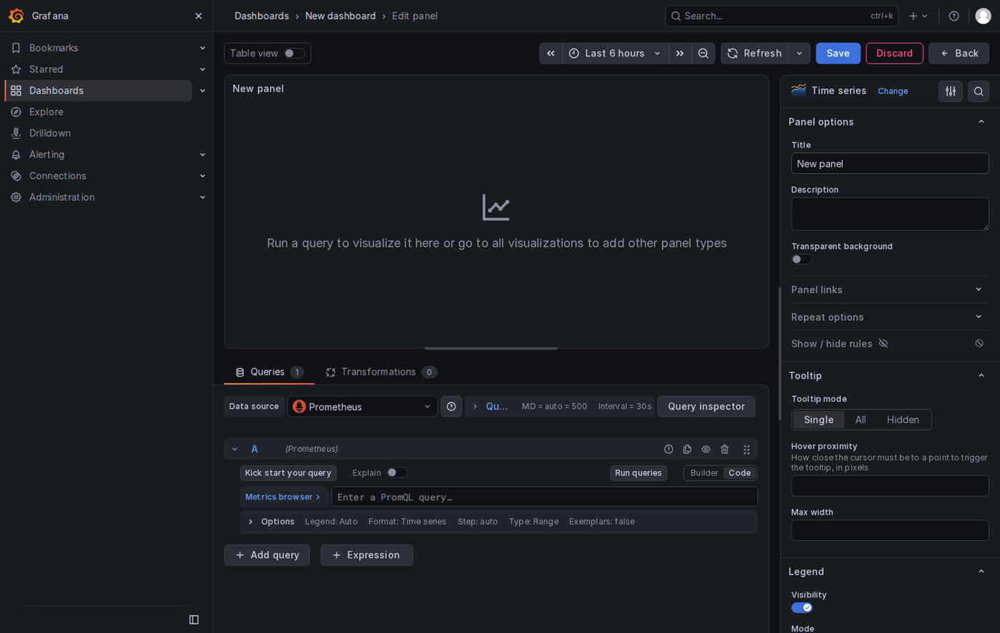
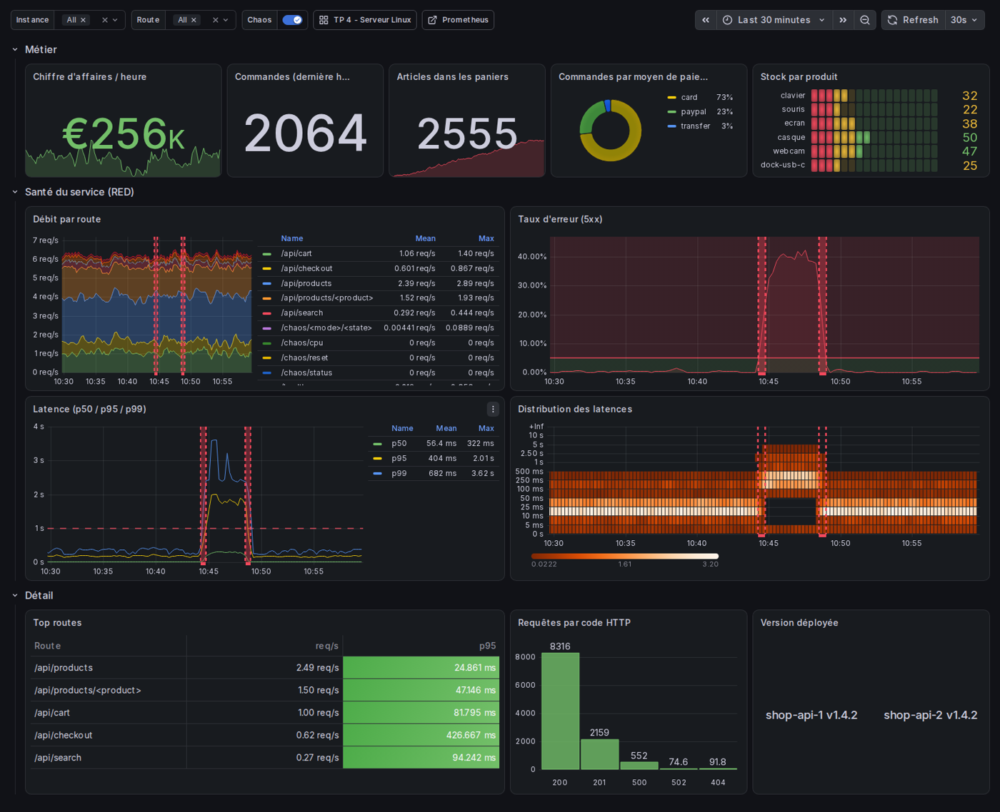

# Formation Prometheus & Grafana — Guide stagiaire, jour 2

**Comprendre : PromQL et Grafana**

Formateur : Yohan Parent · Dépôt : https://github.com/yparent/formation-observabilite-lab (branche `formation-2026`)

## Le programme du jour

| Heure | Séquence |
|---|---|
| 9h00 | Rappel du jour 1, état des lieux |
| 9h15 | PromQL, les fondations |
| 9h55 | Exercices série A (2.1 à 2.10) |
| 10h50 | PromQL avancé |
| 11h30 | Exercices série B (2.11 à 2.22) |
| 12h10 | TP 3 — Recording rules et tests |
| 14h00 | Grafana |
| 14h35 | TP 4 — Dashboard Serveur Linux |
| 15h50 | TP 5 — Dashboard Boutique, dashboards as code |
| 16h50 | Provisioning, utilisateurs, droits — exercices 2.30 à 2.33 |
| 17h20 | Récap, quiz |

Avant de commencer : `./lab.sh up` puis `./lab.sh status`, et dans Prometheus **Status → Target
health**, les six jobs d'hier (`prometheus`, `node`, `shop-api`, `redis`, `blackbox-http`,
`pushgateway`) doivent être UP.

---

## Rappels — PromQL

**Types de résultats.** Instant vector (`up`), range vector (`up[5m]`, ne se dessine pas),
scalar (`42`, `time()`).

**Sélecteurs.** `=`, `!=`, `=~` (regex ancrée), `!~`. Le nom de la métrique est le label `__name__`.

**Décalage.** `x offset 1h`, `x @ <timestamp>`.

**Opérateurs.** `+ - * / % ^`, `== != > < >= <=` (filtrent ; `bool` pour 0/1), `and or unless`.
Entre deux vecteurs, appariement sur les labels identiques.

**Agrégations.** `sum min max avg count topk bottomk quantile count_values stddev`, avec
`by (labels)` (garder) ou `without (labels)` (jeter).

**Counters.** `rate(x[5m])` (par seconde, lissé), `irate` (instantané, graphiques seulement),
`increase(x[1h])` (augmentation sur la fenêtre). Fenêtre ≥ 4 × scrape_interval. Dans Grafana :
`[$__rate_interval]`.

**Histogrammes.** `histogram_quantile(0.95, sum by (le) (rate(x_bucket[5m])))`. Moyenne :
`rate(x_sum[5m]) / rate(x_count[5m])`.

**Gauges dans le temps.** `max_over_time`, `avg_over_time`, `min_over_time`, `changes`, `deriv`,
`predict_linear(x[6h], 86400)`.

**Sous-requêtes.** `max_over_time(rate(x[1m])[1h:1m])`.

**Jointures.** `a * on (instance) group_left(version) b`. `label_replace(x, "dst", "$1", "src", "(.*):5000")`.
`absent(x)` renvoie 1 si `x` n'existe pas.

**Recording rules.** `niveau:metrique:operations`, ex. `job:http_requests:rate5m`.

---

## Exercices série A — Sélection et agrégation

Travaillez dans l'interface Prometheus (onglet Query, Table puis Graph). Notez vos requêtes.

**2.1** — Toutes les cibles et leur état. Puis uniquement celles du job `shop-api`.

> 

**2.2** — Les requêtes HTTP en erreur (4xx ou 5xx) sur la boutique, en excluant la route `/metrics`.

> 

**2.3** — Les cinq dernières minutes de `http_requests_total` pour `shop-api-1` sur `/api/checkout`
(range vector). Combien de points par série ? Pourquoi le graphique refuse-t-il de l'afficher ?

> 

**2.4** — Pourcentage de mémoire disponible sur le serveur (`node_memory_MemAvailable_bytes`,
`node_memory_MemTotal_bytes`).

> 

**2.5** — Combien d'articles y avait-il dans les paniers il y a 10 minutes ? Et l'écart avec maintenant ?

> 

**2.6** — Nombre total de requêtes reçues par instance, tous codes et routes confondus. Est-ce un débit ?

> 

**2.7** — Même chose en gardant tout sauf `method`, `status`, `route`. Quelle différence avec 2.6 ?

> 

**2.8** — Les trois produits les plus en stock, et le moins en stock. Attention : il y a deux instances.

> 

**2.9** — Les produits dont le stock est sous 60 unités. Puis la même chose en 0/1 pour tous les produits.

> 

**2.10** — Combien de routes distinctes la boutique a-t-elle servies ? (Deux agrégations imbriquées.)

> 

*Pour les rapides : combien de codes HTTP distincts par route ?*

---

## Exercices série B — Taux, quantiles, jointures

**2.11** — Débit de requêtes par seconde, par route, sur la boutique.

> 

**2.12** — Combien de commandes dans la dernière heure ? Par moyen de paiement ? Que remarquez-vous
sur les valeurs ?

> 

**2.13** — Chiffre d'affaires par heure (euros/h) à partir de `shop_revenue_euros_total`.

> 

**2.14** — Taux d'erreur 5xx global, en pourcentage. Lancez `./lab.sh chaos errors on`, attendez
deux minutes, observez, puis `./lab.sh chaos errors off`.

> 

**2.15** — Latence p50, p95 et p99 sur toutes les routes. Puis uniquement sur `/api/checkout`.

> 

**2.16** — Latence moyenne. Comparez-la au p95. Pourquoi l'écart ?

> 

**2.17** — CPU utilisé en % par instance à partir de `node_cpu_seconds_total`. Puis la répartition
par mode (`user`, `system`, `iowait`...) sans `idle`.

> 

**2.18** — Débit réseau entrant en bits/s, hors interfaces `lo`, `veth*`, `br*`, `docker*`.

> 

**2.19** — Le pic du nombre d'articles dans les paniers sur la dernière heure, puis le pic de
débit de requêtes sur la dernière heure (sous-requête).

> 

**2.20** — Ajoutez le label `version` (de `shop_app_info`) aux séries de débit par instance.

> 

**2.21** — Prometheus scrape-t-il un job `paiement` ? Écrivez la requête qui renverrait 1 s'il n'existe pas.

> 

**2.22** — À ce rythme, combien vaudra `shop_revenue_euros_total` dans une heure ? Et dans combien
de temps le disque `/` sera-t-il plein ? (`predict_linear`)

> 

*Vérifiez que le chaos est bien à `off` : `./lab.sh chaos status`.*

---

## TP 3 — Recording rules et tests unitaires

**Situation.** Les panneaux « débit », « taux d'erreur », « p95 » et « CA par heure » vont être
affichés sur un écran mural 24 h/24. On ne veut pas que Prometheus recalcule les histogrammes en
permanence.

### Partie 1 — Écrire les règles

Dans `prometheus/rules/recording.yml`, groupe `shop_api_recording`, créez :

1. `instance_route:http_requests:rate5m` — débit par instance et route.
2. `job:http_requests:rate5m` — débit total du job.
3. `instance:http_errors:ratio_rate5m` — ratio d'erreurs 5xx par instance (entre 0 et 1).
4. `route:http_request_duration_seconds:p95_5m` — p95 par route.
5. `job:shop_revenue_euros:rate1h` — CA en euros par heure.

Puis dans un groupe `node_recording` (intervalle 30 s) :

6. `instance:node_cpu_utilisation:ratio_rate5m` — CPU utilisé (0 à 1).
7. `instance:node_memory_utilisation:ratio` — mémoire utilisée (0 à 1).

Validez (`./lab.sh check`), rechargez, vérifiez dans **Status → Rules**, interrogez
`job:http_requests:rate5m`.

*Astuce : on stocke des ratios 0-1, pas des pourcentages. Grafana convertira.*

### Partie 2 — Tester les règles

Ouvrez `prometheus/tests/alerts_test.yml` : il teste l'alerte `TargetDown` avec des séries simulées.
Lancez `./lab.sh test`. Puis créez `prometheus/tests/recording_test.yml` pour tester
`job:http_requests:rate5m` : avec une série `http_requests_total{job="shop-api", instance="a", ...}`
qui vaut `0+10x40` (0, 10, 20... toutes les 15 s), que doit valoir la règle à `eval_time: 5m` ?

Structure attendue :

```yaml
rule_files:
  - ../rules/recording.yml
evaluation_interval: 15s
tests:
  - interval: 15s
    input_series:
      - series: '...'
        values: "0+10x40"
    promql_expr_test:
      - expr: job:http_requests:rate5m
        eval_time: 5m
        exp_samples:
          - labels: '...'
            value: ...
```

> Valeur attendue et pourquoi :

### Partie 3 — Mesurer le gain (bonus)

Dans Grafana, Explore, comparez avec le *Query inspector* (onglet *Stats*) le temps d'exécution
de la requête p95 brute et de la recording rule.

---

## Rappels — Grafana

**Concepts.** Data source → Panel (une requête + une visualisation + des options) → Dashboard
(panels, variables, annotations, liens) → Folder (rangement et droits).

**Grafana 13.** Barre latérale d'édition (*Add* : Panel, Add row, Add tab, Variable, Annotation
query, Link), disposition *Custom grid* ou *Auto grid*, éditeur de panel avec *Queries* /
*Transformations* en bas, *Suggestions* / *All visualizations* puis les options à droite.




**Choisir la visualisation.** Évolution → Time series. Valeur actuelle → Stat. Niveau borné →
Gauge. Comparer quelques valeurs → Bar gauge. Liste → Table. Répartition → Pie chart. État dans le
temps → State timeline. Distribution → Heatmap.

**Lisibilité.** Unités (Standard options → Unit), seuils (Thresholds), value mappings, légende
`{{label}}`, ordre de lecture, 10-12 panels maximum.

**Variables.** `label_values(metric, label)` ; multi-valeur + All → `=~"$var"` dans les requêtes.
Intégrées : `$__rate_interval`, `$__range`, `$__interval`.

**Transformations.** Merge, Organize fields, Sort by, Reduce, Filter, Add field from calculation.

---

## TP 4 — Un tableau de bord paramétrable pour un serveur Linux

**Situation.** L'équipe d'exploitation veut un écran par serveur : d'un coup d'œil, savoir s'il va
bien ; en dessous, le détail CPU, mémoire, disque, réseau. Le même dashboard doit servir pour tous
les serveurs : une liste déroulante pour choisir.

Le résultat attendu est projeté par le formateur. Toutes les requêtes doivent être filtrées par
`instance=~"$instance"` et utiliser `[$__rate_interval]`.


### Étape 0 — Dashboard et variable

1. Dashboards → New → New dashboard. Disposition *Custom grid*.
2. Barre latérale *Add* → *Variable* → type *Query*. Nom `instance`, label `Serveur`, requête
   `label_values(node_uname_info, instance)`. *Multi-value* et *Include All value* (valeur
   personnalisée pour All : `.*`).
3. Sauvegardez : `TP 4 - Serveur Linux`, dossier *Formation*.

### Étape 1 — Row « Vue d'ensemble »

| # | Panel | Visualisation | Indications |
|---|---|---|---|
| 1 | Uptime | Stat | `time() - node_boot_time_seconds`, unité *duration (dtdurations)*, type Instant |
| 2 | CPU utilisé | Gauge | formule CPU du jour 1, unité *Percent (0-100)*, min 0, max 100, seuils 70 / 90 |
| 3 | Mémoire utilisée | Gauge | `1 - MemAvailable / MemTotal`, mêmes seuils |
| 4 | Charge 1 / 5 / 15 min | Stat | trois requêtes (`node_load1`, `node_load5`, `node_load15`), légendes personnalisées, orientation horizontale, 2 décimales |
| 5 | Cœurs CPU | Stat | `count(...)` sur `mode="idle"` |

> Vos requêtes :
>
>
>

### Étape 2 — Row « CPU et mémoire »

| # | Panel | Visualisation | Indications |
|---|---|---|---|
| 6 | CPU par mode | Time series | `rate` par `mode` hors `idle`, divisé par le nombre de cœurs ; empilé (*Stack series : Normal*), *Fill opacity* 40, unité *Percent (0.0-1.0)*, légende `{{mode}}` en mode Table à droite avec Mean et Max |
| 7 | Mémoire | Time series | trois requêtes : Total, Utilisée (Total − Disponible), Cache + buffers (`node_memory_Cached_bytes + node_memory_Buffers_bytes`) ; unité *bytes (IEC)* ; un *field override* pour colorer « Utilisée » en orange avec remplissage |

*Astuce pour le panel 6 : diviser un vecteur qui a un label `mode` par un `count(...)` sans label
ne s'apparie pas. Regardez la fonction `scalar()`.*

> Vos requêtes :
>
>

### Étape 3 — Row « Disque et réseau »

| # | Panel | Visualisation | Indications |
|---|---|---|---|
| 8 | Espace disque utilisé | Bar gauge | horizontal, mode *Gradient*, une barre par `mountpoint`, unité Percent, seuils 75 / 90, exclure les `fstype` tmpfs, overlay et squashfs (matcher `!~`), type Instant |
| 9 | Systèmes de fichiers | Table | deux requêtes Instant en *Format : Table* (`node_filesystem_size_bytes`, `node_filesystem_avail_bytes`) ; transformations *Join by field* (champ `mountpoint`, mode Outer) → *Organize fields* (masquer les colonnes Time, `__name__`, job, instance, device en double ; renommer `Value #A` → Taille, `Value #B` → Disponible, mountpoint → Montage, `fstype 1` → Type) → *Sort by* Disponible ; unité bytes |
| 10 | Trafic réseau | Time series | réception en positif, émission en négatif (× −1), unité *bits/sec*, légende `rx {{device}}` / `tx {{device}}`, exclure `lo`, `veth*`, `br*`, `docker*` |

> Vos requêtes :
>
>
>

### Étape 4 — Row « Disponibilité »

| # | Panel | Visualisation | Indications |
|---|---|---|---|
| 11 | Cibles Prometheus | State timeline | `up`, légende `{{job}} / {{instance}}`, value mappings `1` → UP vert, `0` → DOWN rouge, *Merge equal consecutive values* |
| 12 | État des cibles | Stat | deux requêtes : `sum(up)` (UP) et le nombre de cibles down (DOWN) ; *Color mode : Background*, override vert / rouge. Que faire pour que DOWN affiche 0 et pas « No data » quand tout va bien ? |

13. Sauvegardez. Testez la variable (une instance, puis All), changez la plage de temps,
    retrouvez un chaos CPU (ou relancez-en un).

*Pour les rapides : un panel « Processus » (`node_processes_state`, pie chart), ou passez le
dashboard en Auto grid pour comparer.*

---

## TP 5 — Le tableau de bord de la boutique, puis dashboards as code

**Situation.** Le directeur commercial veut le chiffre d'affaires, les commandes, les paniers,
les stocks. L'équipe technique veut, sur le même écran, débit, erreurs et latence, filtrables par
instance et par route. Et tout le monde veut voir sur les graphiques « quand est-ce qu'on a cassé
quelque chose ».



### Étape 0 — Variables chaînées

Nouveau dashboard `TP 5 - Boutique en ligne`, dossier Formation. Deux variables Query,
multi-valeur avec All :

- `instance` : `label_values(http_requests_total{job="shop-api"}, instance)`
- `route` : `label_values(http_requests_total{job="shop-api", instance=~"$instance"}, route)`

### Étape 1 — Row « Métier »

| # | Panel | Visualisation | Indications |
|---|---|---|---|
| 1 | Chiffre d'affaires / heure | Stat | `rate(shop_revenue_euros_total[$__rate_interval]) * 3600`, unité *Currency → Euro*, 0 décimale, sparkline (*Graph mode : Area*), couleur verte |
| 2 | Commandes (dernière heure) | Stat | `increase(...[1h])` sommé, Instant |
| 3 | Articles dans les paniers | Stat | `sum(shop_cart_items{...})`, sparkline |
| 4 | Commandes par moyen de paiement | Pie chart | donut, `increase(shop_orders_total[$__range])` par `payment_method`, légende à droite avec pourcentages |
| 5 | Stock par produit | Bar gauge | mode *LCD*, une barre par produit (moyenne des deux instances), seuils rouge < 20, orange < 40, vert au-dessus, max 120 |

> Vos requêtes :
>
>
>
>

*Question : pourquoi un Stat sur `rate` et pas sur la valeur brute du compteur ?*

### Étape 2 — Row « Santé du service (RED) »

Tous filtrés par `$instance` et `$route` (sauf le taux d'erreur, par instance seulement).

| # | Panel | Visualisation | Indications |
|---|---|---|---|
| 6 | Débit par route | Time series | empilé, unité *requests/sec*, légende table à droite (Mean, Max) |
| 7 | Taux d'erreur (5xx) | Time series | unité *Percent (0.0-1.0)*, seuil rouge à 0.05 en *Show thresholds : As lines and filled regions*, couleur rouge, sans légende |
| 8 | Latence p50 / p95 / p99 | Time series | trois requêtes, unité seconds, seuil pointillé à 1 s |
| 9 | Distribution des latences | Heatmap | `sum by (le) (rate(..._bucket[$__rate_interval]))` en *Format : Heatmap*, *Calculate from data : No*, axe Y en secondes, palette Oranges |

Lancez `./lab.sh chaos latency on` pendant quelques minutes pour voir la heatmap réagir, puis `off`.

> Vos requêtes :
>
>
>

### Étape 3 — Row « Détail »

| # | Panel | Visualisation | Indications |
|---|---|---|---|
| 10 | Top routes | Table | deux requêtes Instant / Table : débit par route et p95 par route ; *Merge* → *Organize fields* (renommer `Value #A` → req/s, `Value #B` → p95, masquer Time) → *Sort by* req/s décroissant ; overrides : unité reqps sur req/s ; unité s, 3 décimales et *Cell type : Colored background* avec seuils 0.5 / 1 sur p95 |
| 11 | Requêtes par code HTTP | Bar chart | `sum by (status) (increase(http_requests_total{...}[$__range]))` en Instant, transformation *Reduce* (mode *Series to rows*, calcul Last) |
| 12 | Version déployée | Stat | *Text mode : Name*, requête `shop_app_info{...}`, légende `{{instance_name}} v{{version}}` |

### Étape 4 — Annotations et liens

13. *Add → Annotation query* : nom `Chaos`, source Prometheus, requête
    `changes(shop_chaos_mode{instance=~"$instance"}[1m]) > 0`, titre `Chaos {{mode}}`, couleur rouge.
14. *Add → Link* : un lien vers le dashboard *TP 4 - Serveur Linux* (type Dashboard, *Keep time
    range*), et un lien externe vers Prometheus.
15. `./lab.sh chaos errors on` puis `off` deux minutes plus tard : les traits rouges apparaissent.

### Étape 5 — Dashboards as code

16. Bouton *Export* → *Export as code* → *Advanced options* : *Model : Classic*. *Copy to clipboard*.
17. Enregistrez dans `grafana/dashboards/tp5-boutique.json`. Attendez 10 s, rechargez la liste des
    dashboards : un second « TP 5 » avec un cadenas est apparu. Supprimez ou renommez la version manuelle.
18. Modifiez un titre de panel dans le JSON. Que se passe-t-il ? Et si vous modifiez le dashboard
    provisionné dans l'interface et sauvegardez ?

> Observations :
>

*Regardez `grafana/provisioning/dashboards/dashboards.yml` : `allowUiUpdates`, `disableDeletion`,
`updateIntervalSeconds`.*

---

## Rappels — droits

Organisation (cloisonnement total) → Utilisateurs (rôle Admin / Editor / Viewer / None par
organisation) → Teams → Permissions par dossier ou dashboard (View / Edit / Admin) → Service
accounts (comptes techniques avec token). Bonne pratique : un dossier par équipe, une team par
équipe, la team Editor sur son dossier.

## Exercice 2.30 — Un lecteur

Créez l'utilisatrice `lecture` (Administration → Users and access → Users → New user), rôle
*Viewer*. En navigation privée, connectez-vous avec ce compte. Que peut-elle faire ? Essayez de
modifier le TP 5.

> 

## Exercice 2.31 — Une team éditrice sur son dossier

1. Créez un dossier *Boutique* et déplacez-y le dashboard TP 5.
2. Créez la team *equipe-boutique* (Administration → Users and access → Teams → New team), ajoutez `lecture`.
3. Sur le dossier Boutique : *Folder actions → Manage permissions → Add a permission → Team
   equipe-boutique → Edit*.
4. En navigation privée : `lecture` peut-elle éditer le TP 5 ? Le TP 4 ?

*Question : comment faire pour qu'elle voie le dossier Boutique mais pas le dossier Formation ?*

> 

## Exercice 2.32 — Une organisation

Administration → General → Organizations → New org `Client-B`. Basculez dedans. Que voyez-vous ?
Revenez dans *Main Org.*.

> 

## Exercice 2.33 — Service account et API (bonus)

Créez un service account `ci` (rôle Editor), générez un token, puis depuis un terminal :

```
curl -s -H "Authorization: Bearer <token>" http://localhost:3000/api/search?type=dash-db
```

Bonus : posez une annotation « Déploiement v1.4.3 » via `POST /api/annotations` (corps JSON avec
`tags` et `text`).

---

## Avant de partir

`recording.yml` rempli, dashboards TP 4 et TP 5 sauvegardés dans le dossier Formation,
`tp5-boutique.json` dans `grafana/dashboards/`. Demain : on casse tout et on se fait prévenir.

## Quiz de fin de journée

1. Que renvoie `rate()` et sur quel type de métrique ?
2. Pourquoi `sum by (le)` dans `histogram_quantile` ?
3. `$__rate_interval`, ça sert à quoi ?
4. Multi-valeur + All : `=` ou `=~` ?
5. Comment afficher « UP » au lieu de 1 ?
6. Comment fusionner deux requêtes dans une table ?
7. Où met-on un dashboard pour qu'il survive à une réinstallation ?
8. Un Viewer peut-il éditer un dashboard ?
9. Trois choses qu'apporte Grafana Enterprise.
