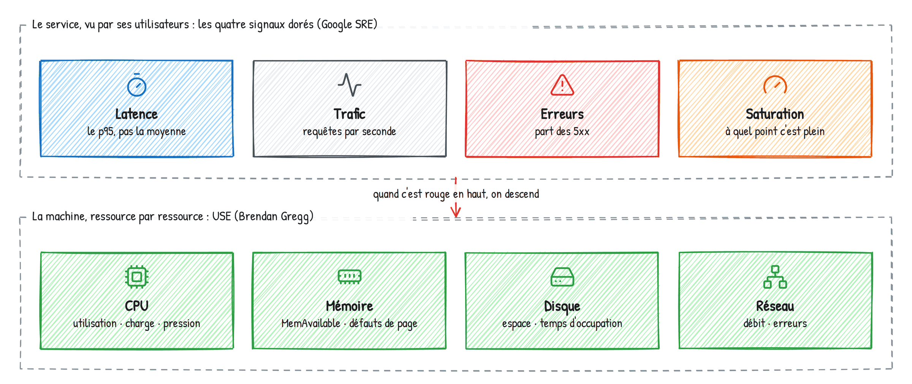
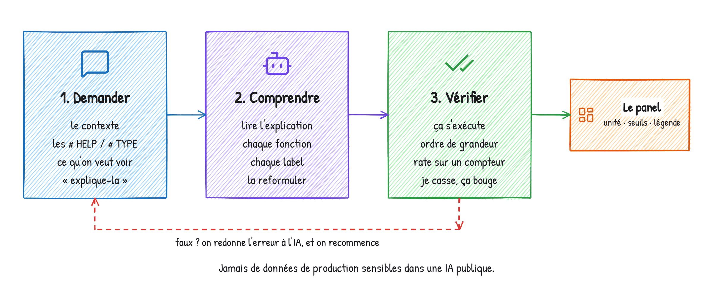
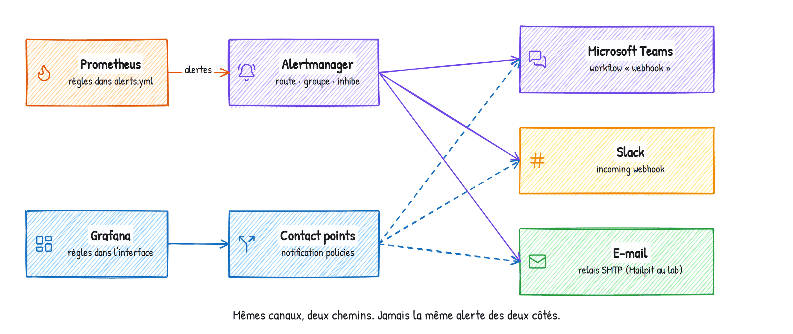
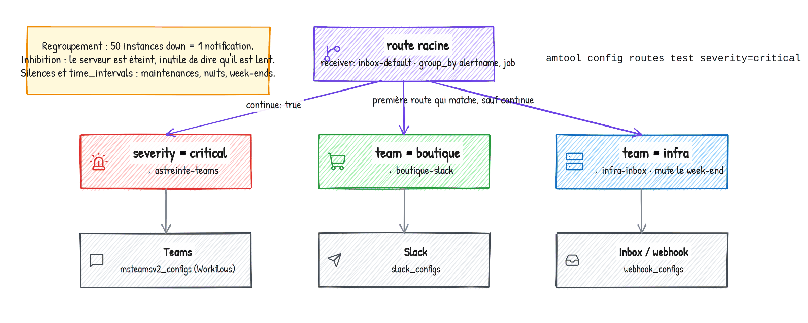
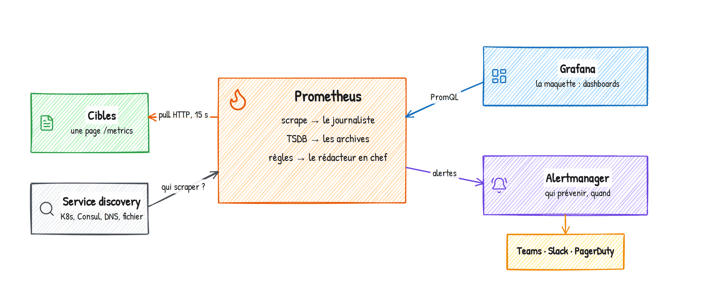
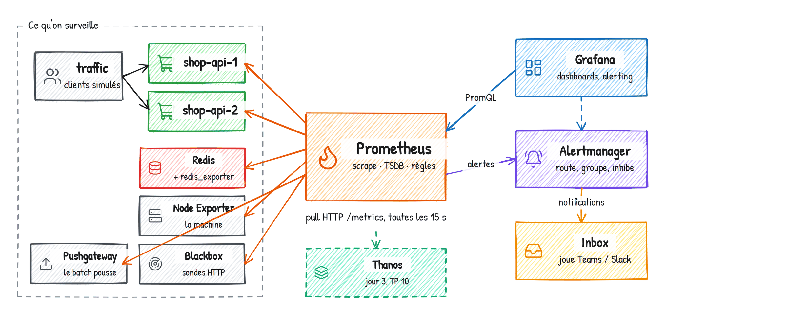
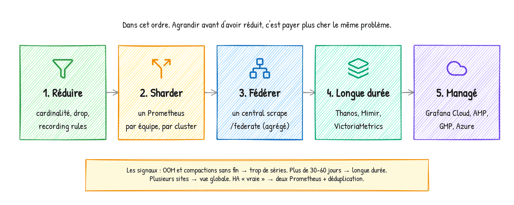

# Formation Prometheus & Grafana — Guide stagiaire, jour 3

**Pratiquer : des tableaux de bord qui parlent, des alertes qui servent**

Formateur : Yohan Parent · Dépôt : https://github.com/yparent/formation-observabilite-lab (branche `jour3`)

## Le programme du jour

Aujourd'hui, on ne code pas. L'application est livrée instrumentée. Les requêtes PromQL, vous les
faites écrire **et expliquer** par une IA, puis vous les vérifiez. Votre travail : construire des
tableaux de bord, alerter dans Teams, Slack et par e-mail, et enquêter sur une panne.

| Heure | Séquence |
|---|---|
| 9h00 | Démarrer le lab : un Codespace, une commande |
| 9h15 | Les bonnes métriques (Google SRE) et PromQL avec l'IA |
| 9h40 | TP A — La boutique en quatre signaux dorés |
| 10h30 | *Pause* |
| 11h00 | TP A, suite et finitions |
| 11h40 | TP B — Le serveur en méthode USE |
| 12h10 | Auto-audit des tableaux de bord (bonnes pratiques Grafana) |
| 12h30 | *Déjeuner* |
| 13h30 | Alerter sans épuiser les équipes |
| 13h40 | TP C — Prometheus, Alertmanager, Teams, Slack et e-mail |
| 14h30 | *Pause* |
| 15h00 | TP D — L'alerting de Grafana, Teams en vrai, et la comparaison |
| 15h30 | Bonnes pratiques Prometheus et sécurité, puis escape game : la boutique sabotée |
| 15h50 | Thanos en cinq minutes, lundi matin |
| 16h00 | Fin |

À la fin du guide : **une synthèse de toute la formation**, des **checklists de mise en
production**, des **ressources** à garder, et les **requêtes de secours**. Les réponses à toutes
les questions du jour sont dans un document à part, `Guide-stagiaire-Jour-3-corriges.pdf` (même
dossier) : à lire **après** avoir cherché.

---

## Démarrer : un Codespace, une commande

1. Ouvrez ce lien (connecté à votre compte GitHub) :
   **https://codespaces.new/yparent/formation-observabilite-lab/tree/jour3**
   Vérifiez que la branche affichée est `jour3`, puis **Create codespace**. Deux à trois minutes.
2. Dans le terminal du Codespace (en bas), une seule commande :

```bash
./jour3.sh start
```

3. Attendez **`10 / 10 cibles UP`** et **`Le lab est prêt`** (3 à 5 minutes la première fois).

Tout est déjà en place sur cette branche : l'application instrumentée, Prometheus configuré avec
six jobs, Grafana, l'Alertmanager, une boîte de réception pour Teams et Slack (l'Inbox), un faux
serveur de messagerie (Mailpit).

**Les onglets à ouvrir** (onglet **PORTS** du Codespace, icône globe sur la ligne) :

| Port | Service | Identifiants |
|---|---|---|
| 3000 | Grafana | admin / formation |
| 9090 | Prometheus | |
| 9093 | Alertmanager | |
| 8080 | Inbox : les messages « Teams » et « Slack » du lab | |
| 8025 | Mailpit : les e-mails | |
| 5001 | shop-api-1, page `/metrics` (les métriques de la boutique) | |
| 9100 | Node Exporter, page `/metrics` (les métriques de la machine) | |

**Les commandes pour casser la boutique**, qui serviront toute la journée :

| Commande | Effet |
|---|---|
| `./lab.sh chaos latency on` / `off` | tout devient 10 fois plus lent |
| `./lab.sh chaos errors on` / `off` | 40 % des appels échouent |
| `./lab.sh chaos cpu 120` | le CPU s'emballe pendant 2 minutes |
| `./lab.sh traffic 30` / `traffic 6` | 30 clients par seconde, puis retour à la normale |
| `docker stop shop-api-2` / `docker start shop-api-2` | une instance tombe, puis revient |
| `./jour3.sh repare` | tout remettre en ordre |

*Si quelque chose ne va pas : relancez `./jour3.sh start` (il est rejouable). Si l'erreur parle de
`toomanyrequests`, faites `docker login` avec un compte Docker Hub gratuit, puis relancez.*

---

## Les bonnes métriques : ce que Google recommande

Quand on ne sait pas quoi mettre dans un tableau de bord, on ne part pas des métriques
disponibles : on part d'une **méthode**.



**Les quatre signaux dorés.** Google, *Site Reliability Engineering*, chapitre 6
« Monitoring Distributed Systems » :
https://sre.google/sre-book/monitoring-distributed-systems/ — si vous ne mesurez que quatre
choses sur un service utilisé par des gens, mesurez celles-ci.

| Signal | La question | Dans la boutique |
|---|---|---|
| **Latence** | Combien de temps pour répondre ? (le p95, pas la moyenne) | `http_request_duration_seconds` |
| **Trafic** | Combien de demandes ? | `http_requests_total`, en requêtes par seconde |
| **Erreurs** | Quelle part échoue ? | les réponses 5xx sur le total |
| **Saturation** | À quel point est-on plein ? | CPU, requêtes en cours |

**RED** (*Rate, Errors, Duration*, Tom Wilkie) : les trois premiers signaux, pour chaque
microservice — https://grafana.com/blog/2018/08/02/the-red-method-how-to-instrument-your-services/

**USE** (*Utilisation, Saturation, Errors*, Brendan Gregg) : « pour chaque ressource, vérifier
l'utilisation, la saturation et les erreurs » — https://www.brendangregg.com/usemethod.html

**La règle** : RED ou signaux dorés pour ce que vos **utilisateurs** voient, USE pour ce que vos
**serveurs** vivent. On alerte sur le premier, on diagnostique avec le second.

---

## PromQL avec l'IA : demander, comprendre, vérifier



Utilisez l'IA de votre choix. Copiez ce modèle et complétez les deux lignes entre chevrons :

```text
Je travaille avec Prometheus 3 et Grafana 13.
Voici les métriques disponibles (extrait de la page /metrics) :
<collez les lignes # HELP et # TYPE de la métrique, et deux ou trois lignes de valeurs>
Les séries ont les labels job="shop-api" et instance.   (pour la machine : job="node", page 9100)
Écris la requête PromQL pour un panel Grafana qui affiche : <ce que vous voulez, avec l'unité>.
Utilise $__rate_interval et le filtre instance=~"$instance".
Donne d'abord la requête seule, puis explique-la ligne par ligne, en français simple :
ce que fait chaque fonction, chaque opérateur et chaque label, et quelle unité on obtient.
```

**Adaptez la ligne des labels** : pour les métriques de la machine (`node_…`, TP B et panel
Saturation du TP A), copiez les lignes depuis la page du port **9100** et écrivez `job="node"`.
Dans le dashboard Boutique, le panel Saturation ne prend **pas** le filtre `instance` (la
variable liste les instances de la boutique, pas la machine).

**Comprendre.** Lisez l'explication. Si vous ne pouvez pas redire la requête en une phrase à
votre voisin, demandez à l'IA de réexpliquer plus simplement. Une requête qu'on ne comprend pas,
on ne saura pas la réparer le jour où elle sera fausse.

**Vérifier, en quatre points :**

1. Elle s'exécute dans **Explore** sans erreur.
2. L'ordre de grandeur est plausible (la boutique reçoit environ 6 requêtes par seconde, pas 60 000).
3. Tout compteur (`_total`) est dans un `rate()` ou un `increase()`.
4. Vous cassez la boutique, et la courbe réagit dans le bon sens.

**Si c'est faux** : redonnez à l'IA le message d'erreur ou le résultat, elle se corrige.
**Sécurité** : jamais de données de production sensibles (noms de clients, adresses internes,
mots de passe) dans une IA publique. Demandez à votre RSSI quel outil est autorisé.

### Échauffement — les quatre signaux dans Explore (7 min)

Grafana → **Explore** → source **Prometheus** → mode **Code**. Une requête par signal doré,
**pour toute la boutique** (dans Explore, remplacez `$__rate_interval` par `5m` et retirez le
filtre `instance`). Vérifiez-les, et résumez chacune en une phrase **à vous**.

| Signal | Valeur actuelle | Ce que fait la requête, en une phrase |
|---|---|---|
| Trafic | | |
| Erreurs | | |
| Latence p95 | | |
| Saturation | | |

---

## Rappels — Grafana

**Concepts.** Data source → Panel (une requête + une visualisation + des options) → Dashboard
(panels, variables, annotations, liens) → Folder (rangement et droits).

**Choisir la visualisation.** Évolution → Time series. Valeur actuelle → Stat. Niveau borné →
Gauge. Comparer quelques valeurs → Bar gauge. Liste → Table. Répartition → Pie chart. État dans
le temps → State timeline. Distribution → Heatmap.

**Les trois réglages qui changent tout.** L'unité (*Standard options → Unit*), les seuils
(*Thresholds*), la légende (`{{label}}`).

**Variables.** `$instance` dans les requêtes, avec `=~"$instance"` pour accepter plusieurs
valeurs. `$__rate_interval` à la place de `[5m]` : Grafana choisit la fenêtre selon le zoom.

---

## TP A — La boutique en quatre signaux dorés (90 min)

**Situation.** Le directeur de la boutique en ligne veut un écran unique. En haut, en cinq
secondes : « est-ce que ça va ? ». En dessous, pour l'équipe technique : quand, où, combien.
Tout en bas, pour le commercial : ce qu'on vend. Le même écran doit fonctionner pour une
instance ou pour toutes.

Pour chaque panel, la colonne « Demandez à l'IA » vous donne la question. Bloqué plus de cinq
minutes sur une requête ? L'annexe « Requêtes de secours », à la fin du guide.


### Étape 0 — Le dashboard et sa variable (5 min)

1. **Dashboards → New → New dashboard**.
2. **Add → Variable** (ou **Settings → Variables → New variable**) : type *Query*, nom
   `instance`, label `Instance`, requête `label_values(http_requests_total{job="shop-api"}, instance)`.
   Cochez *Multi-value* et *Include All option* (*Custom all value* : `.*`).
3. **Settings** (roue dentée) → *Tags* : ajoutez le tag `formation` (il servira aux liens).
   Sauvegardez : `Boutique - Signaux dorés`, dossier *Formation*. Ensuite, **Ctrl+S** (ou
   **Cmd+S**) toutes les dix minutes.

### Étape 1 — Row « Est-ce que ça va ? » (25 min)

Quatre Stat côte à côte, un par signal doré, avec une couleur de fond qui dit tout de suite si
ça va. Réglages communs : *Color mode : Background*, *Graph mode : Area* (la petite courbe).

| # | Panel | Demandez à l'IA | Réglages |
|---|---|---|---|
| 1 | Trafic | le nombre total de requêtes HTTP par seconde | Unit *requests/sec (rps)* ; couleur fixe bleue (le trafic n'est ni bon ni mauvais) |
| 2 | Erreurs | la part des réponses 5xx sur le total, entre 0 et 1 | Unit *Percent (0.0-1.0)* ; seuils vert, orange à 0.01, rouge à 0.05 |
| 3 | Latence p95 | le 95e centile du temps de réponse, depuis l'histogramme `http_request_duration_seconds` | Unit *seconds (s)* ; seuils vert, orange à 0.5, rouge à 1 |
| 4 | Saturation | le pourcentage de CPU utilisé sur la machine (Node Exporter) | Unit *Percent (0-100)* ; seuils vert, orange à 70, rouge à 90 |

**Vérification** : `./lab.sh chaos errors on`. En une à deux minutes, la case Erreurs passe à
l'orange puis au rouge. `./lab.sh chaos errors off`. Même chose avec `chaos latency` et la case
Latence.

> Le signal qui a réagi le plus lentement, et pourquoi :

### Étape 2 — Row « Les signaux dans le temps » (25 min)

| # | Panel | Demandez à l'IA | Réglages |
|---|---|---|---|
| 5 | Trafic par route | les requêtes par seconde, une courbe par `route` | Time series ; légende `{{route}}` ; *Stack series : Normal* ; légende en *Table* à droite avec *Mean* et *Max* |
| 6 | Taux d'erreur | le taux d'erreur 5xx dans le temps | Time series ; Percent (0.0-1.0) ; seuil rouge à 0.05 avec *Show thresholds : As lines and filled regions* ; couleur rouge |
| 7 | Latence p50 / p95 / p99 | trois requêtes, une par centile | Time series ; légendes `p50`, `p95`, `p99` ; unit *seconds* ; seuil pointillé à 1 |
| 8 | Distribution des latences | les buckets de l'histogramme, sommés par `le`, pour une heatmap | Heatmap ; sous la requête *Format : Heatmap* ; *Calculate from data : No* ; palette *Oranges* |
| 9 | Requêtes en cours | la somme de `http_requests_in_progress` | Time series ; une saturation propre à l'application |

`./lab.sh chaos latency on` pendant trois minutes : toute la masse de la heatmap monte. `off`.

### Étape 3 — Row « Métier » (15 min)

| # | Panel | Demandez à l'IA | Réglages |
|---|---|---|---|
| 10 | Chiffre d'affaires / heure | le chiffre d'affaires par heure, depuis le compteur `shop_revenue_euros_total` | Stat ; Unit *Euro (€)* ; 0 décimale ; couleur verte |
| 11 | Moyens de paiement | le nombre de commandes par `payment_method` sur la période affichée (`$__range`) | Pie chart *Donut* ; Instant ; légende `{{payment_method}}` à droite avec *Percent* |
| 12 | Stock par produit | le stock moyen par `product` (deux instances) | Bar gauge *LCD* ; Instant ; légende `{{product}}` ; Max 120 ; seuils rouge, orange à 20, vert à 40 |

*Question : pourquoi le chiffre d'affaires se calcule-t-il avec `rate` alors que c'est « un
montant » ?*

>

### Étape 4 — Les finitions d'un dashboard professionnel (15 min)

1. **Un panel Text** tout en haut (*Add → Visualization → Text*), trois lignes en Markdown : à
   quoi sert ce dashboard, qui contacter, le lien vers le runbook. C'est la première chose que
   lit quelqu'un qui arrive ici à 3 h du matin.
2. **Les incidents sur les courbes** : *Add → Annotation query*, nom `Chaos`, source Prometheus,
   requête `changes(shop_chaos_mode{instance=~"$instance"}[1m]) > 0`, titre `Chaos {{mode}}`,
   couleur rouge. Lancez `./lab.sh chaos errors on` (ou `latency`) : un trait rouge vertical
   apparaît sur **toutes** les courbes. (`chaos cpu` ne laisse pas de trait.)
3. **Les liens** : **Settings → Links → Add dashboard link**, type *Dashboards*, *With tags* :
   `formation`, cochez *As dropdown* et *Include current time range*. Tous les dashboards qui
   portent le tag `formation` (dont celui du TP B) apparaissent dans un menu en haut.
4. **La cohérence** : le même rouge veut dire la même chose partout ; aucune unité manquante.

### Étape 5 — Le crash test (5 min)

`./lab.sh traffic 30` : le Trafic monte, la Saturation aussi, et le chiffre d'affaires. Est-ce
une panne ? Puis `./lab.sh traffic 6`.

> Ce que mon dashboard m'a dit en moins de 10 secondes :

*Pour les rapides : **Export → Export as code**, copiez le JSON dans
`grafana/dashboards/boutique-signaux-dores.json` (éditeur du Codespace), attendez 10 s, rechargez
la liste des dashboards. Le même dashboard existe maintenant en code, versionnable dans Git.*

---

## TP B — Le serveur en méthode USE (30 min, import compris)

**Situation.** Quand le haut du dashboard boutique est rouge, l'équipe infra veut descendre d'un
clic vers la machine, et regarder chaque ressource sous trois angles : **U**tilisation (occupée
combien de temps ?), **S**aturation (combien de travail attend ?), **E**rreurs.

Nouveau dashboard `Serveur - USE`, dossier *Formation*, tag `formation`, variable `instance`
avec la requête `label_values(node_uname_info, instance)`. Ici, toutes les requêtes portent sur
`job="node"` (page 9100 pour copier les `# HELP`).

| # | Ressource | Panel | Demandez à l'IA | Réglages |
|---|---|---|---|---|
| 1 | CPU | Utilisation | le % de CPU utilisé, moyenne des cœurs | Gauge ; Percent (0-100) ; seuils 70 / 90 |
| 2 | CPU | Saturation | la charge sur 1 minute **divisée par le nombre de cœurs** | Stat ; 2 décimales ; seuils orange à 1, rouge à 2 |
| 3 | CPU | Saturation (pression) | le temps d'attente CPU de `node_pressure_cpu_waiting_seconds_total`, en % | Time series ; Percent (0.0-1.0) |
| 4 | Mémoire | Utilisation | le % de mémoire utilisée avec `MemAvailable` (et pas `MemFree`) | Gauge ; Percent (0-100) ; seuils 80 / 90 |
| 5 | Mémoire | Saturation | les défauts de page majeurs par seconde (`node_vmstat_pgmajfault`) | Time series |
| 6 | Disque | Utilisation | le % d'espace utilisé par point de montage, sans tmpfs ni overlay | Bar gauge ; Percent (0-100) ; légende `{{mountpoint}}` ; seuils 75 / 90 |
| 7 | Disque | Saturation | le temps d'occupation des disques (`node_disk_io_time_seconds_total`), en % | Time series ; Percent (0.0-1.0) |
| 8 | Réseau | Erreurs | les erreurs réseau en réception et émission, par interface | Time series ; légende `{{device}}` ; sans `lo` |
| 9 | Cibles | Disponibilité | `up`, une ligne par cible | State timeline ; *Value mappings* 1 → UP vert, 0 → DOWN rouge |

*Le piège du panel 2 : l'IA propose souvent `node_load1 / count(node_cpu_seconds_total{mode="idle"})`.
Essayez-la : pourquoi « No data » ? Donnez le résultat à l'IA et demandez-lui d'expliquer.*

>

Liez ce dashboard au dashboard Boutique (et inversement). Puis `./lab.sh chaos cpu 120` et
suivez la chaîne : la case Saturation de la boutique rougit, un clic, le CPU du serveur.

### Le dashboard de la communauté (5 min)

**Dashboards → New → Import**, ID `1860`, *Load*, source Prometheus, *Import*. C'est « Node
Exporter Full », le plus téléchargé de grafana.com. Lequel des deux ouvririez-vous à 3 h du
matin ? Lequel pour une enquête de deux heures ?

>

---

## Auto-audit des tableaux de bord (15 min)

Notez votre dashboard Boutique, un point par ligne. Puis échangez avec votre voisin. Les critères
viennent des bonnes pratiques de Grafana
(https://grafana.com/docs/grafana/latest/dashboards/build-dashboards/best-practices/) et du
chapitre 6 de Google SRE.

| # | Critère | Le mien | Celui du voisin |
|---|---|---|---|
| 1 | Il répond à **une** question, pour **un** public (le titre le dit) | | |
| 2 | La réponse à « ça va ? » est en haut, lisible en 5 secondes | | |
| 3 | Il suit une méthode (signaux dorés, RED, USE) | | |
| 4 | Chaque panel a une unité | | |
| 5 | Les couleurs ont le même sens partout (rouge = il faut agir) | | |
| 6 | Pas plus de 12 panels visibles d'un coup | | |
| 7 | Une variable plutôt que des copies du dashboard | | |
| 8 | Les incidents et les déploiements apparaissent (annotations) | | |
| 9 | Un lien mène au niveau suivant (le serveur, les logs, le runbook) | | |
| 10 | Il est rangé dans un dossier, et exportable en code | | |
| | **Total sur 10** | | |

**Le modèle de maturité de Grafana** : *faible* (des copies partout, personne ne sait lequel est
le bon), *moyen* (une méthode, des variables, des liens), *élevé* (tout en code, relu, le même
modèle pour chaque service, on arrive sur le dashboard depuis l'alerte). Et chez vous ?

>

---

## Alerter sans épuiser les équipes

Les règles de Google SRE et de Prometheus, en quatre lignes :

- On alerte sur un **symptôme** (les clients souffrent), pas sur une **cause** (le CPU est haut).
  Prometheus le dit ainsi : *« keep alerting simple, alert on symptoms »*
  (https://prometheus.io/docs/practices/alerting/).
- Toute alerte qui réveille quelqu'un doit être **urgente** et **actionnable**. Sinon, c'est un
  panel de dashboard.
- Trois niveaux suffisent : `critical` (on réveille), `warning` (demain matin), `info` (un ticket).
- Une alerte = un responsable, une sévérité, un runbook.




| Prometheus + Alertmanager | Grafana |
|---|---|
| règle dans un fichier YAML (`alerts.yml`) | *Alert rule*, dans l'interface ou en provisioning |
| `for` | *Pending period* |
| receiver | *Contact point* |
| route | *Notification policy* |
| silence | *Silence* |
| `time_intervals` | *Mute timing* |
| `inhibit_rules` | (pas d'équivalent direct) |

---

## TP C — Prometheus, Alertmanager, Teams, Slack et e-mail (50 min)

**Situation.** L'astreinte veut tout ce qui est critique dans **Teams**. L'équipe boutique veut
ses alertes dans **Slack** et **par e-mail**. L'infra veut les siennes dans sa boîte. Et personne
ne veut recevoir « le paiement est lent » quand le site est déjà en erreur.

### Partie 1 — Les règles (10 min)

```bash
cp jour3/alerting/alerts.yml prometheus/rules/alerts.yml
./lab.sh check
./lab.sh reload
```

Ouvrez `prometheus/rules/alerts.yml` dans l'éditeur du Codespace, puis Prometheus → **Alerts**.

1. Quelles alertes portent sur un **symptôme**, lesquelles sur une **cause** ?
2. À quoi sert `for: 1m` ? Et le label `team` ?
3. Laquelle réveillerait quelqu'un la nuit ? Laquelle ne devrait jamais le faire ?

>

*Vous ne comprenez pas une expression ? Collez-la dans l'IA : « explique-moi cette règle
d'alerte Prometheus ligne par ligne ».*

### Partie 2 — L'arbre de routage (10 min)

```bash
cp jour3/alerting/alertmanager.yml alertmanager/alertmanager.yml
./lab.sh check
./lab.sh reload
docker compose exec alertmanager amtool config routes
```



Dessinez l'arbre sur votre guide. Puis **prédisez**, avant de vérifier, vers quels receivers
part chaque alerte. Vérifiez avec
`docker compose exec alertmanager amtool config routes test severity=critical team=boutique`
(en changeant les labels).

| Labels de l'alerte | Ma prédiction | Réponse d'amtool |
|---|---|---|
| `severity=critical team=boutique` | | |
| `severity=warning team=boutique` | | |
| `severity=warning team=infra` | | |
| `severity=critical` (sans team) | | |
| `severity=info team=logistique` | | |

*Que change `continue: true` ? Retirez-le, rechargez, retestez la première ligne. Remettez-le.*

>

### Partie 3 — Casser et suivre les messages (10 min)

1. Ouvrez côte à côte : Prometheus **Alerts**, l'Alertmanager (9093), l'Inbox (8080), Mailpit (8025).
2. `./lab.sh chaos errors on`. Notez l'heure de chaque étape.
3. Combien de messages, sur quels canaux ? Une carte **Teams** et un message **Slack** dans
   l'Inbox, un **e-mail** dans Mailpit. Ouvrez l'e-mail : qu'y trouve-t-on ?
4. `./lab.sh chaos errors off` : quand arrive le « resolved » ?

> Pending à … · Firing à … · Teams / Slack / e-mail à … · Résolue à …

### Partie 4 — L'inhibition (10 min)

Si le site est en erreur, inutile d'alerter aussi sur la lenteur : une alerte critique d'une
équipe fait taire les warnings de la même équipe. À la fin de `alertmanager/alertmanager.yml`,
remplacez `inhibit_rules: []` par :

```yaml
inhibit_rules:
  - source_matchers:
      - severity = critical
    target_matchers:
      - severity = warning
    equal: ["team"]
```

`./lab.sh check`, `./lab.sh reload`. Puis `./lab.sh chaos errors on` ; attendez que
`ShopHighErrorRate` soit *Firing* dans Prometheus → **Alerts** (environ 1 min 30), **puis**
`./lab.sh chaos latency on`. Au bout de deux minutes :
`docker compose exec alertmanager amtool alert query --inhibited` : `ShopCheckoutSlow` est là,
mais n'a rien envoyé (vérifiez l'Inbox et Mailpit).

### Partie 5 — Le silence (5 min)

Une maintenance est prévue : on coupe les notifications de la boutique pendant 30 minutes.
Alertmanager (9093) → **New Silence** : matcher `team="boutique"`, durée 30 min, auteur,
commentaire. L'alerte existe toujours, mais ne notifie plus. Expirez le silence, puis
`./jour3.sh repare`.

### Partie 6 (démonstration) — Le vrai Teams

Le formateur a créé un workflow Teams et vous donne son adresse. En une commande, les alertes
critiques de **votre** Alertmanager partent dans le canal Teams de la salle :

```bash
./jour3.sh teams 'https://…l'adresse donnée par le formateur…'
./lab.sh chaos errors on
```

Le message arrive dans Teams en une à deux minutes. Puis `./lab.sh chaos errors off` et
`./jour3.sh teams off`. L'adresse est un **secret** : elle est dans un fichier
(`alertmanager/secrets/teams_url`), pas dans le YAML qui part dans Git.

---

## TP D — L'alerting de Grafana, Teams en vrai, et la comparaison (30 min)

**Situation.** Le directeur commercial ne lira jamais un fichier YAML. Il veut être prévenu
**par e-mail** si le chiffre d'affaires s'effondre, et l'astreinte veut voir l'alerte dans
**Teams**. On ne duplique **pas** les alertes techniques du TP C : chacun son terrain.

### Partie 1 — Deux contact points (7 min)

**Alerting → Notification configuration → Contact points → + Create contact point** :

1. `equipe-commerce` : intégration **Email**, adresse `commerce@boutique.local`. **Test** :
   ouvrez Mailpit (8025), l'e-mail de test est là. **Save**.
2. `teams-salle` : intégration **Microsoft Teams**, URL : celle donnée par le formateur (à
   défaut : `http://inbox:8080/teams/grafana`). **Test** : regardez l'écran du formateur, votre
   message arrive dans Teams. **Save**.

### Partie 2 — La politique de notification (5 min)

**Notification policies** :

1. *Default policy* → **Edit** : contact point `teams-salle`.
2. **+ New child policy** : matcher `team` `=` `commerce`, contact point `equipe-commerce`.
   Dépliez *Override general timings* : *Group wait* 10s, *Group interval* 1m.

C'est l'arbre de routage du TP C, en clics.

### Partie 3 — La règle métier (10 min)

**Alerting → Alert rules → + New alert rule** :

1. Nom : `Chiffre d'affaires en chute`.
2. Requête A : le chiffre d'affaires par heure (votre panel 10 du TP A, avec `[2m]` au lieu de
   `$__rate_interval`), type **Instant**. Regardez la valeur actuelle dans *Preview*.
3. Condition : *IS BELOW* la **moitié** de la valeur actuelle.
4. Dossier *Formation*, groupe d'évaluation `commerce` (intervalle 1 min), *Pending period* 1m.
5. Labels : `team=commerce`, `severity=warning`.
6. *Configure notifications* : **Use notification policy** (c'est la politique qui route).
7. *Summary* : `Le chiffre d'affaires est tombé à {{ humanize $values.A.Value }} €/h`.
   *Link dashboard and panel* : votre panel Chiffre d'affaires.
8. **Save rule and exit**. Puis `./lab.sh traffic 1` : moins de clients, moins de ventes. Suivez
   l'état de la règle (*Normal → Pending → Firing*), puis l'e-mail dans Mailpit. Revenez à
   `./lab.sh traffic 6`.

*Pour les rapides* : **Time intervals → + Add time interval** `week-end` (samedi, dimanche,
Europe/Paris), appliqué en *Mute timings* sur la politique `team = commerce`.

### Partie 4 — Comparer (8 min)

| | Prometheus + Alertmanager | Grafana |
|---|---|---|
| Où vit la configuration ? | | |
| Comment la versionner et la relire ? | | |
| Comment la tester avant de la déployer ? | | |
| Qui peut la modifier ? | | |
| Peut-elle combiner plusieurs sources (SQL, logs) ? | | |
| Que se passe-t-il si Grafana tombe ? | | |
| Pour quelles alertes je l'utiliserais chez moi ? | | |

---

## Escape game : la boutique sabotée (20 min)

**Le scénario.** Cette nuit, quelqu'un a saboté la boutique. **Deux incidents** se cachent
quelque part. Vous êtes l'équipe d'astreinte : trouvez-les avec vos outils, et seulement eux.

**Les règles.**

- En binôme ou seul. **12 minutes** d'enquête.
- Lancez le sabotage : `./jour3.sh mystere`. Puis **fermez le terminal**.
- Interdit : le terminal, `docker`, les logs. Autorisé : vos dashboards, Explore, Prometheus,
  l'Alertmanager, l'Inbox, Mailpit, et l'IA pour vous aider à écrire une requête.
- À la fin, le formateur dit « stop » : `./jour3.sh solution` révèle la vérité et répare tout.

**Le rapport d'enquête.**

| | Incident 1 | Incident 2 |
|---|---|---|
| Quoi ? (lenteur, erreurs, panne, saturation, trafic…) | | |
| Où ? (quelle instance, quel service) | | |
| Quel signal doré ou quelle ressource USE l'a montré ? | | |
| Avec quel outil ou quel panel l'avez-vous trouvé ? | | |
| Une alerte a-t-elle sonné ? Vers quel canal ? | | |
| Sinon, quelle alerte aurait dû exister ? | | |

**Le barème.** 3 points par incident trouvé avec sa localisation, 1 point par bonne réponse sur
le signal, l'outil et l'alerte. Bonus : 2 points si vous avez trouvé un incident **qui n'a
déclenché aucune alerte**.

**Les questions éclair** (le formateur les pose à la fin, 1 point par bonne réponse) :

1. Quel est le type de `http_requests_total`, et pourquoi ne le regarde-t-on jamais brut ?
2. Pourquoi le p95 et pas la moyenne ?
3. À quoi sert le `for` d'une règle d'alerte ?
4. Dans l'arbre de routage, que fait `continue: true` ?
5. Inhibition ou silence : lequel est une règle permanente, lequel une décision humaine ?
6. Pourquoi l'adresse du workflow Teams est-elle dans un fichier à part ?
7. Pourquoi `MemAvailable` et pas `MemFree` ?
8. Alertmanager ou Grafana pour une alerte sur une requête SQL ? Et pour une alerte qui doit
   survivre à une panne de Grafana ?

> Score : … (12 pour les incidents, 2 de bonus, 8 pour les questions : 22 au maximum)

---

## Thanos en cinq minutes

Prometheus garde ses données quelques semaines, sur un seul serveur. Thanos ajoute, sans toucher
aux Prometheus : une **vue globale** sur plusieurs Prometheus, la **déduplication** de deux
Prometheus jumeaux, et l'**historique long** sur du stockage objet (S3, Azure, OVH).


À essayer chez vous, dans un Codespace : `./jour3.sh thanos on`, puis le port **10902**, la
requête `up{job="shop-api"}` avec et sans **Use Deduplication**, et la source **Thanos** dans
Grafana. `./jour3.sh thanos off` pour revenir. Le TP complet est dans le guide du jour 3
classique.

## Lundi matin

Choisissez **un** service de votre périmètre. Un seul. Faites-le scraper, construisez-lui une row
de signaux dorés, puis **une** alerte sur un symptôme que vos utilisateurs sentiraient, avec un
responsable, un runbook, et une notification dans le bon canal Teams. C'est tout. Le reste viendra.

> Mon service : … · Sa méthode : … · Mon alerte : … · Son canal : …

---

## Synthèse 1 — Prometheus en une page



**Le principe.** Prometheus va **chercher** (pull) toutes les 15 secondes une page texte
`/metrics` sur chaque cible, stocke les échantillons dans sa base (la TSDB), évalue des règles,
et envoie les alertes à l'Alertmanager. Grafana l'interroge en PromQL pour dessiner.

**Une série**, c'est un nom et des labels : `http_requests_total{job="shop-api", instance="shop-api-1:5000", route="/api/cart", status="200"}`.
Chaque combinaison de labels est une série à part : jamais d'identifiant unique en label.

| Type | Ce qu'il mesure | Comment on le lit | Exemple |
|---|---|---|---|
| Counter | ce qui ne fait que monter | `rate()`, `increase()` | `http_requests_total` |
| Gauge | un niveau qui monte et descend | tel quel, `avg_over_time()` | `shop_stock_units` |
| Histogram | une répartition, en buckets | `histogram_quantile()` | `http_request_duration_seconds` |
| Summary | une durée résumée par l'application (`_sum`, `_count`, et des quantiles selon la bibliothèque : le client Python n'en calcule pas) | `_sum / _count`, quantiles non agrégeables | `shop_payment_duration_seconds` |

**Les exporters** traduisent ce qui ne parle pas Prometheus : Node Exporter (la machine),
Blackbox (les sondes de l'extérieur), redis_exporter, et des centaines d'autres. La
**Pushgateway** reçoit les métriques des tâches trop courtes pour être scrapées.

**Les commandes à connaître.** `promtool check config`, `promtool check rules`,
`promtool test rules`, `curl -X POST localhost:9090/-/reload`, `amtool config routes test`.

## Synthèse 2 — PromQL : huit formes pour 90 % des besoins

| # | Forme | À quoi ça sert |
|---|---|---|
| 1 | `metrique{label="valeur"}` | filtrer (`=`, `!=`, `=~` regex, `!~`) |
| 2 | `rate(compteur[5m])` | la **vitesse** d'un compteur, par seconde |
| 3 | `sum by (label) (...)` | additionner en gardant un label (`avg`, `max`, `count` aussi) |
| 4 | `increase(compteur[1h])` | **combien** en une heure |
| 5 | `sum(rate(...{status=~"5.."}[5m])) / sum(rate(...[5m]))` | un **ratio**, ici le taux d'erreur |
| 6 | `histogram_quantile(0.95, sum by (le) (rate(..._bucket[5m])))` | le **p95** d'une latence |
| 7 | `topk(3, ...)` / `bottomk(3, ...)` | les 3 plus grands / plus petits |
| 8 | `expression > seuil` / `== 0` | ne garder que ce qui dépasse : **c'est une alerte** |

Trois règles d'or : un compteur ne se lit jamais brut ; `rate` d'abord, `sum` ensuite ; le `le`
reste toujours dans le `by` d'un histogramme. Et avec une IA : **demander, comprendre, vérifier**.

## Synthèse 3 — Grafana et les tableaux de bord



| La question | La visualisation |
|---|---|
| Ça évolue comment ? | Time series |
| Ça vaut combien, maintenant ? | Stat |
| À quel niveau sur une échelle ? | Gauge |
| Comparer quelques valeurs | Bar gauge |
| Une liste à plusieurs colonnes | Table |
| Une répartition (5 parts max) | Pie chart |
| Un état dans le temps | State timeline |
| Une distribution qui évolue | Heatmap |

**Un bon dashboard** : une question, un public ; « ça va ? » en haut ; une méthode (signaux
dorés, RED, USE) ; des unités ; des couleurs qui veulent dire la même chose partout ; des
variables ; des annotations ; des liens vers le niveau suivant ; rangé, et en code.

## Synthèse 4 — L'alerting

| Étape | Prometheus + Alertmanager | Grafana |
|---|---|---|
| La condition | règle PromQL dans `alerts.yml` | *Alert rule* : requête, puis seuil |
| L'anti-faux positif | `for` | *Pending period* |
| Qui prévenir | route → receiver | notification policy → contact point |
| Regrouper | `group_by`, `group_wait`, `group_interval` | les mêmes, dans la politique |
| Faire taire | silence, `inhibit_rules`, `time_intervals` | silence, mute timing |
| Les canaux | Teams (`msteamsv2`), Slack, e-mail, webhook, PagerDuty… | les mêmes, et plus |
| Tester | `promtool test rules`, `amtool config routes test` | *Preview*, *Test* sur le contact point |

**Teams en 2026** : plus de « connecteur Incoming Webhook ». Dans Teams, un **workflow** créé à
partir du modèle « Send webhook alerts to a channel » (canal → ⋯ → *Workflows*), puis
« Copier le lien du webhook », donne une adresse. On la colle dans le
contact point *Microsoft Teams* de Grafana, ou dans `msteamsv2_configs` de l'Alertmanager.
L'adresse est un secret.

**E-mail** : Grafana (`[smtp]` ou les variables `GF_SMTP_*`) et l'Alertmanager (`email_configs`)
passent par le relais SMTP de l'entreprise, avec TLS et un compte de service.

## Synthèse 5 — Passer à l'échelle



Dans l'ordre : réduire (cardinalité, `metric_relabel_configs`, recording rules) ; découper
(un Prometheus par périmètre) ; la haute disponibilité (deux Prometheus jumeaux,
`external_labels.replica`, Alertmanager en cluster) ; la longue durée (Thanos, Mimir,
VictoriaMetrics, sur stockage objet) ; le managé (Grafana Cloud, Amazon Managed Prometheus,
Azure Monitor).

---

## Checklist 1 — Avant de mettre Prometheus en production

**Installation et versions**

- [ ] Une version LTS de Prometheus, en version exacte (jamais `latest`), et la date de fin de support notée
- [ ] Les images depuis un registre maîtrisé (registre interne, ou `quay.io` pour Prometheus)
- [ ] Un volume persistant pour la TSDB, dimensionné (1 à 2 octets par échantillon, plus une marge)
- [ ] La rétention réglée (15 à 30 jours en local) ; au-delà, Thanos ou Mimir

**Configuration**

- [ ] `scrape_interval` de 15 à 60 s ; `scrape_timeout` inférieur à l'intervalle
- [ ] `external_labels` : `cluster`, `env`, `replica`
- [ ] Des labels de routage sur les cibles : `env`, `team`, `service`
- [ ] Découverte des cibles (Kubernetes, Consul, DNS, `file_sd`) plutôt que des IP en dur
- [ ] `sample_limit` et `label_limit` sur les exporters tiers
- [ ] `honor_labels` uniquement pour la Pushgateway et la fédération
- [ ] Le bloc `alerting` pointe vers l'Alertmanager (sinon les alertes ne partent nulle part)
- [ ] `promtool check config` et `promtool check rules` en intégration continue

**Sécurité**

- [ ] Prometheus, l'Alertmanager et les exporters ne sont pas exposés sur Internet ni à tout le réseau
- [ ] Authentification : `--web.config.file` (TLS, basic auth bcrypt) ou reverse proxy avec SSO
- [ ] `--web.enable-admin-api` et `--web.enable-lifecycle` seulement si nécessaires, et protégés
- [ ] Les secrets dans des fichiers (`password_file`, `bearer_token_file`, `webhook_url_file`), jamais dans le YAML
- [ ] TLS vérifié vers les cibles (pas d'`insecure_skip_verify`)
- [ ] Référence : https://prometheus.io/docs/operating/security/

**Fiabilité**

- [ ] Prometheus se surveille lui-même, et un second Prometheus (ou un service externe) surveille le premier
- [ ] Une alerte « Watchdog » qui sonne en permanence, pour vérifier que la chaîne d'alerte vit
- [ ] Sauvegarde : snapshot TSDB testé, et la configuration dans Git

## Checklist 2 — Avant de mettre Grafana en production

- [ ] Version exacte, base de données PostgreSQL ou MySQL (pas SQLite) dès qu'il y a de la haute disponibilité
- [ ] Mot de passe admin changé au premier démarrage, et fourni par un secret (`GF_SECURITY_ADMIN_PASSWORD__FILE`)
- [ ] Accès anonyme désactivé ; authentification par le SSO de l'entreprise (OIDC, SAML, LDAP)
- [ ] Des équipes et des droits par dossier ; des *service accounts* à jetons limités pour l'automatisation
- [ ] Les sources de données et les dashboards de référence provisionnés depuis Git
- [ ] Le SMTP configuré (relais de l'entreprise, TLS) pour les e-mails
- [ ] Référence : https://grafana.com/docs/grafana/latest/setup-grafana/configure-security/

## Checklist 3 — Avant de publier un tableau de bord

- [ ] Il répond à une question, pour un public, et le titre le dit
- [ ] « Ça va ? » en haut, en signaux dorés (service) ou USE (machine)
- [ ] Unités partout, seuils cohérents, rouge = il faut agir
- [ ] Une variable plutôt que des copies ; `$__rate_interval` dans les `rate()`
- [ ] Un panel Text : à quoi il sert, qui contacter, le runbook
- [ ] Annotations des déploiements et des incidents ; liens vers le niveau suivant
- [ ] Rangé dans le bon dossier ; exporté en JSON et versionné

## Checklist 4 — Avant d'activer une alerte

- [ ] Elle porte sur un **symptôme** que les utilisateurs sentent (ou sur une saturation imminente)
- [ ] Elle est **actionnable** : quelqu'un sait quoi faire quand elle sonne
- [ ] Une sévérité (`critical`, `warning`, `info`) et une équipe (`team`)
- [ ] Un `for` adapté (pas de clignotement) ; la valeur dans une **annotation**, jamais dans un label
- [ ] `summary`, `description`, `runbook_url` remplis
- [ ] Un test unitaire (`promtool test rules`) ; le routage testé (`amtool config routes test`)
- [ ] Elle a été déclenchée **une fois** volontairement, et la notification est arrivée dans le bon canal
- [ ] Elle n'existe pas déjà de l'autre côté (Prometheus **ou** Grafana, pas les deux)

## Le déroulé type d'une mise en production

| Quand | Quoi |
|---|---|
| J − 30 | Choisir le périmètre (un service) ; lister ses utilisateurs, ses dépendances, ses signaux dorés ; choisir la version LTS |
| J − 20 | Installer en préproduction (Prometheus, Alertmanager, Grafana, exporters) ; tout en Git ; sécurité et SSO |
| J − 15 | Dashboard de service (signaux dorés) et dashboard machine (USE) ; revue par l'équipe qui va s'en servir |
| J − 10 | Trois à cinq alertes sur symptômes, avec runbooks ; routage vers les bons canaux Teams et e-mail ; tests unitaires |
| J − 5 | Exercice de panne en préproduction : on casse, on vérifie que l'alerte arrive et que le dashboard permet de diagnostiquer |
| J | Bascule en production ; alertes en `warning` seulement pendant une semaine (observer sans réveiller) |
| J + 7 | Revue : faux positifs, alertes manquantes, seuils ; passage en `critical` de ce qui le mérite |
| J + 30 | Revue mensuelle des alertes (lesquelles ont sonné, lesquelles ont servi) ; on supprime celles qui n'ont servi à rien ; service suivant |

---

## Ressources

**Les sources de cette journée**

- **Google SRE, ch. 6, *Monitoring Distributed Systems* (signaux dorés, symptômes et causes)** — https://sre.google/sre-book/monitoring-distributed-systems/
- **Google SRE, ch. 10, *Practical Alerting from Time-Series Data*** — https://sre.google/sre-book/practical-alerting/
- **Google SRE Workbook, ch. 4, *Monitoring* (la supervision comme du code, les tests)** — https://sre.google/workbook/monitoring/
- **Google SRE Workbook, ch. 5, *Alerting on SLOs* (budget d'erreur, burn rate)** — https://sre.google/workbook/alerting-on-slos/
- **Rob Ewaschuk (Google), *My Philosophy on Alerting*** — https://docs.google.com/document/d/199PqyG3UsyXlwieHaqbGiWVa8eMWi8zzAn0YfcApr8Q/edit
- **Brendan Gregg, *The USE Method*** — https://www.brendangregg.com/usemethod.html
- **Tom Wilkie, *The RED Method*** — https://grafana.com/blog/2018/08/02/the-red-method-how-to-instrument-your-services/
- **Grafana, *Dashboard best practices* (USE, RED, signaux dorés, maturité)** — https://grafana.com/docs/grafana/latest/dashboards/build-dashboards/best-practices/

**Les bonnes pratiques officielles**

- **Prometheus : nommer les métriques et les labels** — https://prometheus.io/docs/practices/naming/
- **Prometheus : instrumenter** — https://prometheus.io/docs/practices/instrumentation/
- **Prometheus : histogrammes et summaries** — https://prometheus.io/docs/practices/histograms/
- **Prometheus : alerter** — https://prometheus.io/docs/practices/alerting/
- **Prometheus : recording rules** — https://prometheus.io/docs/practices/rules/
- **Prometheus : modèle de sécurité** — https://prometheus.io/docs/operating/security/
- **Alertmanager : la configuration complète** — https://prometheus.io/docs/alerting/latest/configuration/
- **Grafana : sécuriser une instance** — https://grafana.com/docs/grafana/latest/setup-grafana/configure-security/
- **Grafana : contact point Microsoft Teams (workflows)** — https://grafana.com/docs/grafana/latest/alerting/configure-notifications/manage-contact-points/integrations/configure-teams/

**Des petits outils**

- **PromLens** : construire, analyser et **expliquer** une requête PromQL, visuellement — https://demo.promlens.com/
- **PromQL Cheat Sheet (PromLabs)** : l'aide-mémoire PromQL de référence — https://promlabs.com/promql-cheat-sheet/
- **Relabeler** : tester des règles de relabeling avant de les déployer — https://relabeler.promlabs.com/
- **Routing Tree Editor** : dessiner l'arbre de routage d'un `alertmanager.yml` — https://prometheus.io/webtools/alerting/routing-tree-editor/
- **Awesome Prometheus Alerts** : des centaines de règles d'alerte prêtes à adapter — https://samber.github.io/awesome-prometheus-alerts/
- **Dashboards Grafana** : la bibliothèque de dashboards de la communauté (Node Exporter Full : 1860) — https://grafana.com/grafana/dashboards/
- **Grafana Play** : un Grafana de démonstration, pour s'inspirer — https://play.grafana.org/
- **Mailpit** : un faux serveur SMTP pour tester les e-mails — https://mailpit.axllent.org/
- **kube-prometheus-stack** : tout ce qu'on a vu, en un `helm install` sur Kubernetes — https://github.com/prometheus-community/helm-charts

**Pour continuer à apprendre**

- **Documentation Prometheus** — https://prometheus.io/docs/
- **Documentation Grafana** — https://grafana.com/docs/grafana/latest/
- **Thanos, le tutoriel** — https://thanos.io/tip/thanos/quick-tutorial.md/
- **Le dépôt de la formation (guides des jours 1 à 3, corrigés de la branche formateur)** — https://github.com/yparent/formation-observabilite-lab

---

## Annexe — Requêtes de secours

À n'utiliser qu'après avoir essayé avec l'IA. Copiez-les depuis le **PDF** (dans le Markdown brut, le `\|` du TP B n° 6 doit devenir `|`).

**TP A — Boutique**

| # | Requête |
|---|---|
| 1 | `sum(rate(http_requests_total{job="shop-api", instance=~"$instance"}[$__rate_interval]))` |
| 2, 6 | `sum(rate(http_requests_total{job="shop-api", instance=~"$instance", status=~"5.."}[$__rate_interval])) / sum(rate(http_requests_total{job="shop-api", instance=~"$instance"}[$__rate_interval]))` |
| 3 | `histogram_quantile(0.95, sum by (le) (rate(http_request_duration_seconds_bucket{job="shop-api", instance=~"$instance"}[$__rate_interval])))` |
| 4 | `100 * (1 - avg(rate(node_cpu_seconds_total{mode="idle"}[$__rate_interval])))` |
| 5 | `sum by (route) (rate(http_requests_total{job="shop-api", instance=~"$instance"}[$__rate_interval]))` |
| 7 | la requête 3 avec `0.50`, puis `0.99` à la place de `0.95` |
| 8 | `sum by (le) (rate(http_request_duration_seconds_bucket{job="shop-api", instance=~"$instance"}[$__rate_interval]))` |
| 9 | `sum(http_requests_in_progress{job="shop-api", instance=~"$instance"})` |
| 10 | `sum(rate(shop_revenue_euros_total{job="shop-api", instance=~"$instance"}[$__rate_interval])) * 3600` |
| 11 | `sum by (payment_method) (increase(shop_orders_total{job="shop-api", instance=~"$instance"}[$__range]))` |
| 12 | `avg by (product) (shop_stock_units{job="shop-api", instance=~"$instance"})` |

**TP B — Serveur**

| # | Requête |
|---|---|
| 1 | `100 * (1 - avg(rate(node_cpu_seconds_total{mode="idle", instance=~"$instance"}[$__rate_interval])))` |
| 2 | `node_load1{instance=~"$instance"} / on (instance) count by (instance) (node_cpu_seconds_total{mode="idle", instance=~"$instance"})` |
| 3 | `rate(node_pressure_cpu_waiting_seconds_total{instance=~"$instance"}[$__rate_interval])` |
| 4 | `100 * (1 - node_memory_MemAvailable_bytes{instance=~"$instance"} / node_memory_MemTotal_bytes{instance=~"$instance"})` |
| 5 | `rate(node_vmstat_pgmajfault{instance=~"$instance"}[$__rate_interval])` |
| 6 | `100 * (1 - node_filesystem_avail_bytes{fstype!~"tmpfs\|overlay\|squashfs", instance=~"$instance"} / node_filesystem_size_bytes{fstype!~"tmpfs\|overlay\|squashfs", instance=~"$instance"})` |
| 7 | `rate(node_disk_io_time_seconds_total{instance=~"$instance"}[$__rate_interval])` |
| 8 | `rate(node_network_receive_errs_total{device!="lo", instance=~"$instance"}[$__rate_interval]) + rate(node_network_transmit_errs_total{device!="lo", instance=~"$instance"}[$__rate_interval])` |
| 9 | `up` |

**TP D — Règle Grafana** : `sum(rate(shop_revenue_euros_total{job="shop-api"}[2m])) * 3600`
