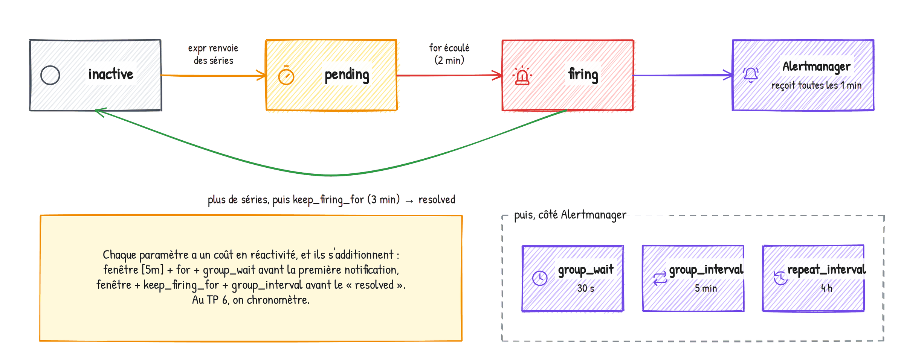

# Formation Prometheus & Grafana — Guide stagiaire, jour 3

**Réagir : alertes, exploitation, passage à l'échelle**

Formateur : Yohan Parent · Dépôt : https://github.com/yparent/formation-observabilite-lab (branche `formation-2026`)

## Le programme du jour

| Heure | Séquence |
|---|---|
| 9h00 | Rappel du jour 2 — exercice 3.0 : brancher l'Alertmanager |
| 9h15 | Philosophie de l'alerting, règles Prometheus |
| 9h40 | Alertmanager |
| 10h05 | TP 6 — Alertes Prometheus et routage Alertmanager |
| 11h15 | Notifications tierces : Slack, PagerDuty, Teams (Workflows), GitHub, templates |
| 11h45 | TP 7 — Cas pratique : alerte CPU → Teams |
| 14h00 | Alerting Grafana |
| 14h25 | TP 8 — Alerting Grafana, de l'interface au code |
| 15h10 | Performances, limites, bonnes pratiques — exercices 3.1 à 3.5 |
| 15h35 | TP 9 — Sauvegarde, restauration, sécurité |
| 16h15 | Mise à l'échelle et écosystème |
| 16h25 | TP 10 — Thanos : historique long et vue globale |
| 17h15 | War game, évaluation |

---

## Exercice 3.0 — Brancher l'Alertmanager

Depuis le jour 1, Prometheus évalue une règle d'alerte (`TargetDown`, dans `prometheus/rules/alerts.yml`)
mais n'a personne à qui l'envoyer.

1. Dans `docker-compose.yml`, décommentez `compose/06-alerting.yml`. Lisez-le : deux services.
   `./lab.sh up`, `./lab.sh status`. Ouvrez http://localhost:9093 et http://localhost:8080.
2. Dans `prometheus/prometheus.yml`, décommentez le bloc `alerting` (cible `alertmanager:9093`).
   Validez, rechargez.
3. Vérifiez dans Prometheus, **Status → Alertmanager discovery** : une cible active.
4. Ouvrez `alertmanager/alertmanager.yml` : un seul receiver, vers l'Inbox. C'est lui qu'on
   enrichit au TP 6.

> Que vaut `prometheus_notifications_sent_total` avant / après ?

---

## Rappels — alerting

**On alerte sur les symptômes** (le client attend, le client a des erreurs, le CA est à zéro),
pas sur les causes (CPU à 90 %). Une alerte doit être actionnable et avoir un runbook.

**Une règle Prometheus.**

```yaml
groups:
  - name: shop-api
    rules:
      - alert: ShopHighErrorRate
        expr: <requête PromQL> > 0.05
        for: 2m
        keep_firing_for: 3m
        labels:
          severity: critical
          team: boutique
        annotations:
          summary: "Taux d'erreur élevé sur {{ $labels.instance }}"
          description: "{{ $value | humanizePercentage }} des requêtes échouent."
          runbook_url: "https://..."
```

Une alerte se déclenche **par série renvoyée**. Cycle : inactive → pending (`for`) → firing.
Templates : `{{ $labels.x }}`, `{{ $value }}`, `humanize`, `humanizePercentage`,
`humanizeDuration`, `printf "%.0f"`.



**Alertmanager.** `route` (arbre : `matchers`, `receiver`, `continue`), `group_by` /
`group_wait` (30 s) / `group_interval` (5 m) / `repeat_interval` (4 h), `receivers`
(`webhook_configs`, `slack_configs`, `msteamsv2_configs`, `pagerduty_configs`...),
`inhibit_rules` (`source_matchers`, `target_matchers`, `equal`), silences, `time_intervals`.

Commandes :

```
./lab.sh check      ./lab.sh test      ./lab.sh reload
docker compose exec alertmanager amtool config routes show --config.file=/etc/alertmanager/alertmanager.yml
docker compose exec alertmanager amtool config routes test --config.file=/etc/alertmanager/alertmanager.yml severity=critical
docker compose exec alertmanager amtool alert
docker compose exec alertmanager amtool silence add alertname=X -d 30m -c "commentaire"
```

Toutes les notifications du lab arrivent dans l'Inbox : http://localhost:8080 (chemins
`/webhook/...`, `/teams/...`, `/slack/...`).

---

## TP 6 — Alertes Prometheus et routage Alertmanager

**Situation.** L'équipe boutique veut être prévenue dans son canal quand le site souffre.
L'astreinte veut recevoir uniquement le critique, tout de suite. L'infra ne veut rien recevoir
le week-end sauf le critique. Et personne ne veut recevoir « erreurs sur shop-api-2 » quand
shop-api-2 est éteint.

### Partie 1 — Les alertes de la boutique

Dans `prometheus/rules/alerts.yml`, groupe `shop-api`, écrivez :

1. `ShopHighErrorRate` (critical, team boutique) : taux d'erreur 5xx > 5 % **par instance**
   pendant 2 min, `keep_firing_for: 3m`, `summary` avec l'instance, `description` avec la valeur
   (`humanizePercentage`), `runbook_url` vers
   `https://github.com/yparent/formation-observabilite-lab/blob/formation-2026/docs/runbooks/shop-errors.md`.
2. `ShopCheckoutSlow` (warning, boutique) : p95 de `/api/checkout` > 1 s pendant 3 min, `summary`
   avec la valeur (`humanizeDuration`).
3. `ShopNoOrders` (critical, boutique) : aucune commande depuis 10 min **alors qu'il y a du
   trafic** (deux conditions avec `and`), pendant 5 min.
4. `ShopStockLow` (info, team logistique) : stock < 15 unités, produit dans le summary.

Dans le groupe `disponibilite`, ajoutez `BlackboxProbeFailed` (critical) sur `probe_success == 0`.

Validez, testez (`./lab.sh test` doit toujours passer), rechargez. Vérifiez dans **Alerts**.

*Astuce : réutilisez les requêtes des exercices 2.14 et 2.15. Les ratios sont entre 0 et 1.*

### Partie 2 — Casser et vérifier

1. `./lab.sh chaos errors on`. Chronométrez : au bout de combien de temps `ShopHighErrorRate`
   passe *pending* ? *firing* ? Quand la notification arrive-t-elle dans l'Inbox ? Expliquez
   chaque délai.
2. `./lab.sh chaos errors off`. Combien de temps avant *resolved* ? Pourquoi ?
3. Même exercice avec `./lab.sh chaos latency on` et `ShopCheckoutSlow`.
4. Regardez le dashboard TP 5 pendant ce temps.

> Chronologie et explications :
>
>
>

### Partie 3 — L'arbre de routage

Dans `alertmanager/alertmanager.yml` :

1. Receivers : `inbox-default` (webhook `http://inbox:8080/webhook/default`), `infra-inbox`
   (`/webhook/infra`), `astreinte-teams` en `msteamsv2_configs` (`webhook_url: http://inbox:8080/teams/astreinte`),
   `boutique-slack` en `slack_configs` (`api_url: http://inbox:8080/slack/boutique`, canal
   `#boutique-alertes`). `send_resolved: true` partout.
2. Routes : `severity = critical` → astreinte-teams, `group_wait` 10 s, `repeat_interval` 1 h,
   `continue: true` ; `team = boutique` → boutique-slack ; `severity = info` → inbox-default avec
   `group_interval` 30 m et `repeat_interval` 24 h ; `team = infra` → infra-inbox.
3. Validez, rechargez, puis testez le routage avec `amtool config routes test ... severity=critical team=boutique`
   : vers quels receivers ?
4. Relancez `./lab.sh chaos errors on` : combien de messages dans l'Inbox, sur quels canaux, avec
   quel format ? Comparez le JSON Slack et la carte Teams.

> 

### Partie 4 — Inhibition

Ajoutez deux `inhibit_rules` : (a) `TargetDown` inhibe `ShopHighErrorRate` et `ShopCheckoutSlow`
sur la même `instance` ; (b) une alerte `critical` inhibe le `warning` de même `alertname` sur la
même `instance`. Testez : chaos errors on, puis `docker compose stop shop-api-2`. Que voit-on dans
Alertmanager (filtre *Inhibited*) ? Redémarrez shop-api-2, chaos off.

> 

### Partie 5 — Silence et plage horaire

1. Dans l'interface Alertmanager, créez un silence de 30 min sur `alertname="ShopStockLow"` avec un
   commentaire. Même chose en ligne de commande avec `amtool silence add`, puis `amtool silence
   query` et `amtool silence expire <id>`.
2. Ajoutez un `time_intervals` nommé `nuit-et-weekend` (samedi, dimanche, et 20h-8h en
   `Europe/Paris`) et appliquez-le en `mute_time_intervals` sur la route `team = infra`.

*Astuce : un intervalle horaire ne peut pas passer minuit. Lisez le message d'erreur de `./lab.sh check`.*

---

## Rappels — notifications tierces

- **Slack** : `slack_configs` avec `api_url_file` (incoming webhook) ou token d'application ;
  `channel`, `title`, `text` templatables.
- **PagerDuty** : `pagerduty_configs` avec `routing_key_file` (Events API v2) ; `severity`.
- **Microsoft Teams** : les connecteurs Office 365 sont coupés depuis mai 2026. On crée un flux
  **Workflows** dans le canal (« Post to a channel when a webhook request is received ») et on
  utilise son URL dans `msteamsv2_configs` (Alertmanager) ou le contact point *Microsoft Teams*
  (Grafana). Le flux attend une Adaptive Card, générée automatiquement.
- **GitHub** : webhook (Grafana ou Alertmanager) → `repository_dispatch` → workflow Actions qui
  ouvre/commente/ferme une issue. Voir `.github/workflows/alert-to-issue.yml`.
- **Templates** : fichiers `.tmpl` chargés par `templates:`, blocs `{{ define "nom" }}`, utilisés
  avec `{{ template "nom" . }}`. Variables : `.Status`, `.Alerts`, `.CommonLabels`,
  `.CommonAnnotations`, `.ExternalURL`.

## TP 7 — Cas pratique : alerte CPU élevé, notification dans Teams

**Situation.** L'équipe infra veut être prévenue dans son canal Teams quand un serveur dépasse
80 % de CPU pendant plus de deux minutes, avec un message lisible : le serveur, la valeur, un lien
vers le dashboard.

### Partie 1 — La règle

Groupe `infrastructure` dans `alerts.yml` :

1. `HostHighCpuLoad` (warning, team infra) : CPU > 80 % pendant 2 min, fenêtre de `rate` 2 min,
   `summary` : « CPU à NN % sur <instance> » (`printf "%.0f"`),
   `description` : « L'utilisation CPU dépasse 80 % depuis 2 minutes. ».
2. Bonus : `HostOutOfMemory` (mémoire > 90 % pendant 5 min), `HostDiskWillFillIn24h`
   (`predict_linear` sur 6 h, et espace < 20 %), `BackupTooOld` (dernière sauvegarde
   Pushgateway de plus de 24 h), `PrometheusConfigReloadFailed`.
3. Ajoutez un test unitaire pour `HostHighCpuLoad` dans `prometheus/tests/cpu_test.yml` : une
   série `node_cpu_seconds_total{mode="idle", cpu="0", instance="srv", job="node"}` **qui
   n'augmente plus** (vingt valeurs identiques), et vérifiez l'alerte à `eval_time: 4m`.

Validez, testez, rechargez.

*Astuce : `rate` d'une série constante vaut 0. Que vaut alors `1 - 0` ?*

### Partie 2 — Le routage vers Teams

1. Ajoutez une route `alertname = HostHighCpuLoad` → receiver `astreinte-teams`, `group_wait: 10s`,
   placée **avant** la route `team = infra`. Pourquoi avant ?
2. Si vous avez une URL Workflows : remplacez `webhook_url` par la vraie URL (ou mieux,
   `webhook_url_file` vers un fichier monté). Sinon, gardez `http://inbox:8080/teams/astreinte`.
3. Validez, rechargez, testez le routage avec `amtool config routes test ... alertname=HostHighCpuLoad team=infra severity=warning`.

> 

### Partie 3 — Déclencher

1. `./lab.sh chaos cpu 300`.
2. Suivez dans Prometheus **Alerts**, dans Alertmanager, puis dans Teams (ou l'Inbox, canal `teams`).
   Chronométrez.
3. Ouvrez la carte : que contient-elle ? Qu'est-ce qui manque pour qu'elle soit vraiment utile ?

> 

### Partie 4 — Personnaliser le message

1. Ouvrez `alertmanager/templates/formation.tmpl` : deux blocs, `formation.title` et `formation.text`.
2. Utilisez-les dans le receiver `astreinte-teams` (`title:` et `text:`).
3. Ajoutez au bloc `formation.text` un lien vers le dashboard TP 4 :
   `http://localhost:3000/d/formation-serveur-linux?var-instance={{ .Labels.instance }}`.
4. Rechargez, relancez un chaos CPU, comparez.

Pour tester sans attendre une alerte réelle :

```
curl -X POST http://localhost:9093/api/v2/alerts -H 'Content-Type: application/json' -d '[{
  "labels": {"alertname": "HostHighCpuLoad", "severity": "warning", "team": "infra", "instance": "test"},
  "annotations": {"summary": "CPU à 99 % sur test"}}]'
```

---

## Rappels — alerting Grafana

| Alertmanager | Grafana |
|---|---|
| receiver | Contact point |
| route | Notification policy |
| silence | Silence |
| time_interval | Time interval (mute timing) |
| règle Prometheus | Alert rule (Grafana-managed) : requêtes + expressions Reduce / Math / Threshold |

Prometheus + Alertmanager pour les alertes pures métriques, versionnées et testées ; Grafana
pour le multi-sources, le SQL, le lien règle ↔ panel. Jamais la même alerte des deux côtés.

## TP 8 — Alerting Grafana, de l'interface au code

### Partie 1 — Contact point et politique

1. **Alerting → Notification configuration → Contact points → New contact point**. Nom
   `inbox-grafana`, intégration *Webhook*, URL `http://inbox:8080/webhook/grafana`. *Test*,
   vérifiez l'Inbox, sauvegardez.
2. Second contact point `teams-astreinte`, intégration *Microsoft Teams*, URL : votre URL
   Workflows ou `http://inbox:8080/teams/grafana`. *Test*, sauvegardez.
3. **Notification policies** : la *Default policy* envoie vers `inbox-grafana`. *New notification
   policy* : matcher `severity = critical` → `teams-astreinte`, group wait 10 s.

Comparez dans l'Inbox le format du webhook Grafana et celui d'Alertmanager.

> 

### Partie 2 — Une règle dans l'interface

**Alerting → Alert rules → New alert rule** :

1. Nom : `Boutique - taux d'erreur élevé (Grafana)`.
2. Requête A (Prometheus, mode *Code*, type *Instant*) : le taux d'erreur 5xx **par instance**, en
   pourcentage.
3. Condition : *WHEN QUERY A IS ABOVE 5*. *Preview alert rule condition*.
4. Dossier *Formation*, labels `severity=critical`, `team=boutique`, `source=grafana`.
5. Groupe d'évaluation `boutique-grafana`, intervalle 1 min, *Pending period* 2 min, *Keep firing
   for* 1 min. *Configure no data and error handling* : NoData → OK.
6. Notifications : laissez la politique de notification décider, ou choisissez `teams-astreinte`.
7. Message : *Summary* `{{ $labels.instance }} : {{ printf "%.1f" $values.B.Value }} % d'erreurs`,
   *Description*, *Runbook URL*, et *Link dashboard and panel* vers le panneau *Taux d'erreur* du TP 5.
8. Sauvegardez. `./lab.sh chaos errors on`. Suivez l'état de la règle, son historique, puis l'Inbox.

*Astuce : pourquoi une requête de type Instant ? Que faudrait-il ajouter en mode Range ?*

> 

### Partie 3 — La règle CPU et une mise en sourdine

Créez `Serveur - CPU élevé (Grafana)` (warning, team infra) sur la même logique, seuil 80. Puis
**Time intervals → Add time interval** `nuit` (22h-7h, Europe/Paris) et appliquez-le en *Mute
timings* sur la politique par défaut. Que se passe-t-il avec l'intervalle 22:00 → 07:00 ?

> 

### Partie 4 — Tout en code

1. Sur chaque objet (règle, contact point, politique, time interval) : *Export* au format YAML.
   Assemblez `grafana/provisioning/alerting/formation.yml` avec les sections `contactPoints`,
   `policies`, `groups`, `muteTimes`.
2. Supprimez les objets créés à la main. `docker compose restart grafana`.
3. Vérifiez que tout est revenu, en lecture seule (*Provisioned*).
4. Bonus : `curl -s -u admin:formation http://localhost:3000/api/v1/provisioning/alert-rules | jq`.

*Si Grafana ne redémarre pas : `docker compose logs grafana` et cherchez « failure to parse file ».*

---

## Rappels — performances

Ce qui coûte : le nombre de séries actives (mémoire), le débit d'échantillons (CPU, disque), les
requêtes. TSDB : head en mémoire + WAL, blocs de 2 h, compaction, rétention. Séries périmées
après 5 min sans échantillon. Le churn (séries qui changent de labels sans arrêt) est le second
tueur après la cardinalité.

Métriques à connaître : `prometheus_tsdb_head_series`, `prometheus_tsdb_head_samples_appended_total`,
`process_resident_memory_bytes`, `scrape_duration_seconds`, `scrape_samples_scraped`,
`prometheus_engine_query_duration_seconds`. Garde-fous : `sample_limit`, `metric_relabel_configs`,
`--query.max-samples`, recording rules.

## Exercices 3.1 à 3.5 — Diagnostic

**3.1** — Combien de séries actives ? Quelle métrique en a le plus ? Quel label a le plus de
valeurs distinctes ? (**Status → TSDB status** et requêtes)

> 

**3.2** — Combien d'échantillons par seconde entrent ? Combien de mémoire consomme Prometheus ?

> 

**3.3** — Quel job coûte le plus cher au scrape (`scrape_samples_scraped`) ? Quel est le plus lent
(`scrape_duration_seconds`) ?

> 

**3.4** — Mettez un `sample_limit: 100` sur le job `redis`. Rechargez. Que devient `up{job="redis"}` ?
Quelle métrique explique pourquoi ? Retirez-le.

> 

**3.5** — Comparez le coût de la requête p95 brute et de la recording rule avec `?stats=all` :

```
curl -s 'http://localhost:9090/api/v1/query?stats=all' \
  --data-urlencode 'query=histogram_quantile(0.95, sum by (route, le) (rate(http_request_duration_seconds_bucket[5m])))' | jq .data.stats
```

> 

---

## TP 9 — Sauvegarde, restauration, sécurité

**Situation.** Un audit demande : « si le serveur de monitoring brûle, en combien de temps le
remettez-vous ? Qui peut lire vos métriques ? » (La question « avez-vous 13 mois d'historique ? »,
c'est le TP 10.)

### Partie 1 — Snapshot et restauration de Prometheus

1. `./lab.sh snapshot`. Listez : `docker compose exec prometheus ls /prometheus/snapshots/`. Que
   contient un snapshot ?
2. Notez : `count(shop_orders_total offset 5m)`.
3. Simulez la catastrophe et restaurez :

```bash
SNAP=<nom du snapshot>
docker compose stop prometheus
docker compose run --rm --no-deps --user root --entrypoint sh prometheus -c \
  "cd /prometheus && mv snapshots /tmp/ && rm -rf ./* && cp -a /tmp/snapshots/$SNAP/. . && mv /tmp/snapshots . && chown -R nobody:nobody /prometheus"
docker compose start prometheus
```

4. Vérifiez que l'historique est là. Qu'a-t-on perdu ? (Le `chown nobody` correspond à
   l'utilisateur de l'image officielle.)

> 

### Partie 2 — Sauvegarde de Grafana

1. Copiez la base : `docker compose cp grafana:/var/lib/grafana/grafana.db ./grafana-backup.db`.
   Quelle taille ? Qu'y a-t-il dedans ?
2. Exportez tous les dashboards via l'API en un script : `/api/search?type=dash-db` puis
   `/api/dashboards/uid/<uid>` pour chacun, un fichier JSON par dashboard.
3. Qu'est-ce qui n'est **pas** dans les dashboards JSON et qu'il faut aussi sauvegarder ?

> 

### Partie 3 — Un mot de passe sur Prometheus

1. Créez `prometheus/web.yml` :

```yaml
basic_auth_users:
  admin: $2b$10$3wlDJ8unzqCKCH.k2lW4Mu3KNMCxsdufq6qqSkz/O7CRGj5tTT.m6   # "formation"
```

2. Ajoutez `--web.config.file=/etc/prometheus/web.yml` au service `prometheus` de
   `compose/01-prometheus.yml`, `docker compose up -d prometheus`. http://localhost:9090 demande un mot de passe.
3. Qu'est-ce qui casse ? Réparez-le (Grafana, `./lab.sh reload`...). Puis **retirez** l'option :
   le TP 10 et le war game se font sans mot de passe.

> 

---

## Rappels — mise à l'échelle

Sharding fonctionnel → fédération → stockage longue durée (Thanos, Mimir, VictoriaMetrics) → managé
(Grafana Cloud, AMP, GMP, Azure). Mode agent et Grafana Alloy pour l'edge. OpenTelemetry pour
instrumenter, Prometheus 3 reçoit l'OTLP nativement. Loki (logs) et Tempo (traces) pour la suite.
Kubernetes : kube-prometheus-stack.

**Thanos, qui fait quoi.**

| Composant | Rôle |
|---|---|
| Sidecar | à côté de chaque Prometheus : sert sa TSDB au Querier, envoie les blocs terminés au stockage objet |
| Store Gateway | sert les blocs du stockage objet |
| Querier | une API Prometheus globale : interroge tous les stores, fusionne, déduplique les réplicas |
| Compactor | fusionne les blocs, applique la rétention, calcule les résolutions 5 min et 1 h |

Les `external_labels` de chaque Prometheus identifient l'origine des blocs ; le label `replica`
est celui que le Querier ignore pour dédupliquer.


## TP 10 — Thanos : historique long et vue globale

**Situation.** La boutique ouvre un second site. Chaque site a son Prometheus (rétention 15 jours).
L'audit veut 13 mois d'historique et une vue globale, sans toucher aux Prometheus existants.

Tout tient dans une brique, `compose/07-thanos.yml`, et tout tourne dans votre Codespace ou sur
votre machine (six conteneurs de plus). Le « stockage objet » du lab est un dossier partagé
(`thanos/objstore.yml`) ; en production, le même fichier pointerait sur S3, GCS ou Azure.

### Partie 1 — Lire l'architecture et lancer

1. Ouvrez `compose/07-thanos.yml` et repérez, pour chaque service, son rôle et à qui il parle :
   `thanos-sidecar-a`, `prometheus-b`, `thanos-sidecar-b`, `thanos-store`, `thanos-query`,
   `thanos-compact`. Quel volume est partagé par qui ?
2. Ouvrez `thanos/prometheus-b.yml` : qu'est-ce qui diffère du Prometheus principal ? Pourquoi les
   deux ont-ils un `external_labels.replica` différent ?
3. Dans `compose/01-prometheus.yml`, décommentez les deux flags `--storage.tsdb.*-block-duration=10m`
   (des blocs de 10 minutes au lieu de 2 heures, pour voir les envois pendant le TP). **Ne sautez pas
   cette étape** : un sidecar exige que ces deux valeurs soient égales.
4. Dans `docker-compose.yml`, décommentez `compose/07-thanos.yml`. `./lab.sh up`, `./lab.sh status` :
   six conteneurs de plus, tous `Up`. Notez l'heure : ______

> Qui partage quoi, et pourquoi deux `replica` :
>
>

### Partie 2 — Le Querier : une vue, deux Prometheus

1. http://localhost:10902 : l'interface de Prometheus, à un détail près. **Stores** : que voyez-vous ?
   Quels labels chaque *store* annonce-t-il ?
2. Requête `up{job="shop-api"}`. Combien de séries ? Décochez **Use Deduplication** (en haut de la
   page). Combien maintenant ? Expliquez.
3. `count by (replica) (up)` sans déduplication, puis avec. Où est passé le label `replica` ?
4. Arrêtez `prometheus-b` (`docker compose stop prometheus-b`) : `up{job="shop-api"}` avec
   déduplication. Redémarrez-le (`docker compose start prometheus-b`).
5. Combien de noms de métriques différents sur le Querier, sur Prometheus (9090), sur Prometheus B (9092) ?
   `count(count by (__name__) ({__name__=~".+"}))`.

> Vos observations :
>
>
>

*Astuce : cherchez `--query.replica-label` dans le compose.*

### Partie 3 — Grafana sur Thanos

1. Ajoutez une source de données dans Grafana : type *Prometheus*, nom `Thanos`, URL
   `http://thanos-query:10902`. Dans *Performance*, *Prometheus type* : **Thanos**. *Save & test*.
   (Ou en fichier : `grafana/provisioning/datasources/thanos.yml`, puis `docker compose restart grafana`.)
2. Ouvrez le dashboard TP 5 et changez sa source de données pour `Thanos` (réglages du dashboard,
   ou une variable `datasource` de type *Data source*). Tout s'affiche-t-il ?
3. Explore, source Thanos : `shop_orders_total`. Le label `replica` a disparu, `cluster` est resté.
   Pourquoi garde-t-on `cluster` ?

> 

### Partie 4 — Le bucket, le Store Gateway et le Compactor

À faire au moins quinze minutes après le lancement de la partie 1.

1. `docker compose exec thanos-store ls -la /bucket` : des dossiers au nom bizarre (des ULID).
   Ouvrez le `meta.json` de l'un d'eux (`docker compose exec thanos-store cat /bucket/<ULID>/meta.json`) :
   de qui vient ce bloc ? quelle période couvre-t-il ?
   Côté sidecar : `docker compose exec thanos-sidecar-a wget -qO- localhost:10902/metrics | grep thanos_shipper_uploads`.
2. Sur le Querier, **Stores** : le Store Gateway annonce maintenant une fenêtre de temps et des
   labels. Lesquels ?
3. Les logs du compactor : `docker compose logs thanos-compact | tail -20`. Que fait-il ? Quelle
   rétention a-t-on configurée pour chaque résolution ?
4. Que se passe-t-il quand `prometheus` supprime un bloc localement au bout de 15 jours ? D'où
   vient la donnée d'il y a 6 mois quand Grafana la demande ? Et celle d'il y a 2 minutes ?

> 
>
>

*Astuce : si `/bucket` est vide, regardez `docker compose logs thanos-sidecar-a` (les flags de la
partie 1, étape 3, ont-ils été décommentés ?) et l'heure notée.*

### Partie 5 — Ranger

Le war game se fait sur la stack de ce matin. Recommentez `compose/07-thanos.yml` et les deux
flags de `compose/01-prometheus.yml`, puis `./lab.sh up` (les conteneurs en trop sont retirés).
Vérifiez avec `./lab.sh status`. Gardez les volumes : `./lab.sh reset` seulement à la fin de la formation.

## War game

Le formateur casse la boutique d'une façon que vous ne connaissez pas. En moins de cinq minutes,
par écrit :

1. Qu'est-ce qui est cassé ?
2. Sur quelle instance ?
3. Depuis quand ?
4. Quelle alerte a sonné ? Laquelle aurait dû sonner ?
5. Quelle serait votre première action ?

> 
>
>
>
>

## Lundi matin

Choisissez **un** service chez vous. Instrumentez-le en RED. Un dashboard, deux alertes symptômes,
un runbook. Pas plus. Le reste viendra.

Ressources : https://prometheus.io/docs/ · https://grafana.com/docs/grafana/latest/ ·
https://samber.github.io/awesome-prometheus-alerts/ · https://grafana.com/grafana/dashboards/ ·
https://blog.stephane-robert.info/docs/outils/observabilite/
